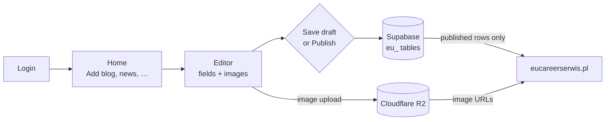
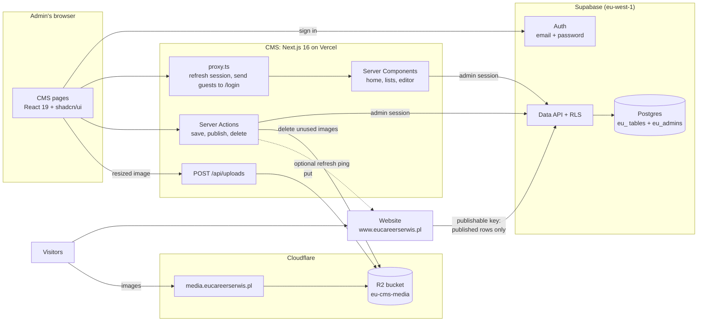

# Content Admin (CMS): Design & Implementation

> A private admin website for the content of **eucareerserwis.pl**: **blog posts, news, success stories, testimonials, visa stamps and work permits**.
>
> - Content is saved in **Supabase**, in tables prefixed with `eu_`, and images in **Cloudflare R2**.
> - The public website reads the published content **directly from Supabase**.
>
> **Status:** v3, **built** · **Updated:** 2026-10-03. This document now describes what was built; [§1.4](#14-what-changed-during-the-build) lists how it differs from the plan. What is left to do is in [§16](#16-status--next-steps). Everyday commands are in the [README](README.md).
>
> Earlier versions are in git history: v2, the plan for this CMS (commit `00990f4`), and v1, a general-purpose "Strapi alternative" (commit `1e9e734`).

---

## Table of contents

1. [Summary](#1-summary)
2. [Scope](#2-scope)
3. [How it works](#3-how-it-works)
4. [Key decisions](#4-key-decisions)
5. [Tech stack](#5-tech-stack)
6. [Database](#6-database)
7. [Login & access control](#7-login--access-control)
8. [Images on Cloudflare R2](#8-images-on-cloudflare-r2)
9. [Rich-text editor](#9-rich-text-editor)
10. [CMS screens](#10-cms-screens)
11. [How the code works](#11-how-the-code-works)
12. [Using the content on your website](#12-using-the-content-on-your-website)
13. [Importing the old Strapi content](#13-importing-the-old-strapi-content)
14. [Project structure](#14-project-structure)
15. [Environment variables & config](#15-environment-variables--config)
16. [Status & next steps](#16-status--next-steps)
17. [Testing](#17-testing)
18. [Deployment & operations](#18-deployment--operations)
19. [Security & privacy checklist](#19-security--privacy-checklist)
20. [Later (backlog)](#20-later-backlog)
21. [References](#21-references)

---

## 1. Summary

### 1.1 What you get

| Step | Screen | What happens |
|---|---|---|
| 1 | **Login** (`/login`) | Email + password. This is the only page a visitor can open. There is no sign-up and no "forgot password"; admins are created with `pnpm admin add` ([§6.5](#65-managing-admins)). |
| 2 | **Home** (`/`) | One card per content type, with its published and draft counts and **Add** / **View all** buttons. |
| 3 | **List** (e.g. `/blog`) | Search, **All / Published / Drafts** tabs, 20 items per page. A table, or an image grid for visa stamps and work permits. Each item has **Edit**, **Publish/Unpublish**, **View on website** and **Delete**. |
| 4 | **Editor** (e.g. `/blog/new`) | All the fields of that type: text, rich text with images, the main image with alt text, tags, counters and the publish date. |
| 5 | **Save draft / Publish** | The row is saved in that type's `eu_` table. Its images are already in R2. |
| 6 | **Your website** | Reads published rows with `supabase-js` and the publishable key. It cannot see drafts. |



### 1.2 The six content types

| CMS section | Table | Page on the website | Fields |
|---|---|---|---|
| Blog | `eu_blog` | `/blog/<slug>` | title, slug, short description, rich-text content, cover image, author, tags, likes, comments, SEO |
| News | `eu_news` | `/immigration-news/<slug>` | title, slug, short description, rich-text content, cover image, tags, views, SEO |
| Success stories | `eu_success_stories` | `/success-stories` | name, story (plain text), photo, video link |
| Testimonials | `eu_testimonials` | `/testimonials` | name, quote, photo, views |
| Visa stamps | `eu_visa_stamps` | `/visa-stamp` | image, country, caption |
| Work permits | `eu_work_permits` | `/work-permit` | image, country, caption |

Every column is listed in [§6.2](#62-fields-per-table).

### 1.3 The main decisions

- **Six fixed tables with real columns,** all prefixed with `eu_`. The admin list (`eu_admins`), the status type and the helper functions use the prefix too, so nothing clashes with other tables in the same Supabase project.
- **Supabase Row Level Security (RLS) is the gatekeeper.** Visitors can read only published rows, and only admins on an allowlist can write.
- **The CMS talks to Supabase as the logged-in admin.** The secret key is never deployed; only local scripts use it.
- **Images are resized in the browser, then uploaded through the CMS to R2** (`POST /api/uploads`). The row stores the image's URL, alt text, width and height.
- **Rich text** is written in **Tiptap** and stored as **sanitized HTML**, so the website only has to render it.
- **One config file describes all six types** (`src/config/collections.ts`). There is one generic list page, one editor and one set of actions.

### 1.4 What changed during the build

| Plan (v2) | As built | Why |
|---|---|---|
| Tables `blog`, `news`, …, `admins` | `eu_blog`, `eu_news`, …, `eu_admins`, plus the type `eu_content_status` and the functions `private.eu_is_admin()` and `private.eu_content_before_write()` | You asked for an `eu` prefix. It keeps the new tables clearly apart from the old Strapi tables in the same project. |
| Proposed fields (featured flag, rating, job title, visa type, issue date, person name, source link, …) | The fields the website already uses, taken from the Strapi data ([§6.2](#62-fields-per-table)) | Matches the live site, and the old content could be imported as it is |
| Success stories with a slug, rich text and their own page | Name, plain-text story, photo and video link, listed on `/success-stories` | That is what the Strapi data and the website have |
| Visa stamps and work permits need a country | Only the image is required; country and caption are optional | The old visa stamps have no country |
| The browser uploads straight to R2 with a presigned URL; `HeadObject` check when saving | The browser uploads to the CMS (`POST /api/uploads`), which checks the admin, the origin, the size and the file's first bytes, then writes to R2 | After resizing, images are small (4 MB cap, under Vercel's 4.5 MB request limit). No bucket CORS rules and no upload URLs are needed, and the server sees every file. |
| Only replaced main images are deleted; inline images wait for a clean-up tool | Main **and** inline images are deleted as soon as no item uses them (checked across all six tables). Old Strapi files (`uploads/…`) are never deleted. | Fewer leftover files; old files may still be linked from elsewhere |
| Admins added with SQL in the dashboard; `scripts/set-password.ts` | `pnpm admin add / list / password / remove / delete` | One command instead of dashboard + SQL |
| — | A `legacy_id` column on every table and `pnpm import:strapi` ([§13](#13-importing-the-old-strapi-content)) | Brings the old content over |
| Vercel region `fra1` | `dub1` (Dublin) | The Supabase project is in `eu-west-1` (Ireland) |
| New bucket `cms-media` | The existing bucket `eu-cms-media`, served at `media.eucareerserwis.pl` | Old and new images live side by side |
| Field types `date`, `rating`, `boolean` | Not needed; a `number` type was added for likes, comments and views | Follows the real fields |
| `src/lib/env.ts` | `src/lib/public-env.ts` and `src/lib/server-env.ts` (server-only) | Next.js only inlines `NEXT_PUBLIC_*` values that are read literally, and server secrets stay out of browser code |
| Playwright end-to-end tests | Unit tests (Vitest) and a scripted browser run-through ([§17](#17-testing)) | An automated end-to-end suite is in the backlog |

---

## 2. Scope

### Built

- **Login and logout** with email and password. Only users on the **admin allowlist** get in.
- **Home dashboard** with counts and quick **Add** buttons.
- **For each content type:** a list (search, status tabs, pagination), plus create, edit, delete and publish/unpublish (also straight from the list).
- **Editor:**
  - URL slugs generated from the title, with a warning when the slug of a published item changes;
  - rich text with links and inline images;
  - main-image upload with progress, alt text, Replace and Remove, and a privacy reminder;
  - tags, counters, and a publish date that can be set in the past or the future (scheduling);
  - draft vs publish validation with clear messages;
  - an unsaved-changes warning and **Ctrl/⌘ + S**;
  - edit-conflict detection with a **Reload** button;
  - a "View on website" link;
  - works on phones.
- **Images:** resized in the browser (EXIF removed), uploaded through the CMS to R2, and deleted once no item uses them.
- **Database rules (RLS):** the website, or anyone holding the publishable key, can read only **published** content, and only admins can write.
- **Scripts:** `pnpm admin` to manage admins, and `pnpm import:strapi` to import the old content.
- **For your website:** a guide with copy-paste queries ([§12](#12-using-the-content-on-your-website)) and an optional "refresh the website" ping after each save.

### Not built (see [§20](#20-later-backlog))

- Sign-up, invitations, password-reset emails and user-management screens. Use `pnpm admin` instead.
- Roles: every admin can do everything.
- Creating content types or fields from the UI. A new field is one migration plus one line of config ([§6.7](#67-changing-the-schema-later)).
- A media library, image galleries (several images per item), and video uploads. Paste a YouTube link instead.
- Multiple languages, revision history, and previewing drafts on the website.
- View and like counting by the website: visitors can only read ([§12.5](#125-rules-for-the-website)).

---

## 3. How it works

### 3.1 Architecture



- **CMS:** a Next.js app on its own address. It holds no database password and no Supabase secret key, only the R2 credentials (server-side).
- **Supabase:** stores the content and runs the login. The **Data API** (PostgREST) serves both the CMS (as the admin) and the website (as an anonymous visitor). RLS decides what each one may see or change.
- **Cloudflare R2:** stores the images. They are served from `media.eucareerserwis.pl`.

### 3.2 Who can do what

Postgres enforces this; the CMS code only adds friendlier checks on top.

| Who | Connects with | Can read | Can write |
|---|---|---|---|
| Your website / any visitor | publishable key, no login | rows with `status = 'published'` and `published_at <= now()` | nothing |
| **Admin** (listed in `eu_admins`) | publishable key + their login session | everything, drafts included | the six content tables |
| A logged-in user **not** in `eu_admins` | publishable key + session | the same as a visitor | nothing |
| Local scripts (`pnpm admin`, `pnpm import:strapi`) | secret key (`service_role`, bypasses RLS) | everything | the content tables and `eu_admins` |
| You, in the Supabase dashboard or CLI | database owner | everything | everything |

### 3.3 Saving an item with an image

```mermaid
sequenceDiagram
  autonumber
  participant B as Browser (CMS editor)
  participant S as CMS server
  participant R as Cloudflare R2
  participant D as Supabase (Postgres + RLS)
  participant W as Your website
  B->>B: Choose image, resize to 2000 px max, WebP or JPEG, strip EXIF
  B->>S: POST /api/uploads (collection, file), with a progress bar
  S->>S: Same origin? Admin? Size ≤ 4 MB? Bytes match the type? Generate key
  S->>R: Put object (cached for a year, never changes)
  S-->>B: Public URL
  B->>B: Show preview; admin fills alt text and the other fields
  B->>S: saveItem(values, status = published)
  S->>S: requireAdmin, Zod validation, sanitize HTML
  S->>D: Insert, or update where updated_at is unchanged (admin's session)
  D->>D: RLS: is the caller in eu_admins?
  D-->>S: Saved row
  S-->>B: OK, then the toast "Published"
  S--)R: After the response: delete images no item uses any more
  S--)W: After the response (optional): POST /api/revalidate
```

---

## 4. Key decisions

| # | Decision | Why | Trade-off |
|---|---|---|---|
| D1 | **Six real tables with typed columns,** prefixed with `eu_`. No generic content engine. | Exactly what the website needs. Easy to query, and `supabase gen types` gives full TypeScript types. | A new field needs a small migration plus one config line, about 10 minutes. |
| D2 | **The CMS uses supabase-js with the logged-in admin's session, and RLS decides what is allowed.** No secret key on the server. | The database itself enforces "only admins write, the public sees only published content", even if app code has a bug. It is the same access path the website uses, and there is one less secret to leak. | No multi-statement transactions. They aren't needed: every save touches one row. |
| D3 | **An admin allowlist** (`eu_admins` plus `private.eu_is_admin()`), with sign-ups switched off. | Being logged in is not the same as being an admin. This keeps you safe if you later add user accounts to the website in the same Supabase project. | One command (`pnpm admin add`) to create an admin. |
| D4 | **Every table has a Draft/Published `status` and a `published_at`.** The website only sees published rows whose date has passed. | Unfinished work never reaches the website, and backdating or scheduling come for free. | Editing a *published* item changes the live site as soon as you save. There is no separate draft copy. |
| D5 | **Images are resized and re-encoded in the browser, then uploaded through a CMS route** that writes them to R2. | Small files and fast pages. Re-encoding removes GPS/EXIF data from phone photos. Going through the server needs no CORS rules or upload URLs, and every file is checked. | Uploads are capped at 4 MB (Vercel's request limit is 4.5 MB); only a large animated GIF can hit it. Safari can't encode WebP, so images uploaded from Safari are saved as JPEG. |
| D6 | **The main image is stored as four columns:** `image_url`, `image_alt`, `image_width`, `image_height`. | The website gets everything from one row, fully typed and with no joins. Width and height prevent layout shift. | If the media domain ever changes, run one SQL `replace()` on `image_url` and `content`. |
| D7 | **Rich text is written in Tiptap, saved as HTML and sanitized on the server** before it is stored. | The website renders it in one line and needs no editor libraries. | HTML is less structured than JSON, which is fine for articles. |
| D8 | **One config file describes the six content types**, so there is one generic list, editor and set of actions. | Six types for the cost of one, and adding a field is one line. | A type with unusual UI needs a custom field component. |
| D9 | **SQL migrations go in `supabase/migrations/`, applied with the Supabase CLI**, and types are generated from the database. | A reproducible database, and the same types in the CMS and on the website. | You need the CLI, which installs as a dev dependency. |
| D10 | **The browser signs in with the Supabase client; access checks run on the server.** | Supabase limits `/auth/v1/token`, used for both sign-in and token refresh, to **150 requests per 5 min per IP**. If login ran on our server, every attempt (an attacker's too) would come from the server's IP, so a flood of bad logins could lock real admins out. | — |
| D11 | **CMS pages are never cached.** The website does its own caching, refreshed on a timer and by an optional ping. | Admins always see the latest data, and there is nothing to invalidate in the CMS. | — |
| D12 | **Edit conflicts are caught with `updated_at`:** an update only succeeds if the row hasn't changed since the editor opened it. | Two people (or two tabs) can never silently overwrite each other. | The second person has to reload and redo their change. |
| D13 | **An image is deleted only when no item uses it any more**, checked across the main images and the rich text of all six tables. Files from Strapi are never deleted. | No broken images, and no pile of unused files. | A few extra count queries after each save, run after the response. |
| D14 | **The Strapi content is imported once into the `eu_` tables;** the Strapi tables are only read, never changed. | The new tables start with all the old content, and the old site keeps working until you switch. | Importing again would overwrite CMS edits to imported items, so it needs `--overwrite` ([§13](#13-importing-the-old-strapi-content)). |

---

## 5. Tech stack

Versions as installed on 2026-10-03.

| Layer | Choice | Version | Notes |
|---|---|---|---|
| Runtime | Node.js LTS | 24 (minimum 22.12, required by sanitize-html) | pinned in `.nvmrc`; choose Node 24.x in Vercel |
| Framework | Next.js (App Router, Turbopack) + React | 16.3.8 / 19.2.8 | `src/proxy.ts` instead of middleware |
| Language & styling | TypeScript (strict), Tailwind CSS + `@tailwindcss/typography` | 5.x / 4.x / 0.5 | |
| UI kit | shadcn/ui (CLI v4, Base UI 1.8) + lucide-react + sonner | 4.21 / 1.50 / 2.0 | components are copied into `src/components/ui` |
| Animation | Motion (`motion/react`, `motion/react-client` in Server Components) | 14.0 | entrance, layout and gesture animations; respects "reduce motion" |
| Themes | next-themes | 0.4.6 | light, dark and system; the switch animates with the View Transitions API |
| Forms | react-hook-form + @hookform/resolvers + zod | 7.89 / 5.9 / 4.6 | the same Zod schemas run in the browser and on the server |
| Supabase | @supabase/supabase-js + @supabase/ssr; Supabase CLI | 2.117 / 0.12.7; 2.119 | cookie-based sessions; migrations and type generation |
| Images | @aws-sdk/client-s3 | 3.1145 | R2 speaks the S3 API |
| Rich text | Tiptap 3: `react`, `pm`, `starter-kit`, `extension-image`, `extensions`, `extension-file-handler`, `extension-text-style` | 3.31 | MIT licensed |
| HTML cleaning | sanitize-html | 2.18 | used by the save action and the import |
| Slugs | @sindresorhus/slugify | 3.0 | transliterates letters such as ł, ą, ü |
| Scripts | tsx, marked | 4.23 / 18 | `pnpm admin`, `pnpm import:strapi` (marked converts the old Markdown) |
| Tests | Vitest | 5.0 | |
| Lint and format | Biome | 2.5 | `next lint` no longer exists |
| Hosting | Vercel | — | region `dub1` |

---

## 6. Database

### 6.1 Tables at a glance

| Table | Used on the website for | Slug (own page) | Rich text | Main image | Also |
|---|---|---|---|---|---|
| `eu_blog` | article list + article pages | ✅ | ✅ `content` | cover, needed to publish | tags, likes, comments, SEO |
| `eu_news` | news list + news pages | ✅ | ✅ `content` | cover, needed to publish | tags, views, SEO |
| `eu_success_stories` | the success-stories page | — | — (plain-text `story`) | photo, optional | video link |
| `eu_testimonials` | the testimonials page | — | — (plain-text `quote`) | photo, optional | views |
| `eu_visa_stamps` | gallery of approved visas | — | — | **image, always required** | country, caption |
| `eu_work_permits` | gallery of issued work permits | — | — | **image, always required** | country, caption |
| `eu_admins` | nothing (CMS access list) | | | | |

Every content table has these **standard columns**:

| Column | Type | Notes |
|---|---|---|
| `id` | `uuid` primary key | `gen_random_uuid()` |
| `status` | enum `eu_content_status` | `'draft'` (default) or `'published'` |
| `published_at` | `timestamptz` | Set automatically the first time the item is published. It can be edited to backdate, or set in the future to schedule. |
| `created_at`, `updated_at` | `timestamptz` | A trigger sets `updated_at` on every update (it also detects edit conflicts) and protects `created_at`. |
| `image_url`, `image_alt`, `image_width`, `image_height` | `text`, `text`, `integer`, `integer` | The main image |
| `legacy_id` | `text`, unique | The Strapi document id of imported items; empty for items created in the CMS |

### 6.2 Fields per table

**Required:**
- **Always:** needed even to save a draft.
- **Publish:** needed before publishing.
- **Blank:** optional.

**`eu_blog`**

| Column | Type | Required | Editor input | Notes |
|---|---|---|---|---|
| `title` | text ≤ 200 | Always | Text | |
| `slug` | text ≤ 120, unique | Always | Slug | Generated from the title; `/blog/<slug>` |
| `excerpt` | text ≤ 300 | Publish | Textarea "Short description" | Shown on the blog cards |
| `content` | text (HTML) | Publish | Rich text | |
| `image_*` | — | Publish | Image "Cover image" | |
| `author_name` | text ≤ 100 | | Text "Author" | |
| `tags` | text[] (≤ 15) | | Tags | |
| `likes_count`, `comments_count` | integer ≥ 0, default 0 | | Number | |
| `seo_title` | text ≤ 200 | | Text (SEO section) | Falls back to `title` |
| `seo_description` | text ≤ 320 | | Textarea (SEO section) | Falls back to `excerpt` |
| `seo_keywords` | text ≤ 500 | | Text (SEO section) | Comma-separated |

**`eu_news`**

| Column | Type | Required | Editor input | Notes |
|---|---|---|---|---|
| `title` | text ≤ 200 | Always | Text | |
| `slug` | text ≤ 120, unique | Always | Slug | `/immigration-news/<slug>` |
| `excerpt` | text ≤ 300 | Publish | Textarea "Short description" | |
| `content` | text (HTML) | Publish | Rich text | |
| `image_*` | — | Publish | Image "Cover image" | |
| `tags` | text[] (≤ 15) | | Tags | |
| `views_count` | integer ≥ 0, default 0 | | Number | |
| `seo_title`, `seo_description` | text ≤ 200 / ≤ 320 | | SEO section | |

**`eu_success_stories`**

| Column | Type | Required | Editor input | Notes |
|---|---|---|---|---|
| `name` | text 1–100 | Always | Text | e.g. "Rakesh - India" |
| `story` | text ≤ 3000 | Publish | Textarea | Plain text; line breaks are kept |
| `image_*` | — | | Image "Photo" | |
| `video_url` | text ≤ 500, `http(s)://` only | | URL "Video link" | e.g. a YouTube link |

**`eu_testimonials`**

| Column | Type | Required | Editor input | Notes |
|---|---|---|---|---|
| `name` | text 1–100 | Always | Text | |
| `quote` | text ≤ 1000 | Publish | Textarea "What they say" | Plain text; line breaks are kept |
| `image_*` | — | | Image "Photo" | |
| `views_count` | integer ≥ 0, default 0 | | Number | |

**`eu_visa_stamps`** and **`eu_work_permits`** (same columns)

| Column | Type | Required | Editor input | Notes |
|---|---|---|---|---|
| `image_*` | `image_url not null` | Always | Image | Blur personal data first ([§8.7](#87-privacy)) |
| `country` | text ≤ 60 | | Country | Suggests country names |
| `caption` | text ≤ 200 | | Text | Optional text shown with the image |

- **`country`** is a text field that suggests names from `src/config/countries.ts` (an HTML `datalist`). The suggestions keep the spelling consistent, so the website can filter by country, but any value can be typed.
- **SEO lengths:** the database allows 200 and 320 characters because some imported values are that long. The editor's help text says that search engines show about 60 and 160.

### 6.3 Migrations

| File | Contains |
|---|---|
| `supabase/migrations/20261002200000_eu_content_tables.sql` | the `eu_content_status` type; the `private` schema; the trigger function `private.eu_content_before_write()`; the six tables; on each table an index for the website (`published_at desc` where published), an index for the CMS lists (`updated_at desc`) and the trigger |
| `supabase/migrations/20261002200100_eu_access_control.sql` | `eu_admins`; `private.eu_is_admin()`; the grants; the RLS policies |

- Both were applied to the live project on 2026-10-02 with `supabase db push`; `supabase migration list` shows the local and remote migrations in sync.
- **The trigger:**
  - on every update, it keeps `created_at` and sets `updated_at = now()`;
  - when an item is published without a date, it sets `published_at = now()`.
- **Draft vs publish checks:**
  - The database enforces formats, lengths and the *Always* fields: `title`/`name` not null, a unique and well-formed slug, and an image for visa stamps and work permits.
  - The *Publish* requirements are checked by the shared Zod schemas ([§11.3](#113-validation-draft-vs-publish)): in the browser for quick feedback, and on the server as the final word.

### 6.4 Access rules (RLS)

> **Why explicit `GRANT`s?** Supabase is changing its defaults. Projects created since 2026-05-30 no longer give the API roles automatic access to new `public` tables, and **from 2026-10-30 this applies to all projects**. This project still has the old defaults, which give the API roles full access to new tables. The migration therefore revokes everything and grants exactly what is needed, which works under both. RLS then filters the rows.

**Privileges**

| Role | Content tables | `eu_admins` |
|---|---|---|
| `anon` (visitors, the website) | `SELECT` | — |
| `authenticated` (logged-in users) | `SELECT`, `INSERT`, `UPDATE`, `DELETE`, filtered by RLS | `SELECT`, own row only |
| `service_role` (secret key, local scripts) | `SELECT`, `INSERT`, `UPDATE`, `DELETE` | `SELECT`, `INSERT`, `DELETE` |

**Policies on each content table**

| Policy | Role | Rule |
|---|---|---|
| Public reads published | `anon` | `status = 'published' and published_at <= now()` |
| Admins read all, others read published | `authenticated` | the same, **or** `(select private.eu_is_admin())` |
| Admins insert / Admins update / Admins delete | `authenticated` | `(select private.eu_is_admin())` |

**Notes**
- **`private.eu_is_admin()`** is `SECURITY DEFINER`, so it can read `eu_admins` regardless of RLS. It lives in the `private` schema, which the Data API doesn't expose, and only `authenticated` may run it.
- **`(select private.eu_is_admin())`** is evaluated once per query, not once per row (Supabase's RLS performance advice).
- **One SELECT policy per role.** This avoids the advisor's "multiple permissive policies" warning.
- **Missing grants** show up as error `42501`.

### 6.5 Managing admins

```bash
pnpm admin add you@example.com                    # create the login (password printed once) and give CMS access
pnpm admin add you@example.com --password '…'     # choose the password yourself (at least 12 characters)
pnpm admin list                                   # admins, with their last sign-in
pnpm admin password you@example.com               # set a new password (printed once)
pnpm admin remove you@example.com                 # take away CMS access, keep the login
pnpm admin delete you@example.com                 # delete the login completely
```

These commands run locally with `SUPABASE_SECRET_KEY` from `.env.local` (`scripts/admin.ts`). `add` creates a confirmed user, so no email is sent. The same in the SQL editor:

```sql
-- give an existing login CMS access
insert into public.eu_admins (user_id)
select id from auth.users where email = 'name@example.com';

-- list admins
select u.email, a.created_at
from public.eu_admins a join auth.users u on u.id = a.user_id
order by a.created_at;

-- remove CMS access
delete from public.eu_admins
where user_id = (select id from auth.users where email = 'name@example.com');
```

### 6.6 Checking the rules

Run each block **on its own** in the SQL editor. Every block ends with `rollback`, so nothing is kept.

```sql
-- As a website visitor: drafts are invisible and writes are refused
begin;
  insert into public.eu_blog (title, slug) values ('RLS test draft', 'rls-test-draft');
  set local role anon;
  select title, status from public.eu_blog where slug = 'rls-test-draft';  -- no rows
rollback;

begin;
  set local role anon;
  insert into public.eu_blog (title, slug) values ('Hack', 'hack');  -- ERROR: permission denied
rollback;

-- As an admin: drafts are visible
begin;
  select set_config('request.jwt.claims',
    json_build_object('sub', (select id from auth.users where email = 'name@example.com'), 'role', 'authenticated')::text, true);
  set local role authenticated;
  select count(*) from public.eu_blog;  -- includes drafts
rollback;
```

From a terminal, as a visitor:

```bash
curl "https://<project-ref>.supabase.co/rest/v1/eu_blog?select=title&status=eq.draft" \
  -H "apikey: <publishable key>"   # → [] (drafts never appear)
```

**Verified on the live project (2026-10-02 and 2026-10-03):**
- With the publishable key, each table shows exactly its published rows; the 2 blog drafts stay hidden.
- Visitors can't write and can't read `eu_admins`.
- A logged-in non-admin sees the same as a visitor and can't write.
- Admins see and change everything.
- The trigger stamps `published_at`, moves `updated_at` and protects `created_at`.
- A stale `updated_at` matches 0 rows, which is the edit-conflict check.
- A duplicate slug gives `23505`, a malformed slug gives `23514`, and a visa stamp without an image is rejected.
- **Security Advisor:** no findings for `eu_` objects. Its 42 errors ("RLS disabled") are all on the old Strapi tables ([§16.2](#162-before-go-live)).

### 6.7 Changing the schema later

To add a field, e.g. a blog category:

1. Create a migration with `pnpm db:new add_blog_category`, containing `alter table public.eu_blog add column category text check (char_length(category) <= 60);`.
2. Apply it and regenerate the types with `pnpm db:push && pnpm db:types`.
3. Add one line to the blog's `fields` in `src/config/collections.ts`: `{ name: "category", label: "Category", type: "text", maxLength: 60, placement: "side" }`.
4. Optionally, regenerate the types in the website project and use the new column.

**Renaming or deleting** a column breaks website queries that use it. Update the website in the same release.

---

## 7. Login & access control

### 7.1 Supabase settings

| Setting | Value |
|---|---|
| Region / database | `eu-west-1` (Ireland), Postgres 17 |
| Sign-ups | **off** (`disable_signup`), changed on 2026-10-02. Users you create can still log in. |
| Minimum password length | **12**, changed on 2026-10-02 |
| Anonymous sign-ins | off |
| Site URL | still `http://localhost:3000`. **Set it to the CMS address when you deploy** (Authentication → URL Configuration). |
| Keys | The **publishable key** (`sb_publishable_…`) is used by the CMS and the website. The **secret key** (`sb_secret_…`) is only in `.env.local`, for the scripts. |
| CAPTCHA | not set up (optional: Cloudflare Turnstile under Authentication → Attack Protection; the login form would then have to send `options.captchaToken`) |

### 7.2 How login works

1. **The `/login` page** is a Server Component. It checks the current session:
   - **an admin** is redirected to `/`;
   - **logged in but not an admin:** shows "No access" with a **Sign out** button;
   - **otherwise:** shows the login form, with the footer "Access by invitation only."
2. **The login form** is a Client Component. It calls `supabase.auth.signInWithPassword()` **in the browser** (see D10), and `@supabase/ssr` stores the session in cookies. A wrong password shows one generic message, and the email stays filled in; a rate limit (HTTP 429) shows "Too many attempts".
3. **The form then reads `eu_admins`.** RLS lets a user see only their own row.
   - **No row:** it signs out and shows "This account does not have access to the CMS."
   - **Otherwise:** it goes to `next` (only paths starting with a single `/`) or to `/`.
4. **`src/proxy.ts` runs on every page request.** It refreshes the session cookie and sends visitors without a session to `/login?next=…`. It skips `/login` and `/api/*`; the upload route answers `401` itself. This is only a fast first gate.
5. **The real check is `requireAdmin()`** in `src/lib/auth.ts`. It runs in every CMS page, every data function and every Server Action:
   - it calls `getClaims()`, which verifies the JWT;
   - it then looks up `eu_admins` (once per request, thanks to React `cache`).

   RLS backs it up: even if a check were forgotten, a non-admin could not read drafts or write anything.
6. **Logout** is a Server Action that calls `signOut()` and redirects to `/login`.

### 7.3 Code

| File | What it does |
|---|---|
| `src/lib/supabase/server.ts` | Supabase client for Server Components and Server Actions (cookies) |
| `src/lib/supabase/client.ts` | Supabase client for the browser (login form) |
| `src/lib/supabase/proxy.ts`, `src/proxy.ts` | Session refresh and the redirect to `/login` |
| `src/lib/auth.ts` | `getCurrentUser()` (per-request cache) and `requireAdmin()` |
| `src/app/login/` | `page.tsx` (the three states), `login-form.tsx`, `no-access.tsx` |
| `src/actions/auth.ts` | `logout()` |

**Rules**
- **`proxy.ts` is only a fast first gate.** Next.js docs say Proxy must not be your only authorization. Server Actions are POST requests to the page that uses them, so **every action calls `requireAdmin()` itself**.
- **Don't rely on checks in layouts alone.** Layouts don't re-render on client navigation.
- **Use `getClaims()` on the server, never `getSession()`.** `getSession()` doesn't verify the token.
- **Client Components never import `src/lib/auth.ts` or other server modules.** `import "server-only"` enforces this.

### 7.4 Passwords

- There are no reset emails. To set a new password, run `pnpm admin password <email>`: it prints a generated password once, or add `--password '…'` to choose one.
- A "change my password" page is in the backlog.

---

## 8. Images on Cloudflare R2

### 8.1 Cloudflare setup

| Item | State |
|---|---|
| Bucket | `eu-cms-media`, the bucket Strapi already used. Its old files are under `uploads/`. It is not an EU-jurisdiction bucket, so `R2_JURISDICTION` stays empty. |
| Custom domain | `media.eucareerserwis.pl` ✅ |
| API token | **Object Read & Write**, limited to this bucket |
| CORS | Not needed by the CMS: uploads go through its server |
| Cache Rule | **To do:** for `media.eucareerserwis.pl`, set "eligible for cache" with an edge TTL and a browser TTL of 1 year. This is safe because a file never changes once uploaded (a new upload always gets a new name). |
| `nosniff` header | **To do:** a Response Header Transform Rule for `media.eucareerserwis.pl` that sets `X-Content-Type-Options: nosniff` |

### 8.2 File names (object keys)

```text
<collection>/<yyyy>/<mm>/<uuid>.<ext>      e.g. visa-stamps/2026/10/7c9e6679-7425-40de-944b-e07fc1f90ae7.webp
uploads/…                                  files from Strapi (kept as they are)
```

- **The server generates the keys.** Original file names are never used, because they often contain people's names.
- **Keys are never reused,** so a replacement is always a new file and the files can be cached forever.

### 8.3 Upload flow

1. **Prepare the image in the browser** (`src/lib/images/prepare.ts`):
   - checks the type (JPG, PNG, WebP, AVIF, GIF, HEIC/HEIF) and the size (25 MB at most);
   - decodes it with `createImageBitmap(file, { imageOrientation: "from-image" })`, so phone rotation is applied;
   - scales it so the longest side is at most **2000 px** (main images) or **1600 px** (images in rich text), on a white background;
   - encodes **WebP** (quality 0.82), or **JPEG** (quality 0.85) in Safari, which can't encode WebP. Re-encoding drops EXIF data such as the GPS location.
   - GIFs are uploaded unchanged, to keep animations.
2. **Upload it** (`src/lib/images/upload.ts`): `uploadImage()` posts `FormData { collection, file }` to `/api/uploads` with `XMLHttpRequest`, which reports progress and can be cancelled.
3. **Check and store it** (`src/app/api/uploads/route.ts`):
   - the `Origin` must be the CMS itself (otherwise `403`), and the user must be an admin (`401`);
   - the collection must be valid; the file must be 1 byte to 4 MB (`413`);
   - the type must be WebP, JPEG or GIF, and the file's first bytes must match it (`415`);
   - the server builds the key, writes the file with `Cache-Control: public, max-age=31536000, immutable`, and returns the public URL.
4. **Save the item.** The image field's value is `{ url, alt, width, height }`. It is written to the `image_*` columns when the item is saved ([§11.5](#115-server-actions)).

### 8.4 Rules & limits

| Rule | Value |
|---|---|
| Accepted files | JPG, PNG, WebP, AVIF, GIF and HEIC. iPhones hand photos from the photo library to the browser as JPEG. A HEIC file only works in Safari; other browsers show "please convert it to JPG". |
| Largest file you can choose | 25 MB |
| Stored size | Longest side **2000 px** for main images and **1600 px** for images in rich text |
| Stored format | **WebP** (quality 0.82) from Chrome, Edge and Firefox; **JPEG** (quality 0.85) from Safari. Transparent areas become white. GIFs are kept as they are. |
| Largest upload (server check) | 4 MB |
| Not allowed | SVG (can carry scripts), PDF, video, and any file whose bytes don't match its type |
| Caching | 1 year, `immutable` |

### 8.5 Checks on save

- **The URL must be ours.** `image_url` must start with `https://media.eucareerserwis.pl/` (`NEXT_PUBLIC_MEDIA_URL`), so the database can't point at random outside images. New uploads and the old Strapi files both pass.
- **Inline images** in rich text are restricted to the same domain by the HTML sanitizer ([§9.3](#93-cleaning-the-html-on-the-server)).
- No separate "does the file exist" check is needed: files only get into the bucket through the upload route, which has already checked them.

### 8.6 Deleting images

| Event | What happens in R2 |
|---|---|
| Main image replaced or removed, then saved | The old file is deleted **after** the save, if no other item uses it |
| Image removed from rich text, then saved | The same |
| Item deleted | Its main image and its inline images are deleted, if no other item uses them |
| Upload abandoned (image chosen, page left without saving) | The file stays. At this scale it costs nothing; a clean-up tool is in the backlog. |
| Files from Strapi (`uploads/…`) | **Never deleted** by the CMS |

"Uses" means: the URL appears as `image_url` in any of the six tables, or inside the `content` of a blog post or news article (`deleteImagesIfUnused()` in `src/lib/r2.ts`).

Deleting a file doesn't instantly clear Cloudflare's CDN cache. **If something sensitive was published by mistake,** delete the item, then purge its image URL in Cloudflare under **Caching → Configuration → Purge Cache → Custom purge**.

### 8.7 Privacy

Visa stamps, work permits and client photos contain **personal data**, so the GDPR applies.

- **Blur before uploading:** passport numbers, the machine-readable (MRZ) lines, dates of birth, signatures, and the faces of people who haven't agreed. The editor shows this reminder above the image field for success stories, testimonials, visa stamps and work permits.
- **Keep names short:** a first name and a country ("Rakesh - India") is enough.
- **Get the person's consent** before publishing their story, photo or document. Keep that record outside the CMS.
- **Location data is stripped.** Re-encoding in the browser removes GPS and other EXIF data. GIFs are not re-encoded, so don't use GIFs for documents.
- **Images are public once uploaded.** Anyone with the URL can open them, even while the item is a draft. The random file names make the URLs impossible to guess.

---

## 9. Rich-text editor

Used by `eu_blog.content` and `eu_news.content`.

### 9.1 What it can do

- **Toolbar:** paragraph, heading 2, 3 and 4, bold, italic, underline, strikethrough, bulleted list, numbered list, quote, link, image, horizontal line, undo and redo.
- **Images:**
  - The **image button** opens a small dialog: choose a file, type the alt text, Insert. The image is resized (1600 px max), uploaded, and inserted as ``.
  - **Pasted or dropped image files** are uploaded the same way. Images are never embedded as base64.
- **Pasting from Word or Google Docs** keeps headings, lists and links. Anything the editor doesn't support, such as fonts, colours or tables, is dropped.
- **Links** are added with a dialog; `https://` is added when missing, and links open in a new tab. Tiptap refuses `javascript:`, `data:` and `vbscript:` links, and the server only keeps `http(s)`, `mailto` and `tel`.
- **Long articles:** the text area scrolls on its own (at most 70% of the screen height), so the toolbar stays in reach.

### 9.2 Editor setup

`src/components/editor/rich-text-editor.tsx`, with `toolbar.tsx`, `link-dialog.tsx` and `image-dialog.tsx` next to it.

- **Extensions:**
  - StarterKit with headings 2–4, without `code` and `codeBlock`, and links with `openOnClick: false` and `defaultProtocol: "https"`;
  - Image;
  - FileHandler for pasted and dropped files, with `consumePasteEvent: true` so a pasted image isn't added twice;
  - Placeholder ("Start writing…").
- **`immediatelyRender: false`,** as Next.js requires; the whole form is also loaded only in the browser ([§11.1](#111-collection-config)).
- **Toolbar state:** in Tiptap 3 the editor doesn't re-render React on every keystroke, so the toolbar reads active states, such as "bold is on", with `useEditorState()`. Its buttons don't take the focus, so the text selection is kept.
- **The value** is `editor.getHTML()`, or `''` when the editor is empty.
- **Styling:** the `prose` classes from `@tailwindcss/typography`, so the editor looks like an article.

### 9.3 Cleaning the HTML on the server

Everything the browser sends is untrusted. `sanitizeRichText()` (`src/lib/sanitize.ts`, sanitize-html) runs in the save action, and in the import, before anything is stored. It keeps only:

| Kept | Details |
|---|---|
| Tags | `p`, `br`, `h2`–`h4`, `strong`, `em`, `u`, `s`, `blockquote`, `ul`, `ol`, `li`, `hr`, `a`, `img` |
| Link attributes | `href` (`http`, `https`, `mailto`, `tel` only), and `target="_blank"` with `rel="noopener noreferrer nofollow"` set by the sanitizer |
| Image attributes | `src`, `alt`, `title`, `width`, `height`. `src` must be `https://media.eucareerserwis.pl/…`; other images are dropped. |
| Other | `ol start`. Protocol-relative URLs (`//…`) are refused. A link whose `href` was removed is unwrapped and keeps its text. An empty document becomes `''`. |

The unit tests (`tests/sanitize.test.ts`) cover `<script>`, `<iframe>`, `onclick=…` and `style=…`; `javascript:` links, also when hidden with a tab or written as `&colon;`; protocol-relative links (`//…`); images from other hosts and look-alike hosts; and `data:` and `http:` images.

### 9.4 What gets stored

```html
<h2>How long does it take?</h2>
<p>Most <strong>work permits</strong> take 4–8 weeks. See the
  <a href="https://www.gov.pl/web/udsc" target="_blank" rel="noopener noreferrer nofollow">official page</a>.</p>

```

---

## 10. CMS screens

### 10.1 Routes

| URL | Screen |
|---|---|
| `/login` | Login |
| `/` | Home dashboard |
| `/blog`, `/news`, `/success-stories`, `/testimonials`, `/visa-stamps`, `/work-permits` | List for that type |
| `/<type>/new` | Create |
| `/<type>/<id>` | Edit |
| `POST /api/uploads` | Image upload (not a page) |

The content pages are one dynamic segment, `src/app/(cms)/[collection]/…`. An unknown type name, or an `id` that isn't a UUID, shows a 404.

### 10.2 Login

- A centred card with the app name, **Email**, **Password**, and a **Sign in** button with a spinner.
- One generic error message, plus "Too many attempts" when rate-limited.
- The footer reads "Access by invitation only." There are no sign-up or forgot-password links.

### 10.3 Layout (app shell)

- **Sidebar** (shadcn `Sidebar`): it collapses to icons on desktop (remembered in a cookie) and becomes a drawer on phones. It contains:
  - **Home**;
  - **Content:** the six types with icons;
  - at the bottom: **Open website ↗**, your email, and **Sign out**.
- **Header:** a menu button, breadcrumbs (Home / Blog / title) and the theme toggle. On phones only the last crumb is shortened.
- **Look:** the brand yellow of eucareerserwis.pl with warm neutrals; light and dark mode (Light / Dark / System in the account menu). Switching theme reveals the new one in a circle from the toggle. Each content type has its own accent colour (`tone` in the config).
- The CMS is told **never to be indexed** by search engines, through the `robots` metadata, `robots.txt` and an `X-Robots-Tag` header.

### 10.4 Home

```text
┌───────────────────┬──────────────────────────────────────────────────────────┐
│ EU Career Serwis  │ Home                                                     │
│                   │ Choose what you want to add or edit.                     │
│ Home              │ ┌────────────────┐ ┌────────────────┐ ┌────────────────┐ │
│ Content           │ │ Blog           │ │ News           │ │ Success stories│ │
│   Blog            │ │ 35 published   │ │ 7 published    │ │ 3 published    │ │
│   News            │ │ 2 drafts       │ │ 0 drafts       │ │ 0 drafts       │ │
│   Success stories │ │ [+ Add] [View] │ │ [+ Add] [View] │ │ [+ Add] [View] │ │
│   Testimonials    │ └────────────────┘ └────────────────┘ └────────────────┘ │
│   Visa stamps     │ ┌────────────────┐ ┌────────────────┐ ┌────────────────┐ │
│   Work permits    │ │ Testimonials   │ │ Visa stamps    │ │ Work permits   │ │
│                   │ │ 20 published   │ │ 9 published    │ │ 46 published   │ │
│ Open website ->   │ │ 0 drafts       │ │ 0 drafts       │ │ 0 drafts       │ │
│ you@...  Sign out │ │ [+ Add] [View] │ │ [+ Add] [View] │ │ [+ Add] [View] │ │
│                   │ └────────────────┘ └────────────────┘ └────────────────┘ │
└───────────────────┴──────────────────────────────────────────────────────────┘
```

Each card shows the type's icon, name and one-line description, its published and draft counts, and **+ Add** / **View all** buttons. The counts above are the real ones after the import.

### 10.5 List

- **Header:** the type name and a **New …** button (e.g. "New blog post").
- **Toolbar:** a search box (titles for blog and news, names for stories and testimonials, country for the image types) and the tabs **All / Published / Drafts**.
- **Table** for blog, news, success stories and testimonials:
  - thumbnail, title with a second line (the page address, or the start of the quote or story), status badge (**Draft** / **Published** / **Scheduled** when the publish date is in the future), publish date, last updated;
  - clicking a row opens the editor;
  - the row menu has **Edit**, **Publish/Unpublish**, **View on website** and **Delete** (with a confirmation dialog). Publishing an item that misses required fields is refused with "Open the item to fill in: …".
- **Grid of image cards** for **visa stamps** and **work permits**, because those are mostly pictures.
- **Pagination:** 20 per page, with Previous / Next.
- **The state lives in the URL**, e.g. `/blog?q=visa&status=draft&page=2`, so Back and Refresh work.
- **Empty state:** e.g. "No testimonials yet · Create the first testimonial.", or "Nothing matches" when a search or filter finds nothing.

### 10.6 Editor

```text
┌──────────────────────────────────────────────────────────────────────────────┐
│ ☰ │ Home / Blog / New blog post                                              │
├──────────────────────────────────────────────────────────────────────────────┤
│ New blog post                                         [Save draft] [Publish] │
│ Draft                                                                        │
├────────────────────────────────────────────────────┬─────────────────────────┤
│ Title *                                            │ Publishing              │
│ [How to get a Polish work visa                ]    │ Publish date            │
│ URL slug *   /blog/[how-to-get-a-polish-work-visa] │ [2026-10-03  10:00]     │
│                                       [Generate]   │ Empty = when published  │
│ Short description · needed to publish     86/300   ├─────────────────────────┤
│ [.............................................]    │ Cover image · needed to │
│ Content · needed to publish                        │ publish                 │
│ ┌─────────────────────────────────────────────┐    │ ┌─────────────────────┐ │
│ │ P H2 H3 H4 | B I U S | List 1. Quote | Link │    │ │ Drop an image here  │ │
│ │ Img — | Undo Redo                           │    │ │ or click to choose  │ │
│ ├─────────────────────────────────────────────┤    │ └─────────────────────┘ │
│ │ Start writing…                              │    │ Author   [...........]  │
│ └─────────────────────────────────────────────┘    │ Tags  [visa x] [+]      │
│ > Search engines (SEO) · optional                  │ Likes [0]  Comments [0] │
└────────────────────────────────────────────────────┴─────────────────────────┘
```

**Buttons by state**

| Item state | Main button | Other actions |
|---|---|---|
| New | **Publish** | Save draft |
| Draft | **Publish** | Save draft · Delete |
| Published | **Save changes** (goes live immediately) | Unpublish · View on website · Delete |

**Behaviour**
- **Slug:** fills in from the title as you type, for new items only, until you edit it yourself. **Generate** rebuilds it from the title. Changing the slug of a *published* item shows a warning that old links will break.
- **Publish:** checks the *Publish* fields and highlights what's missing. Save draft only needs the *Always* fields.
- **Image uploads:** saving waits until the upload has finished.
- **After saving:**
  - a new item's URL becomes `/<type>/<id>`;
  - a toast says "Draft saved", "Published", "Changes saved — they're live" or "Unpublished — it's now a draft".
- **Unsaved changes:** the header shows "Unsaved changes", the browser warns before you leave or reload, and **Ctrl/⌘ + S** saves without changing the status.
- **Edit conflicts:** if someone saved this item after you opened it, saving shows "Someone else changed this item after you opened it…" with a **Reload** button. Nothing is overwritten.
- **Mobile:** one column, and the image input opens the camera or the photo library, which is handy for uploading visa stamps from a phone.

---

## 11. How the code works

### 11.1 Collection config

`src/config/collections.ts` is the single description of the six types. The list page, the editor, the validation and the actions all read it. It is safe to import in the browser.

```ts
export type FieldType = "text" | "textarea" | "slug" | "richtext" | "image" | "url" | "country" | "tags" | "number"

export type FieldConfig = {
  name: string                         // column name; an image field named "image" maps to image_url/_alt/_width/_height
  label: string
  type: FieldType
  required?: "always" | "publish"      // omitted = optional
  maxLength?: number
  help?: string
  placeholder?: string
  placement?: "main" | "side" | "seo"  // where the editor shows it (default "main")
  from?: string                        // slug: the field it is generated from
  rows?: number                        // textarea: visible rows
}

export type CollectionConfig = {
  slug: string                         // URL segment and R2 folder: "success-stories"
  table: ContentTable                  // "eu_success_stories"
  label: string                        // "Success stories"
  singular: string                     // "Success story"
  description: string                  // shown on the home card
  icon: LucideIcon
  fields: FieldConfig[]
  searchField: string                  // column searched by the list
  searchPlaceholder: string
  view: "table" | "grid"
  slugPrefix?: string                  // shown in front of the slug input: "/blog/"
  displayTitle: (row: Row) => string   // list rows, headings, breadcrumbs
  websitePath?: (row: Row) => string | null  // "View on website"
  privacyNotice?: boolean              // the "blur personal data" reminder
}
```

Example: the testimonials entry.

```ts
{
  slug: "testimonials",
  table: "eu_testimonials",
  label: "Testimonials",
  singular: "Testimonial",
  description: "What clients say",
  icon: MessageSquareQuoteIcon,
  view: "table",
  searchField: "name",
  searchPlaceholder: "Search names…",
  fields: [
    { name: "name", label: "Name", type: "text", required: "always", maxLength: 100 },
    { name: "quote", label: "What they say", type: "textarea", required: "publish", maxLength: 1000, rows: 5 },
    { name: "image", label: "Photo", type: "image", placement: "side" },
    { name: "views_count", label: "Views", type: "number", placement: "side" },
  ],
  displayTitle: (row) => text(row.name) || "Unnamed",
  websitePath: () => "/testimonials",
  privacyNotice: true,
}
```

**How the pages use it**
- `src/app/(cms)/[collection]/page.tsx` looks up the type (or shows a 404), loads rows with `listItems()`, and renders `<ItemsTable>` or `<ItemsGrid>`.
- The new and edit pages load the row (edit only) and render `<ItemEditor>`. That Client Component loads the form with `next/dynamic(…, { ssr: false })`: the form uses browser-only APIs (Tiptap, canvas, the local time zone), so it never renders on the server and can't cause hydration mismatches.
- `published_at` is a standard field of every type, so it isn't in `fields`. The editor always shows it in the **Publishing** card.

### 11.2 Field types

| Type | Input | Form value | Stored as |
|---|---|---|---|
| `text` | Input with a character counter | `string` | `text` (empty → `null`) |
| `textarea` | Textarea with a counter | `string` | `text` (empty → `null`) |
| `slug` | Input with a prefix such as `/blog/`, and **Generate**; follows `from` until edited | `string` | `text`, unique |
| `richtext` | Tiptap editor ([§9](#9-rich-text-editor)) | HTML `string` | sanitized HTML (empty → `''`) |
| `image` | Drop zone → preview + progress → alt text, Replace, Remove | `{ url, alt, width, height } \| null` | `image_url`, `image_alt`, `image_width`, `image_height` |
| `url` | `<input type="url">` | `string` | `text` (`http(s)://` only) |
| `country` | Input with a country `datalist` | `string` | `text` |
| `tags` | Type and press Enter (or a comma) → chips; Backspace removes the last one | `string[]` | `text[]` (≤ 15, ≤ 50 characters each, duplicates removed ignoring case) |
| `number` | Number input | `number` | `integer` ≥ 0 |
| *(standard)* publish date | `<input type="datetime-local">` in the admin's time zone | ISO string or `''` | `timestamptz` (empty → set on publish) |

Each type has a component in `src/components/fields/`, picked by `field-renderer.tsx`; the Zod rule is in `src/lib/schemas.ts`, and the row mapping in `src/lib/mapping.ts`.

### 11.3 Validation: draft vs publish

`buildSchema(collection, mode)` in `src/lib/schemas.ts` builds one Zod schema, used both by react-hook-form in the browser and by the Server Actions.

- **Per field type:** text is trimmed and length-checked (empty → `null`); slugs must match `^[a-z0-9]+(-[a-z0-9]+)*$`; a blank editor becomes `''`; URLs must start with `http://` or `https://`; numbers are whole and not negative; an image URL must be on the media domain.
- **Required fields:** *Always* fields are required in both modes, *Publish* fields only in `publish` mode. The message is "Required", or "Add an image" for images.
- **Which schema runs:** the editor validates with the *draft* schema on **Save draft** and **Unpublish**, and with the *publish* schema on **Publish** and **Save changes**. The resolver reads the mode from a ref that is set just before `handleSubmit`.
- **On the server,** the action always re-validates with the schema for the status being saved. Unknown keys are dropped.

### 11.4 Reading data

`src/lib/items.ts` (server-only). Each function calls `requireAdmin()` first (the data-access-layer pattern).

- **`listItems(collection, { q, status, page })`:**
  - filters by status and searches `searchField` with `ilike`;
  - sorts by `updated_at` (newest first) and returns 20 rows plus the total count;
  - a page past the end gives an empty list.
- **`getItem(collection, id)`** returns one row or `null`.
- **`countItems(table)`** returns the published and draft counts (two `head` count queries).
- **Typing:** the generic layer works on `Row = Record<string, unknown>`, because the table name is only known at runtime, and Zod guards every write. Typed rows (`Tables<'eu_blog'>`) are for the website.
- **Dates** are formatted with `Intl.DateTimeFormat` in `APP_TIME_ZONE` (Europe/Warsaw), because Vercel's servers run in UTC.

### 11.5 Server Actions

All actions return the same shape (`src/lib/action-result.ts`):

```ts
export type ActionResult<T = void> =
  | { ok: true; data: T }
  | { ok: false; error: string; fieldErrors?: Record<string, string[]>; code?: "conflict" }
```

| Action (`src/actions/`) | Does |
|---|---|
| `saveItem({ collection, id, values, status, expectedUpdatedAt })` | Create or update, as draft or published (see below) |
| `setItemStatus({ collection, id, status })` | Publish or unpublish from the list. Publishing re-checks the row against the *publish* schema; on failure: "Open the item to fill in: Cover image, Content." |
| `deleteItem({ collection, id })` | Delete the row, then (after the response) delete its unused images and ping the website if it was published |
| `logout()` | Sign out and redirect to `/login` |

**`saveItem`, step by step**
1. `requireAdmin()`; check the type, the status and the id.
2. Validate `values` with `buildSchema(collection, status === "published" ? "publish" : "draft")`. On failure, return the field errors.
3. For an update, load the current row (it is needed to clean up images later).
4. Turn the values into a row (`valuesToRow`): the image object becomes the `image_*` columns, and rich text goes through `sanitizeRichText()`.
5. Write it:
   - an **update** runs `.eq("id", id).eq("updated_at", expectedUpdatedAt)`; if no row matches, someone else saved first, and it returns the conflict error (`code: "conflict"`);
   - a **create** is a plain insert.
6. **After the response** (`after()`):
   - delete every image the old version used and the new one doesn't, if no other item uses it;
   - if the item is or was published, ping the website.
7. Return the saved values, so the form shows exactly what was stored.

**On the client** (`src/components/items/item-form.tsx`)
- **After a create succeeds,** it shows a toast and calls `router.replace('/<type>/<id>')`.
- **After any save,** it calls `form.reset(savedValues)`, which clears the "unsaved" state, and keeps the new `updatedAt` for the next conflict check.
- **Field errors from the server** are shown on the inputs with `setError`.

**Why `after()`?** Deleting old images and pinging the website shouldn't slow the save down or make it fail. Both run after the response has been sent.

### 11.6 Error messages

| Cause | Shown to the admin |
|---|---|
| Zod validation (browser or server) | The message next to each field, plus a toast: "Please fix the highlighted fields", or "Fill in the highlighted fields before publishing" |
| `23505` duplicate slug | A toast, and next to the slug: "Already used by another item" |
| Update matched no row (`updated_at` changed) | "Someone else changed this item after you opened it. Reload the page to see the latest version." with a **Reload** button |
| `42501` (RLS / permission) | "You don't have permission to do this." This should never happen for admins. |
| `23514` (a database check failed) | "Some values are not allowed. Check the fields and try again." |
| Upload refused | The route's message under the image, e.g. "The image is too large (4 MB maximum)." |
| Anything else | "Could not save. Please try again." The details go to the server log. |

---

## 12. Using the content on your website

Your website, a separate project at `www.eucareerserwis.pl`, reads Supabase directly. It **never** talks to the CMS. The examples assume a Next.js website (15.5 or newer, for the `PageProps` helper), but the queries work the same in any framework.

### 12.1 Setup

```bash
pnpm add @supabase/supabase-js
pnpm add -D supabase
pnpm supabase login   # once
pnpm supabase gen types typescript --project-id <project-ref> --schema public > src/lib/database.types.ts
```

```bash
# .env.local (website)
NEXT_PUBLIC_SUPABASE_URL=https://<project-ref>.supabase.co
NEXT_PUBLIC_SUPABASE_PUBLISHABLE_KEY=sb_publishable_...
CMS_REVALIDATE_SECRET=<same value as WEBSITE_REVALIDATE_SECRET in the CMS>   # optional, §12.4
```

```ts
// src/lib/cms.ts (website)
import { createClient } from "@supabase/supabase-js"
import type { Database, Tables } from "./database.types"

export const cms = createClient<Database>(
  process.env.NEXT_PUBLIC_SUPABASE_URL!,
  process.env.NEXT_PUBLIC_SUPABASE_PUBLISHABLE_KEY!,
  { auth: { persistSession: false, autoRefreshToken: false } }, // read-only visitor, no login
)

export type BlogPost = Tables<"eu_blog">
export type NewsArticle = Tables<"eu_news">
export type SuccessStory = Tables<"eu_success_stories">
export type Testimonial = Tables<"eu_testimonials">
export type VisaStamp = Tables<"eu_visa_stamps">
export type WorkPermit = Tables<"eu_work_permits">
```

Also allow the media domain in the website's `next.config.ts`: `images: { remotePatterns: [new URL("https://media.eucareerserwis.pl/**")] }`.

### 12.2 Queries

```ts
// src/lib/cms-queries.ts (website)
import { cache } from "react"
import { cms } from "@/lib/cms"

// Blog list (page 1 = newest 9)
export async function getBlogPosts(page = 1, pageSize = 9) {
  const from = (page - 1) * pageSize
  const { data, count, error } = await cms
    .from("eu_blog")
    .select(
      "id, title, slug, excerpt, image_url, image_alt, image_width, image_height, author_name, tags, likes_count, comments_count, published_at",
      { count: "exact" },
    )
    .eq("status", "published")
    .order("published_at", { ascending: false })
    .range(from, from + pageSize - 1)
  if (error) throw error
  return { posts: data, total: count ?? 0 }
}

// One post by slug (cache() shares it between generateMetadata and the page)
export const getBlogPost = cache(async (slug: string) => {
  const { data, error } = await cms.from("eu_blog").select("*").eq("status", "published").eq("slug", slug).maybeSingle()
  if (error) throw error
  return data // null → notFound()
})

// News: the same two functions with .from("eu_news") and the page /immigration-news/<slug>.
// News has views_count instead of author_name, likes_count and comments_count.

// Success stories
export async function getSuccessStories() {
  const { data, error } = await cms
    .from("eu_success_stories")
    .select("id, name, story, image_url, image_alt, image_width, image_height, video_url")
    .eq("status", "published")
    .order("published_at", { ascending: false })
  if (error) throw error
  return data
}

// Testimonials
export async function getTestimonials() {
  const { data, error } = await cms
    .from("eu_testimonials")
    .select("id, name, quote, image_url, image_alt, image_width, image_height, views_count")
    .eq("status", "published")
    .order("published_at", { ascending: false })
  if (error) throw error
  return data
}

// Work permit gallery, optionally for one country (visa stamps: the same with .from("eu_visa_stamps"))
export async function getWorkPermits(country?: string, page = 1, pageSize = 24) {
  const from = (page - 1) * pageSize
  let query = cms
    .from("eu_work_permits")
    .select("id, image_url, image_alt, image_width, image_height, country, caption", { count: "exact" })
    .eq("status", "published")
  if (country) query = query.eq("country", country)
  const { data, count, error } = await query.order("published_at", { ascending: false }).range(from, from + pageSize - 1)
  if (error) throw error
  return { permits: data, total: count ?? 0 }
}

// Blog posts with a tag, e.g. "Poland" (tags keep the capitals they were typed with; contains() is case-sensitive)
export async function getBlogPostsWithTag(tag: string) {
  const { data, error } = await cms
    .from("eu_blog")
    .select("title, slug")
    .eq("status", "published")
    .contains("tags", [tag])
    .order("published_at", { ascending: false })
  if (error) throw error
  return data
}
```

### 12.3 Rendering rich text and images

```tsx
// app/blog/[slug]/page.tsx (website)
import type { Metadata } from "next"
import Image from "next/image"
import { notFound, permanentRedirect } from "next/navigation"
import { getBlogPost } from "@/lib/cms-queries"

/** Old links with capitals or spaces (e.g. /immigration-news/Schengen-Visa) still work. */
function canonicalSlug(slug: string) {
  let value = slug
  try {
    value = decodeURIComponent(slug)
  } catch {
    // not URL-encoded: keep it as it is
  }
  return value.trim().toLowerCase()
}

export async function generateMetadata({ params }: PageProps<"/blog/[slug]">): Promise<Metadata> {
  const post = await getBlogPost((await params).slug)
  if (!post) return {}
  return {
    title: post.seo_title ?? post.title,
    description: post.seo_description ?? post.excerpt ?? undefined,
    keywords: post.seo_keywords ?? undefined,
    openGraph: post.image_url ? { images: [post.image_url] } : undefined,
  }
}

export default async function BlogPostPage({ params }: PageProps<"/blog/[slug]">) {
  const { slug } = await params
  const canonical = canonicalSlug(slug)
  if (canonical !== slug) permanentRedirect(`/blog/${canonical}`)

  const post = await getBlogPost(slug)
  if (!post) notFound()
  return (
    <article className="prose lg:prose-lg mx-auto">
      <h1>{post.title}</h1>
      {post.image_url && (
        <Image src={post.image_url} alt={post.image_alt ?? ""} width={post.image_width ?? 1600}
               height={post.image_height ?? 900} loading="eager" sizes="(max-width: 768px) 100vw, 768px" />
      )}
      {/* The CMS sanitized this HTML before it was saved */}
      <div dangerouslySetInnerHTML={{ __html: post.content }} />
    </article>
  )
}
```

- **Style rich text** with `@tailwindcss/typography` (`prose`).
- **Stories and quotes are plain text.** Render them with `whitespace-pre-line`, so line breaks show.
- **Video links** (`video_url`) can be turned into a YouTube embed.
- **In Next.js 16, `priority` on `next/image` is deprecated.** Use `loading="eager"` or `fetchPriority="high"` for the main image.
- **Old links:** the import changed three addresses (lower case, no leading spaces; see [§13.3](#133-result)). `canonicalSlug()` above redirects them; use it on the news page too.

### 12.4 Keeping pages fresh

Without extra setup, a Next.js page that reads Supabase at build time stays as it was built. Pick one of these:

| Option | Setup | New content appears |
|---|---|---|
| **A. Time-based (simplest)** | `export const revalidate = 300` in list and detail pages, plus `export async function generateStaticParams() { return [] }` in `[slug]` pages | within 5 minutes |
| **B. A + instant refresh (recommended)** | Option A, plus the route below; set `WEBSITE_REVALIDATE_URL` and the secret in the CMS | within seconds; A stays as the safety net |
| **C. Cache Components** (if the website uses `cacheComponents: true`) | Wrap reads in `"use cache"` + `cacheTag("cms")` + `cacheLife("max")`; the route calls `revalidateTag("cms", "max")` | within seconds |

```ts
// app/api/revalidate/route.ts (website), called by the CMS after each change to published content
import { revalidatePath } from "next/cache"

export async function POST(request: Request) {
  if (request.headers.get("authorization") !== `Bearer ${process.env.CMS_REVALIDATE_SECRET}`) {
    return Response.json({ revalidated: false }, { status: 401 })
  }
  revalidatePath("/", "layout") // content changes are rare: refresh every page
  return Response.json({ revalidated: true })
}
```

- **What the CMS sends** (`src/lib/website.ts`): a `POST` with `{ "collection": "blog", "slug": "…" }`, a 5-second timeout and the bearer secret. Failures are logged; option A catches anything missed.
- **When it sends it:** after saving an item that is or was published, after publishing or unpublishing from the list, and after deleting a published item. It sends nothing until `WEBSITE_REVALIDATE_URL` is set.
- **Scheduled items** (a future `published_at`) appear when the time-based refresh runs after that moment. Saving does not trigger it.

### 12.5 Rules for the website

- **Use only the publishable key.** The secret key bypasses RLS, so drafts would leak.
- **Always add `.eq("status", "published")`.** RLS already enforces it, but the query stays correct and readable, and it matches the index.
- **Select only the columns you show.**
- **Regenerate the types** (`supabase gen types …`) whenever the CMS schema changes.
- **Counters are read-only for visitors.** `views_count`, `likes_count` and `comments_count` are numbers you edit in the CMS. If the website should count views or likes, add a small `security definer` function that only increments the counter, rather than giving visitors write access (backlog).
- **If anything other than the CMS writes to these tables,** sanitize the HTML again on the website.

---

## 13. Importing the old Strapi content

`pnpm import:strapi` (`scripts/import-strapi.ts`, helpers in `scripts/lib/strapi-transform.ts`) copies the content of the old Strapi tables, which live in the same Supabase project, into the `eu_` tables.

### 13.1 How it works

- It **only reads** the Strapi tables and never changes them. Images stay where they are in R2.
- It runs locally with the secret key. `--dry-run` shows what would be imported without writing anything.
- Strapi keeps a draft row and a published row for each item. The script takes the **published** version, or the draft if the item was never published (it then becomes a draft in the CMS).
- **Dates:** `published_at` is the item's original creation date (Strapi reset its own publish date every time an item was re-published); `created_at` and `updated_at` come from Strapi.
- **`legacy_id`** stores the Strapi document id. Importing again matches on it and updates those items.

> **Importing again replaces the imported items with the Strapi version,** including any changes made to them in the CMS (and their status). The script therefore stops when imported items already exist; `--overwrite` makes it go ahead. Items created in the CMS are never touched.

### 13.2 What goes where

| Strapi table | `eu_` table | Mapping |
|---|---|---|
| `blogs` | `eu_blog` | `title`; `slug` (lower case, trimmed, made unique); `short_desc` → `excerpt`; `contents` (Markdown) → `content` as sanitized HTML (a first heading equal to the title is dropped, H1 → H2, H5/H6 → H4); cover image → `image_*`; `author_name`; `tags` (comma-separated) → `tags`; `likes_count`; `comments_count`; `meta_title`, `meta_description`, `meta_keyword` → `seo_*` |
| `khabars` | `eu_news` | `title`; `slug`; `short_desc` → `excerpt`; `contents` (plain text) → paragraphs; image; `tags`; `views` → `views_count` |
| `success_stories` | `eu_success_stories` | `name`; `story` |
| `testimonials` | `eu_testimonials` | `name`; `what_they_say` → `quote`; `view_count` → `views_count`. The Strapi slug is dropped: testimonials have no page of their own. |
| `visa_stamps` | `eu_visa_stamps` | the image (alt text "Visa stamp") |
| `work_permits` | `eu_work_permits` | the image; `country` from the Strapi media folder (Serbia, Slovakia), otherwise Poland. Items that repeat another permit's image are skipped. |

Images are found through Strapi's `files` and `files_related_mph` tables. They keep their URL (`https://media.eucareerserwis.pl/uploads/…`), their alt text when Strapi had one, and their width and height.

### 13.3 Result

The import ran on 2026-10-02:

| Table | Items | Notes |
|---|---|---|
| `eu_blog` | 37: 35 published, 2 drafts | The 2 drafts ("Poland vs Germany Work Visa: Which Is Easier for Non-EU Workers in 2026?" and "Work in Europe from Asia/Africa/Gulf 2026 \| EU Career Services Poland") have no cover image yet, which is needed to publish them. |
| `eu_news` | 7 published | |
| `eu_success_stories` | 3 published | |
| `eu_testimonials` | 20 published | |
| `eu_visa_stamps` | 9 published | |
| `eu_work_permits` | 46 published | 57 in Strapi; 11 repeated another permit's image |

**Follow-ups**
- **Re-enter the tags of 3 blog posts.** Their Strapi tags had no commas, so they couldn't be split safely and were left empty:
  - "Work in Kraków Poland | Tech & Outsourcing Jobs for Foreign Workers"
  - "Work in Wrocław: Best Jobs for International Professionals"
  - "Serbia Work Visa Document Checklist 2026"
- **Three addresses changed,** because slugs must be lower case without spaces. The redirect in [§12.3](#123-rendering-rich-text-and-images) handles them:
  - news `Schengen-Visa` → `schengen-visa`;
  - blog `␣gulf-to-europe-migration-2026-work-permit-uae-saudi-qatar` → without the leading space;
  - blog `␣fastest-work-permit-poland-europe-2026-eu-career-serwis` → without the leading space.

---

## 14. Project structure

```text
.
├── plan.md · README.md · AGENTS.md / CLAUDE.md
├── next.config.ts                      # security headers, noindex, image domain
├── biome.json · vitest.config.mts · tsconfig.json · components.json
├── .env.example                        # template for .env.local
├── .nvmrc                              # 24
├── scripts/                            # local only, use the secret key
│   ├── admin.ts                        # pnpm admin add|list|password|remove|delete
│   ├── import-strapi.ts                # pnpm import:strapi [--dry-run | --overwrite]
│   └── lib/strapi-transform.ts         # dates, slugs, tags, Markdown → HTML
├── supabase/
│   ├── config.toml                     # from `supabase init`
│   └── migrations/
│       ├── 20261002200000_eu_content_tables.sql
│       └── 20261002200100_eu_access_control.sql
├── src/
│   ├── proxy.ts                        # session refresh + send guests to /login
│   ├── app/
│   │   ├── layout.tsx                  # <html>, Geist font, toasts, robots: noindex
│   │   ├── globals.css                 # Tailwind, theme colours, editor styles
│   │   ├── robots.txt · not-found.tsx
│   │   ├── login/                      # page.tsx, login-form.tsx, no-access.tsx
│   │   ├── api/uploads/route.ts        # image upload → R2
│   │   └── (cms)/
│   │       ├── layout.tsx              # requireAdmin + sidebar
│   │       ├── page.tsx                # home dashboard
│   │       ├── loading.tsx · error.tsx · not-found.tsx
│   │       └── [collection]/
│   │           ├── page.tsx            # list
│   │           ├── new/page.tsx        # create
│   │           └── [id]/page.tsx       # edit
│   ├── actions/
│   │   ├── auth.ts                     # logout
│   │   └── items.ts                    # saveItem, setItemStatus, deleteItem
│   ├── config/
│   │   ├── collections.ts              # the six content types
│   │   ├── countries.ts                # country suggestions
│   │   └── site.ts                     # app name
│   ├── components/
│   │   ├── ui/                         # shadcn-generated
│   │   ├── brand.tsx · button-link.tsx
│   │   ├── shell/                      # app-sidebar, page-header
│   │   ├── items/                      # list table/grid, toolbar, pagination, row actions, status badge, editor + form
│   │   ├── fields/                     # one component per field type + field-renderer
│   │   └── editor/                     # Tiptap editor, toolbar, link and image dialogs
│   ├── hooks/use-mobile.ts             # shadcn-generated
│   └── lib/
│       ├── supabase/{server.ts, client.ts, proxy.ts, database.types.ts}
│       ├── auth.ts                     # getCurrentUser, requireAdmin (server-only)
│       ├── items.ts                    # listItems, getItem, countItems (server-only)
│       ├── r2.ts                       # S3 client, putObject, deleteImagesIfUnused (server-only)
│       ├── website.ts                  # pingWebsite (server-only)
│       ├── server-env.ts               # Zod-checked server variables (server-only)
│       ├── public-env.ts               # NEXT_PUBLIC_* values
│       ├── schemas.ts                  # buildSchema (shared)
│       ├── mapping.ts                  # valuesToRow / rowToValues (shared)
│       ├── sanitize.ts                 # sanitizeRichText (server and scripts)
│       ├── media.ts                    # media URL checks, R2 keys, images in HTML
│       ├── uploads.ts                  # upload size and type limits
│       ├── images/{prepare.ts, upload.ts}  # browser-only
│       ├── slug.ts · dates.ts · html.ts · action-result.ts · utils.ts
└── tests/                              # Vitest: schemas, sanitize, content helpers, Strapi transforms
```

---

## 15. Environment variables & config

### 15.1 CMS (`.env.local` and Vercel project settings)

| Variable | Where | Example / notes |
|---|---|---|
| `NEXT_PUBLIC_SUPABASE_URL` | Vercel + local | `https://<project-ref>.supabase.co` |
| `NEXT_PUBLIC_SUPABASE_PUBLISHABLE_KEY` | Vercel + local | `sb_publishable_…`. Safe in the browser; RLS protects the data. |
| `NEXT_PUBLIC_MEDIA_URL` | Vercel + local | `https://media.eucareerserwis.pl` (no trailing slash) |
| `NEXT_PUBLIC_WEBSITE_URL` | Vercel + local | `https://www.eucareerserwis.pl`, for "View on website" |
| `R2_ACCOUNT_ID` | Vercel + local | Cloudflare account ID |
| `R2_ACCESS_KEY_ID`, `R2_SECRET_ACCESS_KEY` | Vercel + local | The bucket-scoped R2 token |
| `R2_BUCKET` | Vercel + local | `eu-cms-media` |
| `R2_JURISDICTION` | Vercel + local | empty (`eu` only for an EU-jurisdiction bucket) |
| `APP_TIME_ZONE` | Vercel + local | `Europe/Warsaw`; used to show dates |
| `WEBSITE_REVALIDATE_URL` | Vercel, optional | `https://www.eucareerserwis.pl/api/revalidate` |
| `WEBSITE_REVALIDATE_SECRET` | Vercel, optional | A long random string, the same as `CMS_REVALIDATE_SECRET` on the website |
| `SUPABASE_SECRET_KEY` | **local only** | `sb_secret_…`, for `pnpm admin` and `pnpm import:strapi`. **Never set it on Vercel.** |
| `SUPABASE_PROJECT_REF` | **local only** | The project id from the dashboard URL |
| `SUPABASE_DB_URL`, `SUPABASE_DB_PASSWORD` | **local only** | Session-pooler URI *without* the password, plus the password: for `db push` and backups |
| `SUPABASE_ACCESS_TOKEN` | **local only** | Personal access token for the CLI and the Management API. It can reach every project in your account: revoke it when the setup is finished. |

- `src/lib/server-env.ts` checks the server variables with Zod the first time they are used, so a missing one fails with a clear message.
- `src/lib/public-env.ts` reads each `NEXT_PUBLIC_*` value literally, because only literal reads are inlined into browser code.

### 15.2 `next.config.ts`

- `poweredByHeader: false`.
- `images.remotePatterns`: the media domain, for list thumbnails and previews.
- Headers on every response:
  - `X-Frame-Options: DENY`;
  - `X-Content-Type-Options: nosniff`;
  - `Referrer-Policy: strict-origin-when-cross-origin`;
  - `X-Robots-Tag: noindex, nofollow`.

Server Action bodies are limited to 1 MB by default, which is plenty: images go through the upload route instead. If very long articles ever hit the limit, raise `experimental.serverActions.bodySizeLimit`.

### 15.3 `package.json` scripts

| Script | Command |
|---|---|
| `dev` / `build` / `start` | `next dev` / `next build` / `next start` |
| `typecheck` | `next typegen && tsc --noEmit` |
| `lint` / `format` | `biome check .` / `biome check --write .` |
| `test` | `vitest run` |
| `db:new` / `db:push` | `supabase migration new` / `supabase db push` |
| `db:types` | `supabase gen types typescript --linked --schema public > src/lib/supabase/database.types.ts` |
| `admin` | `tsx --env-file=.env.local scripts/admin.ts` |
| `import:strapi` | `tsx --env-file=.env.local scripts/import-strapi.ts` |

---

## 16. Status & next steps

### 16.1 Done

- [x] **Phase 0, setup:** dependencies, shadcn/ui, Biome, Vitest, `.nvmrc`, environment files.
- [x] **Phase 1, database:** both migrations applied to the live project, types generated, RLS verified ([§6.6](#66-checking-the-rules)). Sign-ups off and a 12-character password minimum.
- [x] **Phase 2, login & app shell:** login with its three states, logout, proxy, sidebar, header, loading/error/404 pages, noindex.
- [x] **Phase 3, config, home & lists:** all six types, dashboard counts, search, tabs, pagination, table and grid views, publish/unpublish/delete from the list.
- [x] **Phase 4, editor:** every field type, draft vs publish validation, conflicts, slug errors, unsaved-changes warning, Ctrl/⌘ + S.
- [x] **Phase 5, images:** browser resizing, the upload route, image field, thumbnails, deleting unused images.
- [x] **Phase 6, rich text:** Tiptap editor with links and images, server-side sanitizing.
- [x] **Strapi import:** all content copied into the `eu_` tables ([§13](#13-importing-the-old-strapi-content)).
- [x] **Checks:** lint, typecheck, 36 unit tests and the production build pass.

### 16.2 Before go-live

1. **Create your admin:** `pnpm admin add <your email>`. No admin exists right now; the test accounts were deleted.
2. **Switch the website to the `eu_` tables** ([§12](#12-using-the-content-on-your-website)), with the old-address redirect, and deploy it.
3. **Delete the old Strapi tables** (or turn on RLS for them) **before the CMS is reachable on the internet.** Today they have RLS switched off, so anyone with the publishable key can read and change them, and the CMS's login page makes that key public. They include Strapi's admin accounts (with password hashes) and its API tokens. A backup exists ([§18](#18-deployment--operations)). Afterwards:
   - run `pnpm db:types`, so the generated types only contain the `eu_` tables;
   - check that the Security Advisor is clean.
4. **Cloudflare:** add the Cache Rule and the `nosniff` header for `media.eucareerserwis.pl` ([§8.1](#81-cloudflare-setup)).
5. **Deploy the CMS on Vercel** ([§18](#18-deployment--operations)), then set the Supabase **Site URL** to its address.
6. **Content:** re-enter the tags of 3 blog posts, and add cover images to the 2 blog drafts before publishing them ([§13.3](#133-result)).
7. **Optional, instant refresh:** add the revalidate route to the website and set `WEBSITE_REVALIDATE_URL` and `WEBSITE_REVALIDATE_SECRET` in the CMS ([§12.4](#124-keeping-pages-fresh)).
8. **Tidy up the credentials:** revoke `SUPABASE_ACCESS_TOKEN` in the Supabase dashboard and remove it from `.env.local`. Keep the secret key only on your own machine.

**Done when:**
- A blog post published in the CMS appears on the website, and drafts never do.
- The Security Advisor shows no errors.
- One backup restore has been tried.

### 16.3 After launch (optional)

- [ ] **"Clean up unused images":** list CMS files older than 24 h that no row uses (abandoned uploads), ask for confirmation, then delete them.
- [ ] "Recently edited" on the home page.
- [ ] A "Change my password" page.
- [ ] Anything from the backlog ([§20](#20-later-backlog)).

### 16.4 Decisions still open

1. **CMS address:** `cms.eucareerserwis.pl` is the natural choice.
2. **Supabase plan:** **Pro** (daily backups, never paused), or Free plus regular manual backups?
3. **Vercel plan:** Hobby is for non-commercial use only; a business site needs **Pro**.
4. **Languages:** the content is in one language. If you ever need two (e.g. Polish and English), it changes the tables, so decide early.

---

## 17. Testing

| Layer | Tool | Covers |
|---|---|---|
| Unit | Vitest (`pnpm test`, 36 tests) | `buildSchema` in draft and publish mode; value ↔ row mapping; `sanitizeRichText` (scripts, event handlers, `javascript:` links, foreign images, styles); slugs; media URL and R2 key checks; images found in HTML; the Strapi transforms (dates, slugs, tags, Markdown) |
| Database | SQL and API checks ([§6.6](#66-checking-the-rules)) on the live project | visitors see only published, already-live rows; visitors and non-admins can't write; admins can do everything; the trigger; conflicts; constraints |
| Browser | A scripted run-through with Chrome (Playwright, not kept in the repo), desktop and phone sizes | see below |
| Manual | Release checklist | upload from an iPhone, an Android phone, desktop Safari (JPEG fallback) and desktop Chrome (WebP); try a HEIC file in Chrome to see the friendly error; the website renders the content |

**Verified in the browser on 2026-10-02:**
- **Login:** a wrong password shows an error and keeps the email; an admin gets in; a non-admin is refused and signed out; sign out works.
- **Lists:** dashboard counts, pagination, search and status tabs. Publishing from the list is refused when the cover image is missing.
- **Editor:**
  - validation, Save draft and Publish;
  - an image upload: a 3000×2000 PNG was stored as a 2000×1333 WebP of 24 KB, with the `immutable` cache header;
  - an edit conflict was detected without overwriting anything;
  - Unpublish, and Delete: the row was removed and the image returned 404 from R2.
- **Content:** the published item was visible to visitors and the draft wasn't.
- **Rich text:** a news article with a link and an inline image; the HTML was sanitized on save.
- **Other types:** a visa stamp needs an image even as a draft; the testimonial editor works.
- **Phone layout:** no sideways scrolling, and the drawer menu works.

---

## 18. Deployment & operations

- **Where things live:**
  - **CMS:** on Vercel, e.g. `cms.eucareerserwis.pl`.
  - **Database and login:** Supabase, `eu-west-1`.
  - **Images:** `media.eucareerserwis.pl`, the R2 custom domain.
  - **Website:** `www.eucareerserwis.pl`, which reads Supabase directly.
- **Deploying the CMS on Vercel:**
  1. Import the repository. Choose Node.js 24.x and the function region `dub1` (Dublin), next to the database.
  2. Add the environment variables marked "Vercel" in [§15.1](#151-cms-envlocal-and-vercel-project-settings). **Never** add `SUPABASE_SECRET_KEY`, `SUPABASE_DB_*` or `SUPABASE_ACCESS_TOKEN`.
  3. Connect the domain, then set the Supabase Site URL to it.
- **Environments:** one Supabase project. For bigger changes later, a second free project for development is safer.
- **Migrations:** run `pnpm db:push` **before** deploying code that needs the change.
- **Plans and costs** (approximate):

  | Service | Free tier | Recommended for a business site |
  |---|---|---|
  | **Supabase** | Free: **no backups**; pauses after ~7 days without activity (daily website traffic usually prevents this) | **Pro, from $25/month**: daily backups kept 7 days, never paused |
  | **Cloudflare R2** | 10 GB storage, 1M writes and 10M reads per month, **free egress** | stays free at this scale |
  | **Vercel** | Hobby is for non-commercial use only | **Pro, $20/month per member** |

- **Backups:**
  - A full dump taken before the build (Strapi tables included) is in `supabase_data/backups/strapi-public-20261002-232100.dump`. It is git-ignored and contains personal data; keep it private.
  - On Supabase Pro, daily backups are automatic. On Free, take one regularly (pg_dump 17 or newer):

    ```bash
    PGPASSWORD='<database password>' pg_dump "<SUPABASE_DB_URL>" --format=custom --schema=public --no-owner \
      --file=supabase_data/backups/cms-$(date +%Y%m%d).dump
    ```

  - R2 images are **not** part of database backups. Copy the bucket now and then if losing images would hurt (backlog).
- **Runbooks:**
  - add or remove an admin, or reset a password: [§6.5](#65-managing-admins);
  - rotate the R2 token: create the new one → update Vercel and `.env.local` → redeploy → delete the old one;
  - remove a sensitive image: [§8.6](#86-deleting-images);
  - restore the database: `pg_restore` the dump into a **new** project first, check it, then switch over.

---

## 19. Security & privacy checklist

- [x] **Supabase Auth:** sign-ups off, anonymous sign-ins off, minimum password length 12, and only allowlisted users in `eu_admins`.
- [x] **Database (`eu_` tables):**
  - RLS is on for every table;
  - explicit grants are in place (`anon` = SELECT only);
  - the policies have been checked on the live project.
- [ ] **Old Strapi tables:** deleted, or RLS turned on ([§16.2](#162-before-go-live)). Then the Security Advisor is clean.
- [x] **Keys:**
  - only the publishable key is used by the CMS and the website;
  - the secret key stays in `.env.local` and never reaches Vercel or the browser;
  - no secret has a `NEXT_PUBLIC_` name.
- [ ] **`SUPABASE_ACCESS_TOKEN` revoked** after the setup.
- [x] **Server code:**
  - every page, data function and Server Action calls `requireAdmin()`, and the upload route checks the admin and the origin;
  - every action validates its input with Zod;
  - `server-only` is imported in the server modules.
- [x] **Login:**
  - a generic error message;
  - `next` accepts only same-site paths;
  - Supabase's per-IP rate limits apply.
- [ ] **Login, optional:** Turnstile CAPTCHA.
- [x] **Rich text** is sanitized on the server with an allowlist; images in it may only come from the media domain.
- [x] **Uploads:**
  - keys are generated by the server;
  - size and file-signature checks;
  - SVG is not allowed;
  - the R2 token is limited to one bucket.
- [ ] **Media domain:** sends `nosniff` (Cloudflare rule, [§8.1](#81-cloudflare-setup)).
- **Privacy (GDPR):**
  - [x] EXIF is stripped;
  - [x] the editor reminds you to blur personal data;
  - [ ] consent is recorded before publishing (outside the CMS);
  - [ ] you know how to purge a published image from the CDN ([§8.6](#86-deleting-images)).
- [x] **CMS hygiene:** `noindex` everywhere, plus the security headers (`X-Frame-Options`, `nosniff`, `Referrer-Policy`).
- [ ] **Backups:** a backup plan is chosen and one restore has been tested.

---

## 20. Later (backlog)

- **Media:**
  - a media library to reuse images;
  - galleries (several images per item);
  - the unused-image clean-up for abandoned uploads;
  - periodic R2 backups with rclone.
- **Content:**
  - categories for blog and news;
  - manual ordering (drag & drop) for testimonials and galleries;
  - scheduled *unpublish*;
  - duplicating an item.
- **Website integration:**
  - draft preview with Next.js Draft Mode and a signed preview link;
  - view and like counting through a `security definer` function ([§12.5](#125-rules-for-the-website)).
- **Languages:** multi-language content (e.g. Polish + English), either a `locale` column or per-language fields.
- **History and audit:** revision history (who changed what, restore an old version) and an activity log.
- **Accounts:** a "Change my password" page, and MFA for admins (Supabase supports TOTP).
- **Look and feel:** dark mode, bulk actions in lists, and a search across all content types.
- **Quality and operations:** an automated end-to-end test suite (Playwright) in CI, and error monitoring with Sentry.

---

## 21. References

**Next.js 16.3** (bundled docs in `node_modules/next/dist/docs/01-app/`)
- `01-getting-started/16-proxy.md`, `03-api-reference/03-file-conventions/proxy.md`
- `01-getting-started/07-mutating-data.md`, `02-guides/server-actions.md`, `02-guides/forms.md`
- `02-guides/authentication.md`, `02-guides/data-security.md`
- `02-guides/caching-without-cache-components.md`, `02-guides/incremental-static-regeneration.md`, `01-getting-started/09-revalidating.md`
- `03-api-reference/04-functions/{after,refresh,revalidatePath,generate-static-params}.md`
- `03-api-reference/03-file-conventions/route.md` (route handlers)
- `03-api-reference/02-components/image.md` (`remotePatterns`, `preload` / deprecated `priority`)
- `03-api-reference/03-file-conventions/01-metadata/robots.md`

**Supabase**
- https://supabase.com/docs/guides/auth/server-side/creating-a-client (Next.js SSR setup)
- https://supabase.com/docs/reference/javascript/auth-getclaims
- https://supabase.com/docs/guides/getting-started/api-keys
- https://supabase.com/docs/guides/auth/general-configuration
- https://supabase.com/docs/guides/auth/rate-limits
- https://supabase.com/docs/guides/database/postgres/row-level-security
- https://supabase.com/docs/guides/api/securing-your-api
- https://supabase.com/docs/guides/troubleshooting/do-i-need-to-expose-security-definer-functions-in-row-level-security-policies-iI0uOw
- https://supabase.com/changelog/45329-breaking-change-tables-not-exposed-to-data-and-graphql-api-automatically (and discussion #45329)
- https://supabase.com/docs/guides/api/rest/generating-types
- https://supabase.com/docs/reference/javascript/select (counts, ranges)
- https://supabase.com/docs/reference/javascript/auth-admin-createuser
- https://supabase.com/docs/guides/platform/backups, https://supabase.com/docs/guides/platform/free-project-pausing, https://supabase.com/pricing

**Cloudflare R2**
- https://developers.cloudflare.com/r2/examples/aws/aws-sdk-js-v3/
- https://developers.cloudflare.com/r2/buckets/public-buckets/
- https://developers.cloudflare.com/r2/reference/data-location/
- https://developers.cloudflare.com/r2/pricing/
- https://developers.cloudflare.com/cache/how-to/cache-rules/
- https://developers.cloudflare.com/cache/how-to/purge-cache/
- https://github.com/aws/aws-sdk-js-v3/issues/6810 (checksum defaults)

**Vercel**
- https://vercel.com/docs/functions/limitations (4.5 MB request body)
- https://vercel.com/docs/functions/configuring-functions/region
