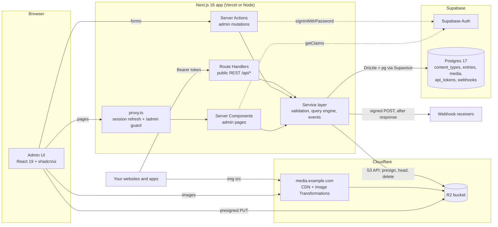
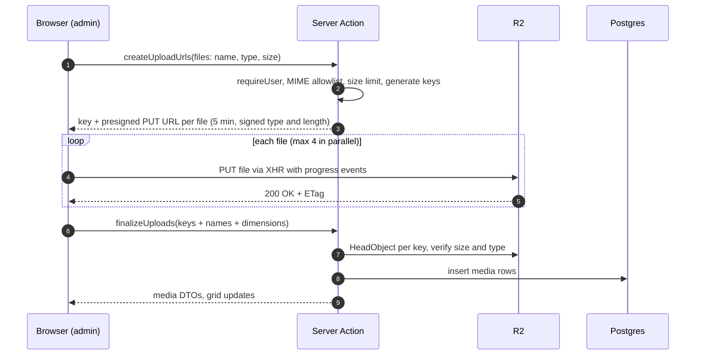
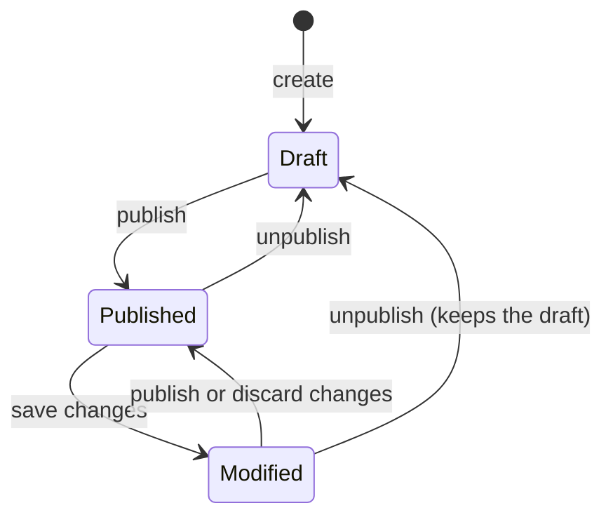

# Personal Headless CMS — Implementation Plan

> A lightweight, self-owned alternative to **Strapi**, built with **Next.js 16 (App Router)**, **Supabase** (Postgres + Auth) and **Cloudflare R2** (media storage).
>
> **Status:** Draft v1 · **Date:** 2026-10-02 · Library versions and platform facts below were verified on this date — re-check versions at install time.

---

## Table of contents

1. [Summary](#1-summary)
2. [Goals, non-goals & scope](#2-goals-non-goals--scope)
3. [Research findings](#3-research-findings)
4. [Key architecture decisions](#4-key-architecture-decisions)
5. [Tech stack](#5-tech-stack)
6. [System architecture](#6-system-architecture)
7. [Data model](#7-data-model)
8. [Field types](#8-field-types)
9. [Authentication & authorization](#9-authentication--authorization)
10. [Media library on Cloudflare R2](#10-media-library-on-cloudflare-r2)
11. [Public REST API](#11-public-rest-api)
12. [Webhooks](#12-webhooks)
13. [Admin UI](#13-admin-ui)
14. [Project structure](#14-project-structure)
15. [Configuration & environment variables](#15-configuration--environment-variables)
16. [Implementation roadmap](#16-implementation-roadmap)
17. [Testing strategy](#17-testing-strategy)
18. [Deployment & operations](#18-deployment--operations)
19. [Security checklist](#19-security-checklist)
20. [Backlog (after v1)](#20-backlog-after-v1)
21. [Risks & open questions](#21-risks--open-questions)
22. [References](#22-references)

---

## 1. Summary

We are building a headless CMS that keeps Strapi's core loop — **model content → edit content → upload media → consume it through a REST API** — with our own UI and a much smaller surface area.

**What v1 delivers**

- **Login-only admin.** Supabase Auth with email + password. There is no sign-up, invite or forgot-password flow. Users are created manually in the Supabase dashboard.
- **Content-Type Builder.** Collection types and single types, with 13 field types. Schemas are stored as data, so they can be edited safely in production.
- **Content Manager.**
  - List view with search, filters, sort, pagination and bulk actions.
  - Edit forms generated from the schema.
  - Draft & Publish with *draft / published / modified* states.
- **Media Library.** Drag-and-drop multi-file upload straight from the browser to R2 using presigned URLs, alt text and captions, a reusable picker, and on-the-fly image resizing.
- **Public REST API.**
  - Strapi-style query parameters: `filters`, `sort`, `pagination`, `fields`, `populate`, `status`.
  - API tokens (read-only / full-access).
  - A per-type "public read" switch.
- **Webhooks.** Signed with HMAC, retried on failure, and every delivery is logged. Strapi has none of these three.

**The key decisions**

- Content is stored as **JSONB documents**: the schema is data, not tables.
- **One row per entry** holds both the draft and the published snapshot.
- Data access goes through **Drizzle ORM over Supabase's connection pooler**, with Supabase's auto-generated REST API (the Data API) turned off.
- **Server Actions** power the admin and **Route Handlers** power the public API.
- Files are **uploaded directly to R2** with presigned URLs.

---

## 2. Goals, non-goals & scope

### Goals

| # | Goal |
|---|---|
| G1 | Cover Strapi's *core* functionality for one owner and a few manually created admins. |
| G2 | Our own UI/UX. This is not a visual clone of Strapi. |
| G3 | Schema changes are safe in production: no redeploys, and no data loss when a field is renamed. |
| G4 | Little to operate: runs on free or low tiers of Vercel, Supabase and Cloudflare. |
| G5 | Secure by default: no public sign-up, a minimal attack surface, and every input validated. |

### Non-goals for v1

- Sign-up, invites, password reset, magic links and end-user (website member) accounts.
- GraphQL, i18n and fine-grained RBAC.
- Review workflows, releases, SSO, audit logs and a plugin marketplace.
- Real-time collaboration and multi-tenancy.
- A REST *write* API. It is in the backlog; the admin writes through Server Actions.

### Scope: Strapi 5 feature → our decision

Legend: ✅ in v1 · 🔁 simplified or replaced · ⏭ later · ❌ skip

| Strapi feature | Decision | Phase |
|---|---|---|
| Collection types & single types | ✅ | 2 |
| Field types: text, rich text, number, boolean, date/datetime, email, enumeration, UID, media, relation, JSON | ✅ 13 types, one rich-text format | 2–4 |
| Password, biginteger, float, time-only fields | ❌ | — |
| Components (single/repeatable) & dynamic zones | ⏭ right after launch | 8 |
| Relations (6 kinds, bidirectional) | 🔁 "has one" / "has many", one-way; reverse lookups via filters | 2–3 |
| Content Manager list (search, filters, sort, columns, bulk publish/unpublish/delete) | ✅ | 3 |
| Edit view (generated form, field widths, entry title) | ✅ layout is configured in the builder | 3 |
| Draft & Publish (draft/published/modified, discard draft) | ✅ | 3 |
| Preview | ✅ simple preview link | 7 |
| Content history, Releases, Review workflows | ⏭ history later; ❌ the others | — |
| Media Library (upload, metadata, picker, search/filter/sort) | ✅ | 4 |
| Pre-generated responsive formats | 🔁 replaced by on-the-fly Cloudflare transformations | 4 |
| Media folders, crop/focal point, upload from URL | ⏭ | — |
| REST read API (filters, populate, fields, sort, pagination, status) | ✅ Strapi-like | 5 |
| REST write API | ⏭ | — |
| GraphQL | ❌ | — |
| API tokens (read-only, full-access, custom) | ✅ read-only + full-access; ⏭ custom | 5 |
| Users & Permissions plugin (end users, Public role) | 🔁 only a "public read" switch per type | 5 |
| Webhooks | ✅ plus signatures, retries and a delivery log | 6 |
| Admin users, roles, RBAC | 🔁 Supabase users created manually; one role in v1 | 1 |
| i18n | ⏭ | — |
| SSO, audit logs, AI, MCP server, marketplace | ❌ | — |

---

## 3. Research findings

### 3.1 Strapi 5: what we replicate

- **Structures.** Collection types (many entries), single types (exactly one entry), components (reusable field groups, single or repeatable) and dynamic zones (ordered lists of components). Components and dynamic zones come after launch.
- **Draft & Publish semantics we copy.**
  - **Draft** means never published. **Published** means no pending changes. **Modified** means published, with saved changes that aren't published yet.
  - Actions are *Save*, *Publish*, *Unpublish* and *Discard changes*.
  - Strapi checks only type, `maxLength`/`max` and enum membership on drafts. `required`, `min`/`minLength`, `regex`, `unique` and email format are checked only at publish.
- **REST conventions we mirror.**
  - Endpoints: `/api/:pluralApiId`, `/api/:pluralApiId/:id`, and `/api/:singularApiId` for single types.
  - Query string: `filters[field][$op]=…` with `$eq $ne $lt $lte $gt $gte $in $notIn $contains $containsi $startsWith $endsWith $null $notNull $between $or $and $not`, plus `sort=a:asc,b:desc`.
  - Pagination: `pagination[page|pageSize]` (default 25, max 100) or `pagination[start|limit]`.
  - Also `fields[]`, `populate` (`*`, arrays, objects) and `status=draft|published`.
  - Response shape: `{ data, meta: { pagination } }`. Errors: `{ data: null, error: { status, name, message, details } }`.
- **API tokens.** Read-only, full-access and custom. Durations are 7, 30 or 90 days, or unlimited. Tokens are stored as HMAC hashes, shown once, and track "last used".
- **Webhooks.** A name, URL, headers and events. Events: `entry.create|update|delete|publish|unpublish` and `media.create|update|delete`. Payload: `{ event, createdAt, model, entry }`. Strapi sends with a 10 s timeout, never retries and does not sign.
- **Naming.** The display name produces kebab-case singular and plural API IDs. Strapi reserves `id`, `documentId`, `createdAt`, `updatedAt`, `publishedAt`, `locale`, `status`, `meta` and more.

### 3.2 Strapi pain points we design around

1. **Schema edits only work in dev mode**, and the boot-time database sync silently drops columns. Renaming a field loses its data.
   → Our schema is data. Edits work in production, and each one runs as one non-destructive transaction that keeps renamed fields' data.
2. **Draft and published are two DB rows with different IDs.** → One row and one ID per entry.
3. **Validation fails late, at publish time.** → Type and uniqueness checks run on every save.
4. **Nothing is populated by default in the API.** → Media is always populated; relations are opt-in.
5. **Webhooks are unsigned and never retried.** → HMAC signatures, retries and a delivery log.
6. **Image sizes are pre-generated at upload.** → Images are resized on the fly at the CDN.
7. **Strapi needs a separate server.** → Everything is one Next.js app, and Server Components call the services in-process.

### 3.3 Next.js 16.3 (read from `node_modules/next/dist/docs`)

- **`proxy.ts` replaces `middleware.ts`.**
  - It lives at `src/proxy.ts`, exports `proxy`, and always runs on the Node.js runtime.
  - The docs position it for *optimistic* checks only.
  - Server Actions are POSTs to the route that uses them, so a matcher change can silently drop coverage. **Every Server Action must check auth itself.**
- **Request APIs are async-only:** `await params`, `await searchParams`, `await cookies()`. The generated global types `PageProps<'/route'>`, `LayoutProps` and `RouteContext` come from `next typegen`, `dev` or `build`.
- **Caching.**
  - `cacheComponents` is opt-in. It enables `use cache` and partial prerendering, and requires `<Suspense>` around request-time data.
  - Without it, GET Route Handlers are not cached and pages that read cookies are dynamic. That is exactly what an auth-gated admin needs.
  - `revalidateTag(tag, 'max')` now requires a cache profile.
  - `updateTag()` gives read-your-own-writes and only works in Server Actions.
  - `refresh()` re-renders the current route.
- **Server Actions.**
  - They have a built-in CSRF origin check.
  - The body limit is **1 MB** (`experimental.serverActions.bodySizeLimit`).
  - A client dispatches them **one at a time**, so batch work (e.g. presign 20 files in one call).
- **`after()`** schedules work after the response is sent. We use it for webhooks and token "last used" updates.
- **Tooling.**
  - Turbopack is the default bundler.
  - `next lint` was removed; use Biome or ESLint directly.
  - Node ≥ 20.9 is required.
  - `typedRoutes` is stable.
- **`next/image`.**
  - `images.domains` is deprecated; use `remotePatterns`, which accepts `new URL()`.
  - The default `qualities` is `[75]` and the default `minimumCacheTTL` is 4 h.
  - A custom `loaderFile` must be a `'use client'` module.

### 3.4 Supabase (October 2026)

- **API keys.** Projects created after 2025-11-01 only get `sb_publishable_…` (safe for the browser) and `sb_secret_…` (server-only, bypasses RLS). The legacy `anon` and `service_role` keys are being removed.
- **SSR auth with `@supabase/ssr` 0.12.**
  - `createServerClient` takes cookie `getAll`/`setAll`. `setAll` also receives no-cache headers that must be forwarded.
  - Trust **`getClaims()`**: it verifies the JWT, locally against the JWKS when asymmetric signing keys are used, which is the default for new projects since Oct 2025.
  - Never trust `getSession()` on the server.
- **Login-only works as needed.**
  - Turning off *"Allow new users to sign up"* blocks only sign-up; `signInWithPassword` keeps working.
  - In the dashboard, *Users → Add user → Create new user* auto-confirms the user and sends no email.
- **Email.** The built-in SMTP only delivers to members of your Supabase team. Password resets for admins are therefore done by the owner via the admin API or a script, which fits "login only".
- **Login rate limit.** Password logins share the `/token` limiter: 150 requests per 5 min per IP. Our login runs server-side, so every attempt comes from the server's IP. Turnstile CAPTCHA is available if abuse appears.
- **The Data API (PostgREST) can't do what we need** without writing Postgres functions:
  - copy one column into another (that is what publish does);
  - cast values inside filters;
  - run multi-statement transactions.

  We therefore use SQL through Drizzle.
- **Driver.**
  - Supabase warns that postgres.js query pipelining can hang or mismatch rows on the transaction pooler. Use **`pg` (node-postgres)** with `drizzle-orm/node-postgres`, plus `attachDatabasePool` on Vercel.
  - The direct DB host is IPv6-only. Use Supavisor instead: port 6543 (transaction mode) at runtime and 5432 (session mode) for tooling.
- **Drizzle version.** Stay on `drizzle-orm` 0.45 and `drizzle-kit` 0.31. The v1 release candidate changed the migration folder layout and dropped `migrations.prefix: 'supabase'`, so the Supabase CLI would ignore its output.
- **Data API exposure.** New tables are no longer auto-granted to the API roles: this has been the default for new projects since 2026-05-30, and applies to all projects from 2026-10-30. We turn the Data API **off** and keep RLS on as a second line of defence.
- **Free tier.** 500 MB database, the project pauses after about 7 days of low activity, and there are **no backups**. Use Pro ($25/mo) in production.

### 3.5 Cloudflare R2

- **Endpoint.** S3-compatible at `https://<ACCOUNT_ID>.r2.cloudflarestorage.com`; EU-jurisdiction buckets use `.eu.` in the host. Region is `auto`.
- **Checksum flags.** AWS SDK v3's default checksums put an *empty-body CRC32* into presigned URLs. Set `requestChecksumCalculation` and `responseChecksumValidation` to `'WHEN_REQUIRED'`.
- **What the presigner signs.**
  - It does **not** sign `Content-Type` unless you pass `signableHeaders: new Set(['content-type'])`.
  - A supplied `ContentLength` **is** signed, which forces an exact-size upload.
  - R2 has no presigned POST, so there is no `content-length-range` policy.
- **Browser uploads.** They need a bucket CORS rule allowing PUT with `Content-Type` and exposing `ETag`. Upload progress requires `XMLHttpRequest`; `fetch` can't report upload progress.
- **Public reads in production.**
  - Use a **custom domain**; the zone must be in the same Cloudflare account. `r2.dev` is rate-limited and meant for development only.
  - Deleting an object does **not** purge the CDN. Purge the URL through the API; that also purges its `/cdn-cgi/image` variants.
- **Image Transformations** on the custom domain use URLs like `/cdn-cgi/image/width=800,format=auto/<key>`. The first 5,000 unique transformations per month are free. After that it costs $0.50 per 1,000 on paid plans; on the free plan new variants fail with error 9422.
- **Pricing.** Free tier is 10 GB-month of storage, 1M Class A and 10M Class B operations per month, and **egress is always free**. Enabling R2 requires a payment method.
- **Security.** Never serve user-uploaded SVG or HTML as-is (stored XSS risk). Keep media on its own hostname and send `X-Content-Type-Options: nosniff`.

### 3.6 Admin UI ecosystem

- **shadcn/ui CLI v4** defaults to **Base UI** primitives; Radix is still supported. It has new `Field` and `InputGroup` components, an async `Combobox` that suits the relation picker, and `Sidebar` blocks.
- **Forms: react-hook-form 7 + Zod 4.** `@hookform/resolvers` 5.x supports Zod 4. This is the best fit for nested forms generated at runtime; RHF v8 is still in beta.
- **Rich text: Tiptap 3** (MIT) stores JSON. `@tiptap/static-renderer` renders HTML on the server without a DOM.
- **Tables: TanStack Table v9** is stable (Aug 2026) and safe with the React Compiler.
- **Drag and drop: `@dnd-kit/react` 0.5** is the maintained dnd-kit line. It is pre-1.0, so pin the exact version.
- **Dark mode.** `next-themes` is unmaintained and logs a dev warning on React 19 with Next 16.2+. Use the inline-script theme pattern from the Next.js docs instead.
- **Query strings.** Use `qs` ≥ 6.14.2 (it contains DoS fixes), with strict limits, to parse Strapi-style query strings.
- **Testing and linting.** Vitest 5 (needs Node ≥ 22.12), Playwright 1.63 and Biome 2.5. Biome avoids today's peer conflicts between ESLint 10 / TypeScript 7 and `eslint-config-next`.

---

## 4. Key architecture decisions

| # | Decision | Why | Trade-off → mitigation |
|---|---|---|---|
| D1 | **Store content as JSONB documents.** Content-type schemas are rows, not tables. | Schemas can be edited in production with no DDL. A rename is a single `UPDATE`, and draft/published snapshots are trivial. | The database doesn't type-check fields → every write is validated with a Zod schema generated from the content type. GIN and expression indexes keep queries fast. |
| D2 | **One row per entry** with `draft_data` and `published_data`. | Publishing is atomic (`published_data = draft_data`). There is one stable ID, and status comes from a generated column. | Two copies per row → negligible at CMS scale. |
| D3 | **Drizzle ORM 0.45 + `pg` over the Supavisor pooler.** supabase-js is used only for Auth, and the Data API is off. | We need SQL that PostgREST can't express: column copies, casts, transactions and advisory locks. It also shrinks the attack surface. | Authorization lives entirely in our server code → a single Data Access Layer (DAL) with tests. |
| D4 | **Admin = Server Actions; public API = Route Handlers.** Both call one shared service layer. | Next-native and CSRF-protected, with no admin REST API to secure. | Actions run one at a time per client → batch operations. |
| D5 | **Browsers upload directly to R2** with presigned PUT URLs. | Avoids Vercel's 4.5 MB body limit and the 1 MB Server Action limit, and uses no server bandwidth. | Needs bucket CORS → plus a finalize step that verifies the file with `HeadObject`. |
| D6 | **Resize images on the fly** with Cloudflare Image Transformations. | No variant pipeline and no extra storage; any size on demand. | Free quota is 5k unique variants per month → fall back to the original URL or `next/image`. |
| D7 | **Store relations and media as ID(s) inside the document.** | Works naturally with snapshots: a published snapshot keeps the relations it had. No join tables. | No foreign-key integrity → missing targets are dropped when reading, and media deletes warn which entries use the file. |
| D8 | **API populates media by default; relations need `populate`; components are inline.** | Fixes Strapi's most common API annoyance without bloating payloads. | Differs from Strapi → documented. |
| D9 | **Drafts get type and uniqueness checks; publish gets full validation.** | Drafts can be incomplete, but conflicts surface early. | — |
| D10 | **No `cacheComponents` in v1.** | The admin is 100% per-user and dynamic, and this avoids wrapping everything in Suspense. | The API isn't cached on the server → consumer sites cache their reads and refresh on webhooks; revisit later. |
| D11 | **Login-only auth** with users created in the Supabase dashboard, mirrored into a `profiles` table that has an `is_active` switch. | Matches the requirement. Deactivation takes effect immediately rather than waiting up to 1 h for the JWT to expire. | Passwords are changed by the owner → via the admin API or a script. |

---

## 5. Tech stack

Versions as of 2026-10-02.

| Layer | Choice | Version | Notes |
|---|---|---|---|
| Runtime | Node.js LTS | 24 (min 22.12) | Vitest 5, jsdom and react-dropzone need ≥ 22 |
| Framework | Next.js (App Router, Turbopack) + React | 16.3.8 / 19.2 | already installed |
| Language | TypeScript (strict) | 5.x | already installed |
| Styling | Tailwind CSS | 4.x | already installed |
| UI kit | shadcn/ui (CLI v4, **Base UI** primitives) + lucide-react | 4.21 / 1.x | generated into `src/components/ui` |
| Forms | react-hook-form + @hookform/resolvers + Zod | 7.89 / 5.9 / 4.6 | one schema builder shared by client and server |
| Tables | @tanstack/react-table | 9.2 | server-side mode |
| URL state | nuqs | 2.10 | list filters, sort and pagination in the URL |
| Drag & drop | @dnd-kit/react + @dnd-kit/helpers | 0.5.0 (pin) | field ordering, repeatables |
| Rich text | Tiptap (StarterKit + Image) + @tiptap/static-renderer | 3.31 | JSON stored, HTML served |
| JSON editor | @uiw/react-codemirror + @codemirror/lang-json | 4.25 | lazy-loaded |
| Dates | date-fns + @date-fns/tz; react-day-picker | 4.4; **9.14 (pin)** | pin until shadcn's Calendar supports v10 |
| Slugs | @sindresorhus/slugify | 3.x | good transliteration (Polish, German, …) |
| File drop | react-dropzone (+ XHR for progress) | 20.x | |
| Auth | @supabase/ssr + @supabase/supabase-js | 0.12.7 / 2.117 | auth only |
| Database | Supabase Postgres 17; drizzle-orm (node-postgres) + pg; drizzle-kit | 0.45.3 / 8.23 / 0.31.11 | do **not** use the 1.0 RC yet |
| Pooling helper | @vercel/functions (`attachDatabasePool`) | 3.9 | Vercel Fluid compute |
| Object storage | @aws-sdk/client-s3 + @aws-sdk/s3-request-presigner | 3.x | pointed at R2 |
| Query strings | qs | ≥ 6.16 | strict limits |
| Utilities | server-only, nanoid, pluralize | — | |
| Tests | Vitest + Testing Library; Playwright | 5.0 / 16.3; 1.63 | |
| Lint/format | Biome | 2.5 (pin) | `next lint` no longer exists |
| DB tooling | Supabase CLI (+ Docker for the local stack) | 2.119 | migrations, local Postgres + Auth |
| Hosting | Vercel (Fluid compute), or any Node host / Docker | — | |

---

## 6. System architecture

### 6.1 Overview



### 6.2 Layers and rules

| Layer | Location | Rules |
|---|---|---|
| Pages | `src/app/**` | Thin. Call the DAL and services, then render. Pass plain DTOs (no DB rows) to Client Components. |
| Server Actions | `src/actions/*.ts` (`'use server'`) | Always `requireUser()` → Zod-parse the input → call a service → `refresh()`/`revalidatePath()` → return an `ActionResult`. |
| Services | `src/server/services/*` (`import 'server-only'`) | Own the business rules, transactions and event emission. Called by both actions and API handlers. |
| Public API plumbing | `src/server/api/*` | Token auth, query parsing and compilation, serialization. Never imports admin UI code. |
| Shared (isomorphic) | `src/lib/**` | Field definitions, the `buildEntrySchema()` validator builder, naming rules, URL helpers. Used by forms in the browser *and* by the server. |

All Server Actions return the same shape:

```ts
type ActionResult<T> =
  | { ok: true; data: T }
  | { ok: false; error: string; fieldErrors?: Record<string, string[]> }
```

### 6.3 Request flows

**A. Admin page render**
1. `proxy.ts` refreshes the Supabase session cookie. With no session it redirects to `/login?next=…`.
2. The page (a Server Component) calls `requireUser()`, which runs `getClaims()` and checks for an active `profiles` row.
3. The page loads data through services and hands DTOs to Client Components (tables, forms).

**B. Admin mutation**
1. The client form (react-hook-form) validates with the shared Zod schema, then calls a Server Action with a plain object.
2. The action runs `requireUser()`, validates again on the server, and calls the service, which runs a transaction.
3. The action calls `refresh()` so the current route re-renders in the same round trip, then returns its result.
4. The service emits a domain event, and `after()` delivers webhooks once the response has gone out.

**C. Public API request**
1. Example: `GET /api/articles?filters[slug][$eq]=hello&populate=*`.
2. Resolve the content type from the API ID, authenticate the caller (Bearer token or public), and check the action is allowed.
3. Parse with `qs` (strict limits), validate with Zod, and compile to SQL with whitelisted fields and typed casts.
4. Serialize: published snapshot → private fields removed → media and relations populated in batches → JSON with CORS and cache headers.

**D. Media upload** (details in [§10.2](#102-upload-flow))



**E. Webhook delivery.** Service `emit()` → `after()` → load enabled webhooks subscribed to the event → POST signed JSON (10 s timeout, up to 3 attempts) → write a row to `webhook_deliveries`.

---

## 7. Data model

### 7.1 Tables

The model is implemented as a Drizzle schema in `src/server/db/schema.ts`. `drizzle-kit generate` writes the SQL migrations into `supabase/migrations/`. The SQL below shows the intended result.

```sql
-- ── Admin users: 1:1 mirror of auth.users ─────────────────────────────
create table public.profiles (
  id            uuid primary key references auth.users (id) on delete cascade,
  email         text not null,
  display_name  text,
  role          text not null default 'admin' check (role in ('owner', 'admin', 'editor')),
  is_active     boolean not null default true,
  created_at    timestamptz not null default now(),
  updated_at    timestamptz not null default now()
);

-- ── Content types: the schema lives here, as data ────────────────────
create table public.content_types (
  id            uuid primary key default gen_random_uuid(),
  kind          text not null check (kind in ('collection', 'single')),
  display_name  text not null,
  singular_id   text not null unique,            -- 'article'  (admin URLs, single-type API path)
  plural_id     text not null unique,            -- 'articles' (collection API path)
  description   text,
  fields        jsonb not null default '[]',     -- FieldDefinition[] (ordered)
  settings      jsonb not null default '{}',     -- ContentTypeSettings
  created_at    timestamptz not null default now(),
  updated_at    timestamptz not null default now(),
  created_by    uuid references public.profiles (id) on delete set null,
  updated_by    uuid references public.profiles (id) on delete set null
);

-- ── Entries: one row per document, holding draft + published snapshots ─
create table public.entries (
  id                  uuid primary key default gen_random_uuid(),
  content_type_id     uuid not null references public.content_types (id) on delete cascade,
  draft_data          jsonb not null default '{}',
  published_data      jsonb,                     -- null = not published
  status              text generated always as (
                        case when published_data is null      then 'draft'
                             when draft_data = published_data then 'published'
                             else 'modified' end) stored,
  published_at        timestamptz,
  first_published_at  timestamptz,
  created_at          timestamptz not null default now(),
  updated_at          timestamptz not null default now(),
  created_by          uuid references public.profiles (id) on delete set null,
  updated_by          uuid references public.profiles (id) on delete set null
);
create index entries_type_updated_idx on public.entries (content_type_id, updated_at desc);
create index entries_type_status_idx  on public.entries (content_type_id, status);
create index entries_draft_gin        on public.entries using gin (draft_data jsonb_path_ops);
create index entries_published_gin    on public.entries using gin (published_data jsonb_path_ops);

-- ── Media: files live in R2, metadata lives here ─────────────────────
create table public.media (
  id            uuid primary key default gen_random_uuid(),
  storage_key   text not null unique,            -- 'media/2026/10/<uuid>-hero.jpg' (immutable)
  file_name     text not null,                   -- original file name
  name          text not null,                   -- editable display name
  alt_text      text,
  caption       text,
  mime_type     text not null,
  size_bytes    bigint not null,
  width         integer,
  height        integer,
  placeholder   text,                            -- thumbhash data URL (optional)
  created_at    timestamptz not null default now(),
  updated_at    timestamptz not null default now(),
  created_by    uuid references public.profiles (id) on delete set null,
  updated_by    uuid references public.profiles (id) on delete set null
);
create index media_created_idx on public.media (created_at desc);

-- ── API tokens: stored as HMAC hashes, plaintext shown once ──────────
create table public.api_tokens (
  id            uuid primary key default gen_random_uuid(),
  name          text not null,
  description   text,
  access        text not null check (access in ('read_only', 'full_access')),
  token_hash    text not null unique,            -- hex(HMAC-SHA256(token, API_TOKEN_PEPPER))
  token_hint    text not null,                   -- e.g. 'cms_Ab12…9xYz'
  expires_at    timestamptz,                     -- null = never expires
  last_used_at  timestamptz,
  created_at    timestamptz not null default now(),
  created_by    uuid references public.profiles (id) on delete set null
);

-- ── Webhooks + delivery log ───────────────────────────────────────────
create table public.webhooks (
  id          uuid primary key default gen_random_uuid(),
  name        text not null,
  url         text not null,
  events      text[] not null default '{}',
  headers     jsonb not null default '{}',       -- extra static headers
  secret      text not null,                     -- HMAC signing secret
  enabled     boolean not null default true,
  created_at  timestamptz not null default now(),
  updated_at  timestamptz not null default now()
);
create table public.webhook_deliveries (
  id            uuid primary key default gen_random_uuid(),
  webhook_id    uuid not null references public.webhooks (id) on delete cascade,
  event         text not null,
  attempt       integer not null default 1,
  status_code   integer,
  success       boolean not null,
  duration_ms   integer,
  error         text,
  request_body  jsonb,
  created_at    timestamptz not null default now()
);
create index webhook_deliveries_idx on public.webhook_deliveries (webhook_id, created_at desc);

-- ── Phase 8: components (reusable field groups) ──────────────────────
create table public.components (
  id            uuid primary key default gen_random_uuid(),
  uid           text not null unique,            -- 'shared.seo'
  category      text not null,                   -- 'shared'
  display_name  text not null,
  icon          text,
  fields        jsonb not null default '[]',
  created_at    timestamptz not null default now(),
  updated_at    timestamptz not null default now()
);
```

Security setup is a custom SQL migration (`drizzle-kit generate --custom --name=security`):

```sql
-- RLS on everywhere, with NO policies: nothing is reachable through the Data API
-- (which is also disabled). The app connects as the table owner and is not affected.
alter table public.profiles           enable row level security;
alter table public.content_types      enable row level security;
alter table public.entries            enable row level security;
alter table public.media              enable row level security;
alter table public.api_tokens         enable row level security;
alter table public.webhooks           enable row level security;
alter table public.webhook_deliveries enable row level security;

-- Never auto-grant future tables/functions to the API roles
alter default privileges for role postgres in schema public
  revoke select, insert, update, delete on tables from anon, authenticated, service_role;
alter default privileges for role postgres in schema public
  revoke execute on functions from public, anon, authenticated, service_role;

-- Every user the owner creates in the dashboard gets a profile.
-- The very first user becomes 'owner'.
create function public.handle_new_user()
returns trigger
language plpgsql
security definer set search_path = ''
as $$
begin
  insert into public.profiles (id, email, role)
  values (
    new.id,
    new.email,
    case when exists (select 1 from public.profiles) then 'admin' else 'owner' end
  );
  return new;
end;
$$;
create trigger on_auth_user_created
  after insert on auth.users
  for each row execute procedure public.handle_new_user();
revoke execute on function public.handle_new_user() from public, anon, authenticated;
```

### 7.2 Content-type definition format

This lives in `src/lib/schema/types.ts` and is validated with Zod on every save in the builder.

```ts
export type FieldType =
  | 'text' | 'longtext' | 'richtext' | 'number' | 'boolean'
  | 'date' | 'datetime' | 'email' | 'enumeration' | 'uid'
  | 'media' | 'relation' | 'json'
  | 'component' | 'dynamiczone' // phase 8

interface FieldBase {
  id: string            // stable nanoid; never changes, so renames can be detected
  name: string          // API key: /^[A-Za-z][A-Za-z0-9_]*$/, not reserved
  label: string
  description?: string  // help text under the input
  required?: boolean    // enforced on publish
  private?: boolean     // never returned by the public API
  ui?: { width?: 4 | 6 | 8 | 12; placeholder?: string } // 12-column edit grid
}

export type FieldDefinition = FieldBase & (
  | { type: 'text' | 'longtext'; unique?: boolean; minLength?: number; maxLength?: number; regex?: string; default?: string }
  | { type: 'richtext' }
  | { type: 'number'; format: 'integer' | 'decimal'; unique?: boolean; min?: number; max?: number; default?: number }
  | { type: 'boolean'; default?: boolean }
  | { type: 'date' | 'datetime'; default?: 'now' | string }
  | { type: 'email'; unique?: boolean }
  | { type: 'enumeration'; values: string[]; default?: string }
  | { type: 'uid'; targetField?: string; regex?: string }           // always unique
  | { type: 'media'; multiple: boolean; allowedTypes: Array<'image' | 'video' | 'audio' | 'file'> }
  | { type: 'relation'; target: string; multiple: boolean }        // target = content_types.id
  | { type: 'json' }
  | { type: 'component'; component: string; repeatable: boolean; min?: number; max?: number }
  | { type: 'dynamiczone'; components: string[]; min?: number; max?: number }
)

export interface ContentTypeSettings {
  draftAndPublish: boolean                              // default true
  displayField?: string                                 // "entry title" in lists and relation pickers
  listColumns?: string[]                                // list-view columns
  defaultSort?: { field: string; order: 'asc' | 'desc' }
  publicRead?: boolean                                  // allow find/findOne without a token
  previewUrl?: string                                   // e.g. 'https://example.com/api/draft?slug={slug}'
}
```

**Naming rules**

- **API IDs** are kebab-case (`^[a-z][a-z0-9-]*$`). They are derived from the display name with `pluralize`, and the singular must differ from the plural.
- **Every ID is unique** across all singular *and* plural IDs.
- **Reserved API IDs:** `admin`, `api`, `auth`, `login`, `logout`, `health`, `media`, `upload`, `uploads`, `files`, `users`, `tokens`, `webhooks`, `content-types`, `components`, `settings`, `graphql`, `i18n`, plus anything starting with `_`.
- **Reserved field names:** `id`, `documentId`, `createdAt`, `updatedAt`, `publishedAt`, `firstPublishedAt`, `createdBy`, `updatedBy`, `status`, `locale`, `meta`, `data`, `__component`, `__id`, plus anything starting with `_` or `$`.

### 7.3 Entry document example

Example content type `Article` (`article` / `articles`). `draft_data` (and `published_data` once published) look like this:

```json
{
  "title": "Uploading straight to R2",
  "slug": "uploading-straight-to-r2",
  "excerpt": "Presigned URLs keep large files off our servers.",
  "body": { "type": "doc", "content": [{ "type": "paragraph", "content": [{ "type": "text", "text": "Hello!" }] }] },
  "cover": "6f1c0a52-8a4e-4c9b-9a51-2f7f5b0d1e11",
  "tags": ["0b7e3c1d-…", "91aa4f20-…"],
  "author": "c3d2e5f6-…",
  "publishedOn": "2026-10-02",
  "featured": true,
  "category": "guide"
}
```

### 7.4 Draft & Publish state machine



| Action | SQL effect | Status after | Webhook |
|---|---|---|---|
| Create | `insert … draft_data = $input` | draft | `entry.create` |
| Save | `draft_data = $input` | draft / modified | `entry.update` |
| Publish | (save if dirty) then `published_data = draft_data, published_at = now(), first_published_at = coalesce(first_published_at, now())` | published | `entry.publish` |
| Unpublish | `published_data = null, published_at = null` | draft | `entry.unpublish` |
| Discard changes | `draft_data = published_data` | published | `entry.update` |
| Delete | `delete` | — | `entry.delete` |
| Save on a type without Draft & Publish | `draft_data = published_data = $input` | always published | `entry.update` |

**Optimistic locking.** Every save sends the `updated_at` it loaded and runs `… where id = $id and updated_at = $expected`. Zero rows updated means "this entry was changed by someone else — reload".

### 7.5 Validation: draft vs publish

`buildEntrySchema(contentType, { mode })` in `src/lib/schema` builds a Zod object from the field definitions. It runs in the browser as the react-hook-form resolver and on the server, where it is authoritative. Unknown keys are stripped.

| Rule | On save (draft) | On publish |
|---|---|---|
| Type/shape (string, number, ISO date, enum member, UUID format) | ✅ | ✅ |
| `maxLength`, `max` | ✅ | ✅ |
| `unique` / UID uniqueness (checked in the DB) | ✅ (stricter than Strapi) | ✅ |
| `required`, `minLength`, `min`, `regex`, email format | — | ✅ |
| Repeatable / dynamic zone `min`/`max` items (phase 8) | — | ✅ |
| Referenced media / entries exist | — | ✅ (warn if a related entry is unpublished) |

### 7.6 Uniqueness

Uniqueness is checked inside the save or publish transaction:

1. `select pg_advisory_xact_lock(hashtextextended($contentTypeId || ':' || $field, 0))`.
2. Run `select 1 from entries where content_type_id = $ct and id <> $id and (draft_data->>$field = $value or published_data->>$field = $value) limit 1`.
3. If a row is found, return a field error: *"Already used by 'Other entry'"*.

Turning `unique` on for an existing field first scans for duplicates and refuses with a list of the clashing entries. UID fields also get a live availability check in the editor.

### 7.7 Relations and media references

- **Storage.** Stored as a UUID string ("has one") or an ordered UUID array ("has many").
- **Snapshots.** The published snapshot keeps the IDs it had at publish time.
- **Reads.**
  - Targets are loaded in batches (one query per target type per response), and missing targets are silently dropped.
  - Published reads only return related entries that are themselves published.
  - Reverse lookups are plain filters, e.g. `filters[author][$eq]=<authorId>`. These compile to `published_data @> '{"author":"<id>"}'`, which the GIN index serves.
- **Deleting a content type** that other types point at is **blocked**, with a message like "Article.author targets Author — remove that field first".
- **Media "used by" check.** `draft_data @? '$.** ? (@ == "<mediaId>")' or published_data @? …` finds exact matches at any depth, including inside components and rich-text image attributes.

### 7.8 Schema evolution rules

When the builder saves a schema, it diffs the old and new field lists by field `id`. All migrations below run in the same transaction as the schema update.

| Change | Allowed | Data migration |
|---|---|---|
| Add a field | ✅ | none (a missing key reads as `null` / default) |
| Rename a field (same `id`, new `name`) | ✅ | `draft_data = (draft_data - old) \|\| jsonb_build_object(new, draft_data->old)` where `draft_data ? old`; same for `published_data`. Also updates `displayField`, `listColumns` and `uid.targetField`. |
| Delete a field | ✅ after confirmation | `draft_data - name`, `published_data - name` |
| Change a field's type or relation target | ❌ delete and re-add | — |
| Toggle `required` / `private` | ✅ | none |
| Turn `unique` on | ✅ if there are no duplicates | duplicate scan |
| Edit enumeration values | ✅ | warn if entries use a removed value |
| Turn Draft & Publish off | ✅ after confirmation | `published_data = draft_data` for every entry |
| Turn Draft & Publish on | ✅ | none; existing entries stay published |
| Change API IDs | ✅ with a warning ("breaks API consumers") | none |
| Delete a content type | ✅ after typing its name; blocked if referenced | entries cascade |

The confirmation dialog shows the impact, e.g. *"1 field renamed, 1 deleted → 134 entries will be updated"*.

### 7.9 Database security posture

- **Data API disabled** (Supabase → Integrations → Data API). We never query through PostgREST.
- **RLS enabled on every table with no policies** as a second line of defence. Supabase's *Security Advisor* will show the INFO-level note `rls_enabled_no_policy`; that is expected.
- **Default privileges revoked** for `anon`, `authenticated` and `service_role`.
- **The app connects as `postgres` (the table owner) through the pooler**, so RLS doesn't apply to it. Authorization is enforced by the DAL and services. `DATABASE_URL` is a server-only secret.

---

## 8. Field types

| Type | Stored as | Settings | Admin input | API output |
|---|---|---|---|---|
| `text` | string | required, unique, min/maxLength, regex, default | input | string |
| `longtext` | string | required, min/maxLength, default | auto-growing textarea | string |
| `richtext` | Tiptap JSON document | required | Tiptap editor: headings, bold/italic, lists, links, quote, code, images from the library | HTML string (default) or the JSON doc with `richText=json` |
| `number` | number | integer/decimal, min, max, unique, default | number input | number |
| `boolean` | boolean | default | switch | boolean |
| `date` | `"YYYY-MM-DD"` | required, default (today) | date picker | string |
| `datetime` | ISO 8601 UTC | required, default (now) | date + time picker, shown in local time | string |
| `email` | string | required, unique | email input | string |
| `enumeration` | string | values, default, required | select (or radio if ≤ 4 values) | string |
| `uid` | slug string | target field, regex | input + "generate" button + availability badge | string |
| `media` | UUID or UUID[] | single/multiple, allowed types, required | media picker (library + upload) with sortable thumbnails | media object(s), **always populated** |
| `relation` | UUID or UUID[] | target type, has one / has many, required | async search combobox on the target's display field; sortable chips for "many" | ID(s), or objects when `populate` names it |
| `json` | any JSON | required | CodeMirror JSON editor with linting | JSON |
| `component` *(P8)* | object or object[] | component, repeatable, min/max | nested fieldset or sortable, collapsible list | object(s) |
| `dynamiczone` *(P8)* | `[{ "__component": "…", … }]` | allowed components, min/max | sortable blocks + "Add block" picker | array with `__component` |

Each field type is one module in a **field registry** (`src/components/fields/registry.ts`):

```ts
interface FieldTypeModule<F extends FieldDefinition> {
  type: F['type']
  label: string
  icon: LucideIcon
  settingsSchema: z.ZodType          // validates the field definition in the builder
  SettingsForm: React.ComponentType  // builder UI for the field's options
  Input: React.ComponentType<{ field: F }> // connected to react-hook-form via Controller
  toZod(field: F, mode: 'draft' | 'publish'): z.ZodType
  defaultValue(field: F): unknown
}
```

Adding a new field type later means adding one module.

---

## 9. Authentication & authorization

### 9.1 Supabase project configuration (one-time)

1. **Create the project** in a region close to your users and your hosting, e.g. `eu-central-1` (Frankfurt) with Vercel `fra1`.
2. **Disable sign-ups.** Authentication → Sign In / Providers → turn **off** "Allow new users to sign up". Keep the Email provider enabled.
3. **Check signing keys.** Authentication → JWT signing keys should show an **asymmetric key (ES256/RS256)**, so `getClaims()` verifies tokens locally. New projects have this by default.
4. **Create users.** Authentication → Users → *Add user → Create new user*, entering email and password with **Auto confirm** checked. The first user becomes `owner` through the trigger.
5. **Turn off the Data API.** Integrations → Data API → disable it.
6. **Copy the keys.** Settings → API keys: copy the **publishable key**. A **secret key** is only needed for the optional password-reset script.
7. **Copy the database connection details** (Database → Connect):
   - the **transaction pooler** URI (port 6543) for the app;
   - the **session pooler** URI (port 5432) for migrations;
   - the **SSL root certificate**.
8. **Optional: CAPTCHA.** Authentication → Attack Protection → enable **Cloudflare Turnstile** for logins.
9. **Run the migrations and check the advisor.** Run `supabase link` then `supabase db push`, and check Advisors → Security shows no errors.

### 9.2 Auth flow

- **Login.** `/login` posts to the `login` Server Action, which calls `supabase.auth.signInWithPassword()`. `@supabase/ssr` writes the session cookies, and the action redirects to `next`, accepted only if it starts with `/admin`; otherwise `/admin`.
- **Session refresh.** `src/proxy.ts` uses the matcher `/admin/:path*`. It refreshes the session cookie and redirects anonymous visitors to `/login?next=…`. It is an *optimistic* gate only.
- **Real checks.** Every admin page, data loader and Server Action calls `requireUser()` from the DAL:
  - it runs `getClaims()`;
  - it loads the user's `profiles` row and requires `is_active = true`;
  - it is wrapped in React `cache()`, so it runs once per request.
- **Deactivated users.** If a user has a valid Supabase session but `is_active = false`, the DAL denies access. `/login` then shows *"Your account is disabled"* with a sign-out button, so there's no redirect loop.
- **Logout** is a Server Action that calls `signOut()` and redirects to `/login`.
- **The public API never uses Supabase sessions**, only API tokens.
- **No sign-up, invite, magic-link or forgot-password routes exist.** The owner changes passwords with `scripts/set-password.ts`, which calls `auth.admin.updateUserById(id, { password })` with the secret key.

### 9.3 Code sketches

**Supabase server client** (`src/server/auth/supabase.ts`):

```ts
import 'server-only'
import { createServerClient } from '@supabase/ssr'
import { cookies } from 'next/headers'

export async function createSupabaseServerClient() {
  const cookieStore = await cookies()
  return createServerClient(
    process.env.NEXT_PUBLIC_SUPABASE_URL!,
    process.env.NEXT_PUBLIC_SUPABASE_PUBLISHABLE_KEY!,
    {
      cookies: {
        getAll: () => cookieStore.getAll(),
        setAll(cookiesToSet) {
          try {
            cookiesToSet.forEach(({ name, value, options }) => cookieStore.set(name, value, options))
          } catch {
            // Called from a Server Component: safe to ignore, proxy.ts refreshes sessions.
          }
        },
      },
    },
  )
}
```

**Proxy** (`src/proxy.ts` + `src/server/auth/proxy-session.ts`). This follows the official `updateSession` pattern:

```ts
// src/proxy.ts
import type { NextRequest } from 'next/server'
import { updateSession } from '@/server/auth/proxy-session'

export async function proxy(request: NextRequest) {
  return updateSession(request)
}

export const config = { matcher: ['/admin/:path*'] }
```

```ts
// src/server/auth/proxy-session.ts
import { createServerClient } from '@supabase/ssr'
import { NextResponse, type NextRequest } from 'next/server'

export async function updateSession(request: NextRequest) {
  let response = NextResponse.next({ request })
  const supabase = createServerClient(
    process.env.NEXT_PUBLIC_SUPABASE_URL!,
    process.env.NEXT_PUBLIC_SUPABASE_PUBLISHABLE_KEY!,
    {
      cookies: {
        getAll: () => request.cookies.getAll(),
        setAll(cookiesToSet, headers) {
          cookiesToSet.forEach(({ name, value }) => request.cookies.set(name, value))
          response = NextResponse.next({ request })
          cookiesToSet.forEach(({ name, value, options }) => response.cookies.set(name, value, options))
          Object.entries(headers).forEach(([key, value]) => response.headers.set(key, value)) // no-cache headers
        },
      },
    },
  )

  // Must run right after createServerClient: validates the JWT and refreshes it if needed.
  const { data } = await supabase.auth.getClaims()

  if (!data?.claims) {
    const url = request.nextUrl.clone()
    url.pathname = '/login'
    url.search = `?next=${encodeURIComponent(request.nextUrl.pathname + request.nextUrl.search)}`
    const redirect = NextResponse.redirect(url)
    response.cookies.getAll().forEach((cookie) => redirect.cookies.set(cookie)) // keep cookie changes
    return redirect
  }
  return response
}
```

**Data Access Layer** (`src/server/auth/dal.ts`):

```ts
import 'server-only'
import { cache } from 'react'
import { redirect } from 'next/navigation'
import { eq } from 'drizzle-orm'
import { db } from '@/server/db'
import { profiles } from '@/server/db/schema'
import { createSupabaseServerClient } from './supabase'

export const getCurrentUser = cache(async () => {
  const supabase = await createSupabaseServerClient()
  const { data } = await supabase.auth.getClaims()
  const userId = data?.claims?.sub
  if (!userId) return null

  const [profile] = await db.select().from(profiles).where(eq(profiles.id, userId)).limit(1)
  if (!profile?.isActive) return null
  return { id: profile.id, email: profile.email, name: profile.displayName, role: profile.role }
})

export async function requireUser() {
  const user = await getCurrentUser()
  if (!user) redirect('/login')
  return user
}
```

**Login and logout actions** (`src/actions/auth.ts`). The form is a Client Component using `useActionState(login, undefined)`.

```ts
'use server'
import { redirect } from 'next/navigation'
import * as z from 'zod'
import { createSupabaseServerClient } from '@/server/auth/supabase'

const LoginInput = z.object({ email: z.email(), password: z.string().min(1), next: z.string().optional() })

export async function login(_prev: { error?: string } | undefined, formData: FormData) {
  const input = LoginInput.safeParse(Object.fromEntries(formData))
  if (!input.success) return { error: 'Enter your email and password.' }

  const supabase = await createSupabaseServerClient()
  const { error } = await supabase.auth.signInWithPassword({
    email: input.data.email,
    password: input.data.password,
  })
  if (error) return { error: 'Invalid email or password.' } // never reveal which part was wrong

  redirect(input.data.next?.startsWith('/admin') ? input.data.next : '/admin')
}

export async function logout() {
  const supabase = await createSupabaseServerClient()
  await supabase.auth.signOut()
  redirect('/login')
}
```

### 9.4 Authorization rules

- In v1, **every active user has full admin rights**. `role` is stored now so RBAC can be added later (editors could manage content and media only). Only the `owner` can deactivate other users.
- **Every Server Action starts with `requireUser()`.** A test walks the exports of `src/actions/*` to enforce this.
- **Do not put auth checks only in layouts.** Layouts don't re-render on navigation. Check in pages, actions and the DAL.
- **Client Components never import `src/server/**`** (`server-only` enforces this). They receive narrow DTOs.

---

## 10. Media library on Cloudflare R2

### 10.1 Cloudflare setup (one-time)

1. **Enable R2.** A payment method is required even for the free tier.
2. **Create the bucket** `cms-media`.
   - **Data residency:** if you need EU data residency, create it with **EU jurisdiction** (`wrangler r2 bucket create cms-media --jurisdiction eu`). This **cannot be changed later**, and the S3 endpoint becomes `<ACCOUNT_ID>.eu.r2.cloudflarestorage.com`.
   - **Otherwise:** use location hint `weur` or `eeur`.
3. **Connect a custom domain**, e.g. `media.example.com`. Its zone must be in the same Cloudflare account. Keep the **r2.dev** URL disabled.
4. **Add the CORS policy** (bucket → Settings → CORS):

   ```json
   [{ "AllowedOrigins": ["https://cms.example.com", "http://localhost:3000"],
      "AllowedMethods": ["PUT"], "AllowedHeaders": ["Content-Type"],
      "ExposeHeaders": ["ETag"], "MaxAgeSeconds": 3600 }]
   ```

5. **Add a Cache Rule** on `media.example.com` to cache everything with a long edge and browser TTL (1 year), and turn on Smart Tiered Cache. Keys are immutable, so this is safe.
6. **Add a Response Header Transform Rule** on `media.example.com` that sets `X-Content-Type-Options: nosniff`.
7. **Optional, recommended:** enable Images → **Transformations** for the zone.
8. **Create an R2 API token** (Account API token) with **Object Read & Write scoped to `cms-media` only**. Copy its Access Key ID and Secret.
9. **Add a lifecycle rule** that aborts incomplete multipart uploads after 1 day.
10. **Optional:** create an API token with **Zone → Cache Purge** for `media.example.com`, so deleted files are purged from the CDN.

### 10.2 Upload flow

**S3 client** (`src/server/storage/r2.ts`):

```ts
import 'server-only'
import { S3Client } from '@aws-sdk/client-s3'

const jurisdiction = process.env.R2_JURISDICTION // 'eu' or undefined
export const r2 = new S3Client({
  region: 'auto',
  endpoint: `https://${process.env.R2_ACCOUNT_ID}${jurisdiction ? `.${jurisdiction}` : ''}.r2.cloudflarestorage.com`,
  credentials: {
    accessKeyId: process.env.R2_ACCESS_KEY_ID!,
    secretAccessKey: process.env.R2_SECRET_ACCESS_KEY!,
  },
  // Keep presigned URLs free of the SDK's default empty-body CRC32 params (R2 rejects them).
  requestChecksumCalculation: 'WHEN_REQUIRED',
  responseChecksumValidation: 'WHEN_REQUIRED',
})
```

**Step 1: request upload URLs.** One Server Action handles up to 20 files, because actions run one at a time.

```ts
'use server'
export async function createUploadUrls(files: UploadRequest[]): Promise<ActionResult<UploadTicket[]>> {
  await requireUser()
  const input = UploadRequests.parse(files) // MIME allowlist + per-kind size limit, max 20 files
  const tickets = await Promise.all(input.map(async (file) => {
    const key = buildStorageKey(file) // media/2026/10/<uuid>-<slugified-name>.<ext from allowlist>
    const url = await getSignedUrl(
      r2,
      new PutObjectCommand({ Bucket: env.R2_BUCKET, Key: key, ContentType: file.type, ContentLength: file.size }),
      { expiresIn: 300, signableHeaders: new Set(['content-type']) }, // signs content-type + content-length
    )
    return { key, url }
  }))
  return { ok: true, data: tickets }
}
```

**Step 2: the browser uploads each file with progress**, up to 4 in parallel.

```ts
function putWithProgress(url: string, file: File, onProgress: (ratio: number) => void) {
  return new Promise<void>((resolve, reject) => {
    const xhr = new XMLHttpRequest()
    xhr.open('PUT', url)
    xhr.setRequestHeader('Content-Type', file.type) // must equal the signed value
    xhr.upload.onprogress = (e) => e.lengthComputable && onProgress(e.loaded / e.total)
    xhr.onload = () => (xhr.status < 300 ? resolve() : reject(new Error(`Upload failed (${xhr.status})`)))
    xhr.onerror = () => reject(new Error('Network/CORS error'))
    xhr.send(file)
  })
}
```

**Step 3: finalize.** The `finalizeUploads(items)` action does the following:

1. Runs `requireUser()`.
2. Validates each key matches the pattern `media/YYYY/MM/<uuid>-…`.
3. Calls **`HeadObject`** and requires `ContentLength` and `ContentType` to match the declared values. On a mismatch it calls `DeleteObject` and reports an error.
4. Inserts the `media` rows, taking width and height from the browser's `createImageBitmap()`.
5. Emits `media.create` and returns DTOs.

### 10.3 Allowed types and limits

These defaults live in `src/lib/media/policy.ts` and are shared by client and server.

| Kind | MIME types | Max size |
|---|---|---|
| image | `image/jpeg`, `image/png`, `image/webp`, `image/avif`, `image/gif` | 20 MB |
| video | `video/mp4`, `video/webm` | 200 MB |
| audio | `audio/mpeg`, `audio/mp4`, `audio/ogg`, `audio/wav` | 50 MB |
| file | `application/pdf` (opt-in: csv, zip, docx, xlsx) | 50 MB |
| SVG | `image/svg+xml` — **disabled by default** (stored-XSS risk); enable only with a CSP-sandbox header rule | — |

- At most 20 files per batch, and presigned URLs live for 5 minutes.
- A single PUT handles files up to about 5 GB. Multipart (resumable) upload for very large files is in the backlog.

### 10.4 Delivery and image transformations

- **Public URL.** `url = ${NEXT_PUBLIC_MEDIA_BASE_URL}/${storage_key}`. Keys never change, because replacing a file writes a new key.
- **Resized URL.** With transformations on: `https://media.example.com/cdn-cgi/image/width=800,quality=75,format=auto/media/2026/10/<uuid>-hero.jpg`.
- **Admin UI images.** The admin uses `next/image` with a custom loader. When transformations are off it falls back to `remotePatterns` and Next's optimizer.

  ```ts
  // src/lib/media/image-loader.ts
  'use client'
  import type { ImageLoaderProps } from 'next/image'

  const BASE = process.env.NEXT_PUBLIC_MEDIA_BASE_URL!
  export default function mediaLoader({ src, width, quality }: ImageLoaderProps) {
    if (!src.startsWith(BASE)) return src // local /public assets pass through
    const key = src.slice(BASE.length + 1)
    return `${BASE}/cdn-cgi/image/width=${width},quality=${quality ?? 75},format=auto/${key}`
  }
  ```

- **API media object.** It includes `url`. When transformations are enabled it also includes **`formats`**: transformation URLs at Strapi's breakpoints (thumbnail 245, small 500, medium 750, large 1000), only those smaller than the original. It includes `placeholder` when a thumbhash exists.

### 10.5 Deleting and replacing

- **Delete.**
  1. Run the "used by" check ([§7.7](#77-relations-and-media-references)).
  2. Show a confirmation dialog listing the entries that use the file.
  3. Delete the DB row, then `DeleteObject` (a free operation).
  4. If configured, purge the URL from the Cloudflare cache; this also purges its resized variants.
  5. Emit `media.delete`.
- **Bulk delete** runs the same steps in a loop. Avoid `DeleteObjects`: it is untested with R2 and recent SDK checksum changes.
- **Replace file** (Phase 4 stretch):
  1. Upload the new file to a **new key**.
  2. Update `storage_key`, size and dimensions on the **same media row**. The ID stays the same, so content keeps working.
  3. Delete the old object and purge its URL.

### 10.6 Housekeeping

- **Orphans** are objects uploaded but never finalized, for example when a tab is closed mid-upload. A weekly maintenance job (Vercel Cron → protected route, or a script) lists `media/` keys older than 24 h that have no DB row and deletes them.
- **Optional:** an `after()` task fetches the object once, computes authoritative dimensions and a **thumbhash** placeholder with `sharp`, and updates the row.

---

## 11. Public REST API

### 11.1 Endpoints

| Method | Path | Description |
|---|---|---|
| `GET` | `/api/{pluralId}` | List published entries of a collection type |
| `GET` | `/api/{pluralId}/{idOrUid}` | One entry, by UUID or by the type's UID field (e.g. its slug) |
| `GET` | `/api/{singularId}` | A single type's entry (404 if unpublished) |
| `GET` | `/api/health` | Liveness check (no DB access) |
| `OPTIONS` | `/api/*` | CORS preflight |
| `POST`/`PUT`/`DELETE` | same paths | **Write API, backlog** (full-access tokens) |

These are implemented as `src/app/api/[apiId]/route.ts` and `src/app/api/[apiId]/[id]/route.ts`. Static routes such as `/api/health` take precedence over the dynamic segment, which is why those names are reserved.

### 11.2 Authentication and permissions

- **Header:** `Authorization: Bearer cms_…`.
- **Token format:** `cms_` followed by 32 random bytes encoded as base64url.
  - The token is shown **once** at creation.
  - It is stored as `HMAC-SHA256(token, API_TOKEN_PEPPER)` and looked up by that hash. Rotating the pepper invalidates every token.
- **Access types:**
  - **`read_only`:** list and find on published content.
  - **`full_access`:** additionally allows `status=draft` (preview), and later the write API.
- **Duration:** 7, 30 or 90 days, or unlimited. Tokens can be **regenerated** (new secret, same row) or **revoked** (row deleted).
- **Last used:** `last_used_at` is updated in `after()` at most once a minute per token.
- **Public access.** Each content type has a `settings.publicRead` switch that allows list and find without a token. It is **off by default**, matching Strapi's Public role.
- **Status codes:**
  - `401` for a missing, invalid or expired token on a non-public type.
  - `403` when the action isn't allowed, e.g. `status=draft` with a read-only token.
  - `404` for an unknown type or entry, or an unpublished single type.

### 11.3 Query parameters

| Parameter | Example | Notes |
|---|---|---|
| `filters` | `filters[title][$containsi]=next` | Schema fields and system fields (`id`, `createdAt`, `updatedAt`, `publishedAt`). `$or`/`$and`/`$not` nest up to 3 levels. |
| `_q` | `_q=hello` | Case-insensitive search across text-like fields |
| `sort` | `sort=publishedAt:desc,title` | Several fields allowed. Default is the type's `defaultSort`, otherwise `createdAt:desc`. |
| `pagination` | `pagination[page]=2&pagination[pageSize]=10` or `pagination[start]=0&pagination[limit]=10` | Default 25, max 100. `withCount` defaults to true. |
| `fields` | `fields[0]=title&fields[1]=slug` | `id` and `documentId` are always included |
| `populate` | `populate=*`, `populate[0]=author`, `populate[author][fields][0]=name` | Relations, 1 level deep (nested populate is in the backlog). Media is always populated. |
| `status` | `status=draft` | Full-access tokens only; returns draft snapshots |
| `richText` | `richText=json` | `html` (default) or `json` for rich-text fields |

**Operators in v1:**
- Comparison: `$eq $eqi $ne $nei $lt $lte $gt $gte $in $notIn $between`
- Text matching: `$contains $notContains $containsi $notContainsi $startsWith $startsWithi $endsWith $endsWithi`
- Null checks: `$null $notNull`
- Logical: `$or $and $not`
- Relation fields accept entry IDs with `$eq`, `$in`, `$null` and `$notNull`.
- Filtering on fields of related entries (`filters[author][name][$eq]=…`) is in the backlog.

**Parsing.** `qs.parse(search, { depth: 10, arrayLimit: 100, parameterLimit: 1000, strictDepth: true, throwOnLimitExceeded: true })`, then Zod validation. Any error returns **400**.

### 11.4 Response format

List response:

```json
{
  "data": [
    {
      "id": "3f6c2c1e-0d3a-4c1b-9e43-6c1f0b7a2d55",
      "documentId": "3f6c2c1e-0d3a-4c1b-9e43-6c1f0b7a2d55",
      "title": "Uploading straight to R2",
      "slug": "uploading-straight-to-r2",
      "cover": {
        "id": "6f1c0a52-8a4e-4c9b-9a51-2f7f5b0d1e11",
        "url": "https://media.example.com/media/2026/10/6f1c0a52-hero.jpg",
        "alternativeText": "An R2 bucket",
        "caption": null,
        "mime": "image/jpeg",
        "sizeInBytes": 248113,
        "width": 1600,
        "height": 900,
        "formats": {
          "thumbnail": { "url": "https://media.example.com/cdn-cgi/image/width=245,format=auto/media/2026/10/6f1c0a52-hero.jpg", "width": 245, "height": 138 },
          "small":     { "url": "https://media.example.com/cdn-cgi/image/width=500,format=auto/media/2026/10/6f1c0a52-hero.jpg", "width": 500, "height": 281 }
        }
      },
      "author": "c3d2e5f6-…",
      "createdAt": "2026-10-01T09:12:44.120Z",
      "updatedAt": "2026-10-02T08:01:10.004Z",
      "publishedAt": "2026-10-02T08:01:10.004Z"
    }
  ],
  "meta": { "pagination": { "page": 1, "pageSize": 25, "pageCount": 1, "total": 1 } }
}
```

- A single-entry response is `{ "data": { … }, "meta": {} }`.
- Errors look like `{ "data": null, "error": { "status": 400, "name": "ValidationError", "message": "Unknown operator \"$regex\" on field \"title\"", "details": {} } }`.
- `documentId` is a Strapi-compatibility alias of `id`.

### 11.5 Query compilation (`src/server/query/*`)

- **Whitelisting.** Only fields from the content-type schema plus system fields are accepted. Private fields can't be filtered or sorted on by API callers.
- **No string-built SQL.** Field names are passed as **bound parameters** (`published_data->>$1`), never concatenated into SQL.
- **Source.** Reads come from `published_data is not null` by default, or `draft_data` for `status=draft`.
- **Typed comparisons:**

  | Field kind | SQL expression |
  |---|---|
  | text-like | `data->>f` |
  | number | `(data->>f)::numeric` |
  | boolean | `(data->>f)::boolean` |
  | date | `(data->>f)::date` |
  | datetime | `(data->>f)::timestamptz` |

  These casts are safe because writes are validated and field types can't change.
- **Equality uses the GIN index.** `$eq` on scalar fields compiles to containment, `data @> '{"slug":"x"}'`, which the `jsonb_path_ops` GIN index serves. That keeps slug lookups fast.
- **`LIKE` operators** escape `%` and `_`; the `i` variants use `ILIKE`.
- **Sorting** uses the typed expression with `NULLS LAST`, then `id`, so pagination is stable.
- **Limits:** page size ≤ 100, at most 20 conditions, and API queries run in a read-only transaction with `SET LOCAL statement_timeout = '5s'`.
- **Shared engine.** The admin list view uses the same engine with `source = draft`: one code path, one test suite.

### 11.6 CORS and caching

- **CORS.**
  - `API_CORS_ORIGINS` is a comma-separated list or `*`.
  - Responses send `Access-Control-Allow-Headers: Authorization, Content-Type` and `Vary: Origin`.
  - Route Handlers export `OPTIONS` for preflight.
- **Caching.**
  - Responses to token holders and drafts get `Cache-Control: private, no-store`.
  - Public responses use `API_PUBLIC_CACHE_SECONDS` (default `0`, i.e. `no-store`).
  - Don't cache at the CDN when consumers refresh on webhooks: the webhook could fire while the CDN still holds stale data.
- **Recommended consumer pattern (a Next.js website).**
  - Tag cached CMS reads, e.g. `cms:articles`.
  - Add a webhook route that verifies the signature ([§12](#12-webhooks)) and calls `revalidateTag('cms:articles', 'max')`.

---

## 12. Webhooks

- **Configuration fields:**
  - name;
  - URL (HTTPS required, except `localhost` in dev);
  - event checkboxes;
  - custom headers;
  - a **signing secret** (auto-generated, can be revealed and rotated);
  - an enabled switch.
- **Events:**
  - `entry.create`, `entry.update`, `entry.delete`, `entry.publish`, `entry.unpublish`;
  - `media.create`, `media.update`, `media.delete`;
  - the "Send test" button sends `trigger-test`.
- **Payload.** `entry` is serialized like the API: private fields removed, relations as IDs, media populated. Publish events send the published snapshot, create/update send the draft, delete sends the last known data.

  ```json
  {
    "event": "entry.publish",
    "createdAt": "2026-10-02T10:00:00.000Z",
    "model": "article",
    "contentType": { "id": "…", "singularId": "article", "pluralId": "articles", "kind": "collection" },
    "entry": { "id": "…", "title": "Uploading straight to R2", "slug": "uploading-straight-to-r2", "publishedAt": "…" }
  }
  ```

- **Headers:**
  - `Content-Type: application/json`
  - `User-Agent: cms-webhooks/1`
  - `X-CMS-Event`
  - `X-CMS-Delivery: <uuid>`
  - `X-CMS-Signature: t=<unix>,v1=<hex HMAC-SHA256(secret, "<t>.<raw body>")>`
  - plus your custom headers.
- **Delivery.**
  - Runs in `after()`, with webhooks sent in parallel.
  - Each request has a **10 s timeout**.
  - Network errors, `5xx` and `429` get **up to 3 attempts** (immediately, +2 s, +10 s).
  - Every attempt is logged, and the last 100 deliveries per webhook are kept.
- **Verifying on the receiver** (Node):

  ```ts
  import { createHmac, timingSafeEqual } from 'node:crypto'

  export function verifyCmsSignature(rawBody: string, header: string, secret: string) {
    const parts = Object.fromEntries(header.split(',').map((p) => p.split('=') as [string, string]))
    const expected = createHmac('sha256', secret).update(`${parts.t}.${rawBody}`).digest('hex')
    const fresh = Math.abs(Date.now() / 1000 - Number(parts.t)) < 300
    return fresh && expected.length === parts.v1?.length && timingSafeEqual(Buffer.from(expected), Buffer.from(parts.v1))
  }
  ```

- **Durable delivery** through a queue (Supabase Queues, Vercel Queues or QStash) is in the backlog.

---

## 13. Admin UI

### 13.1 Principles

- **Our own look** on top of shadcn/ui (Base UI primitives): calm, dense and readable, with light, dark and system themes. Themes use Next's inline-script pattern, not `next-themes`.
- **Keyboard-first:** ⌘K command palette, ⌘S to save, sensible focus order, and visible focus rings.
- **Never lose work:** an unsaved-changes guard, optimistic locking, and clear inline field errors.
- **Fast feedback:** toasts for results, skeletons while loading, and empty states that teach.
- **Accessible:** proper labels, ARIA from the primitives, and colour contrast checked.

### 13.2 Route map

| Route | Screen |
|---|---|
| `/login` | Sign in |
| `/admin` | Dashboard |
| `/admin/content/[type]` | Entries list (collection type) or the editor (single type) |
| `/admin/content/[type]/new` | New entry |
| `/admin/content/[type]/[entryId]` | Edit entry |
| `/admin/content-types` | Content-Type Builder: all types |
| `/admin/content-types/[id]` | Edit a type's fields and settings |
| `/admin/components` *(P8)* | Components |
| `/admin/media` | Media library |
| `/admin/settings/api-tokens` | API tokens |
| `/admin/settings/webhooks`, `/admin/settings/webhooks/[id]` | Webhooks and their delivery log |
| `/admin/settings/users` | Admin users (read-only list, activate/deactivate) |
| `/admin/settings/profile` | Your display name |

`[type]` is the content type's singular API ID, e.g. `/admin/content/article/3f6c…`.

### 13.3 Screens

**Login**
- A centred card with the app name, email and password fields, and a "Sign in" button with a pending spinner.
- Failed logins show one generic error.
- The footer reads "Access is by invitation only." There are no sign-up or forgot-password links.

**App shell** (shadcn `sidebar-07`, collapsible to icons)
- Sidebar groups:
  - **Content:** collection types, then single types.
  - **Build:** Content-Type Builder, plus Components in phase 8.
  - **Media.**
  - **Settings.**
- Header: breadcrumbs, a ⌘K button, the theme toggle, and the user menu (profile, sign out).

**Dashboard** (Phase 7)
- Entry counts per type, plus drafts and modified entries waiting.
- Media count and storage used.
- Recently edited entries.
- Quick-create buttons.
- The API base URL.

**Entries list**
- **Toolbar:**
  - search box (debounced, kept in the URL);
  - status filter: all / draft / published / modified;
  - field filters, starting with enumeration, boolean and relation;
  - column picker, saved to `settings.listColumns`;
  - page size: 10, 20, 50 or 100.
- **Table** (TanStack Table v9, server-side):
  - selection checkboxes;
  - the display field as a link;
  - your chosen columns;
  - a status badge;
  - "updated" as a relative time;
  - a row menu: edit, duplicate, delete.
- **Bulk bar:** Publish, Unpublish, Delete, with a per-entry error report, e.g. "3 published, 1 failed: *title is required*".
- **State lives in the URL** via nuqs: `?q=&status=&sort=title:asc&page=2&pageSize=20`.

**Entry editor**
- **Header:** back link, the entry title (or "Untitled"), and a status badge.
- **Main column:** the generated form on a 12-column grid.
- **Right sidebar:**
  - an **Entry** card with Save, Publish/Unpublish, Discard changes, and a more-menu (Duplicate, Delete, Copy ID, Open in API, Preview);
  - an **Info** card with created/updated by and at, published at, and first published at.
- **Behaviour:**
  - On publish, failing fields are highlighted and the first one is scrolled into view.
  - The relation picker searches the target type's display field.
  - The UID field generates from its target field and shows whether the value is free.

**Content-Type Builder**
- **Index:** every type with its field and entry counts, and "Create content type".
- **Create dialog:**
  - display name, from which singular and plural IDs are filled in (editable);
  - kind: collection or single;
  - Draft & Publish toggle.
- **Type editor:**
  - a field list you reorder by dragging (dnd-kit). Each row shows the type icon, name, label and badges such as *required*, *unique* or *private*.
  - **Add field:** a grid of types → a settings dialog with *Basic* and *Advanced* tabs.
  - **Type settings:** display field, list columns, default sort, public read, description, preview URL.
  - **Save** shows a confirmation of the data impact when there are renames or deletes, then runs the transaction from [§7.8](#78-schema-evolution-rules).
- **API tab:** endpoint URLs, ready-to-copy `curl` and `fetch` examples, and a sample response generated from the schema (Phase 5).

**Media library**
- **Toolbar:** search, type filter, sort, grid/list toggle, upload button. The whole page is a drop zone.
- **Upload queue panel:** per-file progress, errors with retry, and cancel.
- **Detail sheet:** large preview, editable name/alt text/caption, copy URL, dimensions and size, "Used by", Replace, Delete.
- **Picker dialog:** the same grid inside a dialog, with single or multiple selection, the field's allowed types pre-filtered, and an upload tab. Used by media fields and by the Tiptap image button.

**Settings**
- **API tokens:**
  - a list with name, type, hint, created, expires and last used;
  - create → a reveal-once dialog with a copy button;
  - regenerate and delete.
- **Webhooks:** list → editor (events, headers, secret) → deliveries table with "Send test".
- **Users:**
  - email, name, role, active and last sign-in (read from `auth.users`);
  - the owner can deactivate users;
  - a note explaining that users are created in the Supabase dashboard.
- **Profile:** your display name.

### 13.4 Form engine

- `buildEntrySchema(ct, mode)` → `zodResolver`. Submit **plain objects** (not `FormData`) to Server Actions. Map server `fieldErrors` back to fields with `setError`.
- Inputs connect through react-hook-form `Controller`. Use `useWatch` rather than `watch`; it works with the React Compiler, which is relevant for UID generation and conditional UI.
- Tiptap and CodeMirror load lazily (`next/dynamic`, `ssr: false`). Tiptap uses `immediatelyRender: false`, and its Link extension rejects `javascript:` URLs.
- *(P8)* Repeatables and dynamic zones use `useFieldArray` + `move()` driven by dnd-kit's `onDragEnd`. Each item has a stable `__id` (nanoid).

---

## 14. Project structure

```text
.
├── plan.md
├── AGENTS.md / CLAUDE.md
├── next.config.ts
├── drizzle.config.ts
├── biome.json
├── vitest.config.ts
├── playwright.config.ts
├── .env.example
├── scripts/
│   ├── set-password.ts            # owner-only: reset an admin's password (secret key)
│   └── reconcile-media.ts         # delete orphaned R2 objects
├── supabase/
│   ├── config.toml                # local stack (supabase init)
│   ├── migrations/                # drizzle-kit output (prefix 'supabase') + custom SQL
│   └── seed.sql                   # optional demo types/entries for local dev
├── src/
│   ├── proxy.ts                   # session refresh + optimistic /admin guard
│   ├── app/
│   │   ├── layout.tsx             # <html>, fonts, theme script, NuqsAdapter, toaster
│   │   ├── page.tsx               # redirect('/admin')
│   │   ├── login/{page.tsx, login-form.tsx}
│   │   ├── admin/
│   │   │   ├── layout.tsx         # app shell (sidebar loads content types)
│   │   │   ├── loading.tsx, error.tsx, not-found.tsx
│   │   │   ├── page.tsx           # dashboard
│   │   │   ├── content/[type]/page.tsx
│   │   │   ├── content/[type]/new/page.tsx
│   │   │   ├── content/[type]/[entryId]/page.tsx
│   │   │   ├── content-types/page.tsx
│   │   │   ├── content-types/[id]/page.tsx
│   │   │   ├── media/page.tsx
│   │   │   └── settings/{api-tokens,webhooks,users,profile}/…
│   │   └── api/
│   │       ├── [apiId]/route.ts         # GET list / single type, OPTIONS
│   │       ├── [apiId]/[id]/route.ts    # GET one, OPTIONS
│   │       └── health/route.ts
│   ├── actions/                   # 'use server': auth, content-types, entries, media, api-tokens, webhooks, users
│   ├── server/                    # import 'server-only'
│   │   ├── env.ts                 # Zod-validated server env
│   │   ├── db/{index.ts, schema.ts}
│   │   ├── auth/{supabase.ts, proxy-session.ts, dal.ts}
│   │   ├── services/{content-types.ts, entries.ts, media.ts, api-tokens.ts, webhooks.ts, events.ts}
│   │   ├── query/{parse.ts, compile.ts}       # shared by the admin list + public API
│   │   ├── api/{auth.ts, serialize.ts, populate.ts, errors.ts, cors.ts}
│   │   └── storage/{r2.ts, keys.ts, purge.ts}
│   ├── lib/                       # isomorphic
│   │   ├── schema/{types.ts, field-schemas.ts, entry-schema.ts, naming.ts, reserved.ts, diff.ts}
│   │   ├── media/{policy.ts, urls.ts, image-loader.ts}
│   │   ├── richtext/{extensions.ts, render.ts}
│   │   └── utils.ts
│   └── components/
│       ├── ui/                    # shadcn-generated
│       ├── shell/                 # sidebar, header, user menu, command palette, theme toggle
│       ├── data-table/            # TanStack Table v9 wrappers
│       ├── fields/                # registry + one module per field type
│       ├── content-type-builder/
│       ├── content-manager/
│       └── media/                 # grid, uploader queue, picker dialog, detail sheet
└── tests/
    ├── unit/                      # or colocated *.test.ts
    ├── integration/
    └── e2e/
```

---

## 15. Configuration & environment variables

### 15.1 Environment variables

All variables are validated with Zod at startup in `src/server/env.ts`. `NEXT_PUBLIC_*` values are inlined into the browser bundle at build time.

| Variable | Scope | Example / notes |
|---|---|---|
| `NEXT_PUBLIC_APP_URL` | public | `https://cms.example.com` |
| `NEXT_PUBLIC_SUPABASE_URL` | public | `https://<ref>.supabase.co` |
| `NEXT_PUBLIC_SUPABASE_PUBLISHABLE_KEY` | public | `sb_publishable_…` |
| `SUPABASE_SECRET_KEY` | server/scripts | `sb_secret_…`. Only for `scripts/set-password.ts` and the Users page's "last sign-in". |
| `DATABASE_URL` | server | Transaction pooler: `postgresql://postgres.<ref>:<pw>@aws-0-<region>.pooler.supabase.com:6543/postgres` |
| `DATABASE_CA_CERT` | server | Supabase root CA (PEM), for `pg` TLS verification |
| `MIGRATIONS_DATABASE_URL` | CI/local | Session pooler, port 5432 (drizzle-kit and the Supabase CLI) |
| `R2_ACCOUNT_ID` | server | Cloudflare account ID |
| `R2_ACCESS_KEY_ID`, `R2_SECRET_ACCESS_KEY` | server | Bucket-scoped R2 token |
| `R2_BUCKET` | server | `cms-media` |
| `R2_JURISDICTION` | server | `eu`, or unset |
| `NEXT_PUBLIC_MEDIA_BASE_URL` | public | `https://media.example.com` |
| `NEXT_PUBLIC_MEDIA_TRANSFORMATIONS` | public | `true` when Cloudflare Image Transformations are enabled |
| `CLOUDFLARE_ZONE_ID`, `CLOUDFLARE_API_TOKEN` | server | Optional: CDN purge on delete |
| `API_TOKEN_PEPPER` | server | ≥ 32 random bytes. Rotating it invalidates every API token. |
| `API_CORS_ORIGINS` | server | `https://example.com,https://www.example.com` or `*` |
| `API_PUBLIC_CACHE_SECONDS` | server | `0` (default) |
| `CRON_SECRET` | server | Protects the maintenance routes |
| `NEXT_SERVER_ACTIONS_ENCRYPTION_KEY` | server | Only when self-hosting multiple instances |

### 15.2 Database client and migration config

**Database client** (`src/server/db/index.ts`). Use `pg`, not postgres.js, on the transaction pooler.

```ts
import 'server-only'
import { Pool } from 'pg'
import { drizzle } from 'drizzle-orm/node-postgres'
import { attachDatabasePool } from '@vercel/functions'
import * as schema from './schema'

const pool = new Pool({
  connectionString: process.env.DATABASE_URL, // Supavisor transaction mode (6543); no ?sslmode param
  ssl: process.env.DATABASE_CA_CERT ? { ca: process.env.DATABASE_CA_CERT } : undefined, // undefined locally
  max: 5,                    // small pool; Supavisor multiplexes server connections
  idleTimeoutMillis: 5_000,
})
attachDatabasePool(pool)     // Vercel Fluid compute: release idle clients before suspension

export const db = drizzle({ client: pool, schema })
// Don't use named prepared statements (.prepare('name')) on the transaction pooler.
```

**Drizzle Kit** (`drizzle.config.ts`). It writes SQL that the Supabase CLI applies.

```ts
import { defineConfig } from 'drizzle-kit'

export default defineConfig({
  dialect: 'postgresql',
  schema: './src/server/db/schema.ts',
  out: './supabase/migrations',
  migrations: { prefix: 'supabase' },            // YYYYMMDDHHMMSS_name.sql
  entities: { roles: { provider: 'supabase' } }, // ignore Supabase-managed roles
  schemaFilter: ['public'],
  dbCredentials: { url: process.env.MIGRATIONS_DATABASE_URL! },
})
```

**Migration workflow**
1. Edit `schema.ts`.
2. Run `pnpm db:generate`.
3. Review the SQL.
4. Run `pnpm db:reset` (local stack) or `pnpm db:push` (linked project).

Write hand-written SQL with `pnpm db:custom --name=<name>`. **Use only the Supabase CLI to apply migrations**, never `drizzle-kit migrate` as well.

### 15.3 `next.config.ts` (sketch)

```ts
import type { NextConfig } from 'next'

const media = process.env.NEXT_PUBLIC_MEDIA_BASE_URL ?? 'https://media.example.com'
const transformations = process.env.NEXT_PUBLIC_MEDIA_TRANSFORMATIONS === 'true'

const nextConfig: NextConfig = {
  typedRoutes: true,
  poweredByHeader: false,
  images: transformations
    ? { loader: 'custom', loaderFile: './src/lib/media/image-loader.ts' }
    : { remotePatterns: [new URL(`${media}/media/**`)] },
  experimental: {
    serverActions: { bodySizeLimit: '2mb' }, // large rich-text documents
  },
  async headers() {
    return [{
      source: '/:path*',
      headers: [
        { key: 'X-Frame-Options', value: 'DENY' },
        { key: 'X-Content-Type-Options', value: 'nosniff' },
        { key: 'Referrer-Policy', value: 'strict-origin-when-cross-origin' },
      ],
    }]
  },
}

export default nextConfig
```

### 15.4 `package.json` scripts

```json
{
  "dev": "next dev",
  "build": "next build",
  "start": "next start",
  "typecheck": "next typegen && tsc --noEmit",
  "lint": "biome check .",
  "format": "biome format --write .",
  "test": "vitest run",
  "test:e2e": "playwright test",
  "db:generate": "drizzle-kit generate",
  "db:custom": "drizzle-kit generate --custom",
  "db:reset": "supabase db reset",
  "db:push": "supabase db push"
}
```

---

## 16. Implementation roadmap

v1 is Phases 0–7. Phase 8 (components and dynamic zones) is an additive change that can ship right after launch. Each phase ends in a deployable state.

### Phase 0 — Foundations & infrastructure

- [ ] **Create accounts and projects:** the Supabase project (EU region), Cloudflare R2 (enabled, bucket decision), and a Vercel project.
- [ ] **Configure Supabase:** sign-ups off, asymmetric JWT keys, first user created, Data API off ([§9.1](#91-supabase-project-configuration-one-time)).
- [ ] **Set up R2:** bucket, custom domain, CORS, cache rule, `nosniff` rule, scoped token, lifecycle rule; optionally transformations and a purge token ([§10.1](#101-cloudflare-setup-one-time)).
- [ ] **Tooling:**
  - Node 24 via `.nvmrc` and `engines`;
  - Biome with `css.parser.tailwindDirectives: true`;
  - Vitest and Playwright;
  - the scripts from [§15.4](#154-packagejson-scripts).
- [ ] **Install dependencies:**

  ```bash
  pnpm add @supabase/ssr @supabase/supabase-js drizzle-orm@^0.45 pg @vercel/functions \
    @aws-sdk/client-s3 @aws-sdk/s3-request-presigner zod server-only qs nanoid pluralize \
    react-hook-form @hookform/resolvers @tanstack/react-table nuqs \
    @tiptap/react @tiptap/pm @tiptap/starter-kit @tiptap/extension-image @tiptap/static-renderer \
    @uiw/react-codemirror @codemirror/lang-json react-dropzone date-fns @date-fns/tz @sindresorhus/slugify
  pnpm add -E @dnd-kit/react@0.5.0 @dnd-kit/helpers@0.5.0
  pnpm add react-day-picker@^9.14.0
  pnpm add -D drizzle-kit@^0.31 supabase @types/pg @types/qs @types/pluralize \
    vitest vite @vitejs/plugin-react jsdom @testing-library/react @testing-library/dom @testing-library/user-event \
    @playwright/test
  pnpm add -D -E @biomejs/biome
  pnpm dlx shadcn@latest init   # Base UI primitives (default)
  ```

- [ ] **UI foundations:** theme (light/dark/system inline script), fonts, base layout.
- [ ] **Environment:** `src/server/env.ts` plus `.env.example`.
- [ ] **Data layer:**
  - Drizzle schema v1 and the security migration ([§7.1](#71-tables)), applied with `supabase db push`;
  - `src/server/db` (pg pool) and `src/server/storage/r2.ts`.
- [ ] **Deploy a skeleton** to Vercel, with the function region matching Supabase.

**Done when:**
- `pnpm build`, `pnpm lint` and `pnpm typecheck` pass, and the app is deployed.
- The Security Advisor shows no errors.
- Signing up through the Auth API fails, while the dashboard-created user exists with an `owner` profile.

### Phase 1 — Auth & admin shell

- [ ] Supabase server client, `proxy.ts` session refresh, DAL (`getCurrentUser`, `requireUser`).
- [ ] `/login` page (`useActionState`, pending state, generic errors, safe `next`) and logout.
- [ ] Handling for deactivated accounts, without a redirect loop.
- [ ] Admin shell:
  - sidebar listing content types (empty state that links to the builder);
  - header with breadcrumbs, user menu and theme toggle;
  - `loading`, `error` and `not-found` pages.
- [ ] Dashboard placeholder; `scripts/set-password.ts`.
- [ ] A test asserting that every export in `src/actions/*` calls `requireUser()`.

**Done when:**
- Opening `/admin/...` while logged out redirects to `/login?next=…`, and logging in returns you to that page.
- Calling an admin action without a session fails.
- A deactivated profile is locked out even with a valid session.

### Phase 2 — Content-Type Builder

- [ ] `src/lib/schema`:
  - field-definition Zod schemas;
  - naming (display name → kebab-case singular/plural);
  - reserved names;
  - semantic checks: unique names, relation targets exist, UID target is a text field, enum values are unique.
- [ ] Field registry v1, covering settings forms and icons for all 13 types.
- [ ] Builder index and the create dialog.
- [ ] Type editor:
  - drag-to-reorder field list;
  - add/edit field dialog with Basic and Advanced tabs;
  - type settings.
- [ ] Save pipeline: validate → diff by field `id` → impact confirmation → transaction (schema + JSONB migrations) → `revalidatePath('/admin', 'layout')`.
- [ ] Delete type (type its name to confirm; blocked when other types relate to it).

**Done when:**
- `Article`, `Author`, `Tag` and `Homepage` (single type) can be created using every field type.
- Renaming a field keeps its values (integration test), and deleting a field removes its keys.
- Reserved or duplicate names are rejected with clear messages.

### Phase 3 — Content Manager

- [ ] `buildEntrySchema(ct, mode)` with unit tests per field type and mode.
- [ ] Entry service:
  - create, save, publish, unpublish, discard, duplicate, delete and bulk operations;
  - uniqueness under an advisory lock;
  - optimistic locking;
  - domain events.
- [ ] Query engine v1 (shared with the API): `_q`, status, field filters, typed sort, pagination.
- [ ] List view: TanStack Table v9 (server-side), nuqs URL state, column picker, bulk actions, row actions.
- [ ] Editor:
  - inputs for every field type (the media input is a stub until Phase 4);
  - relation combobox, UID generation and availability check;
  - Tiptap, CodeMirror and date pickers.
- [ ] Editor sidebar actions and metadata; the single-type editor.
- [ ] Unsaved-changes guard, ⌘S, toasts, and server field errors mapped onto inputs.

**Done when:**
- The draft → published → modified → discard → unpublish lifecycle works, and status badges and filters are correct.
- Saving a draft allows missing required fields, and publishing lists every failing field.
- When two people save the same entry, the second one gets a conflict message.
- With 1,000 seeded entries, the list paginates, sorts and searches in < 300 ms of server time.

### Phase 4 — Media Library (R2)

- [ ] Shared MIME and size policy ([§10.3](#103-allowed-types-and-limits)).
- [ ] Actions: `createUploadUrls` (batched), `finalizeUploads` (HeadObject check), `updateMedia`, `deleteMedia` (usage check, R2 delete, optional purge).
- [ ] Uploader: react-dropzone, XHR progress, 4 uploads at a time, retry and cancel, `createImageBitmap` for dimensions.
- [ ] Library page: grid/list, search, filter, sort, pagination, multi-select, detail sheet.
- [ ] Picker dialog wired into `media` fields and Tiptap's image button.
- [ ] URL helpers, the custom image loader, and `formats` for the API.
- [ ] *(Stretch)* Replace file; thumbhash placeholders via `sharp` in `after()`; the orphan-reconcile script.

**Done when:**
- 10 images uploaded at once show live progress and land under `media/YYYY/MM/` in R2 and in the grid.
- Files of the wrong type or over the size limit are rejected both before the PUT (policy) and after it (HeadObject).
- Deleting a file removes the R2 object (and purges the CDN when configured), and files in use show "Used by" first.

### Phase 5 — Public REST API & API tokens

- [ ] Token service (generate, HMAC, verify, regenerate, expire) and the settings UI (create → reveal once → copy).
- [ ] Per-type "public read" switch.
- [ ] Route handlers `/api/[apiId]` and `/api/[apiId]/[id]` (with UID lookup), plus `OPTIONS` and `/api/health`.
- [ ] Request pipeline:
  - parse with `qs` (strict) → Zod → compiler;
  - serializer: removes private fields, populates media and relations, renders rich text to HTML, adds `formats`.
- [ ] Error format, CORS, cache headers and the statement timeout.
- [ ] An "API" tab per content type with example requests and a sample response.

**Done when:**
- `curl -H "Authorization: Bearer $TOKEN" "$CMS/api/articles?filters[slug][\$eq]=hello&populate=*"` returns the published entry with media and author populated.
- Without a token, the API returns 401 unless the type is public. Drafts never leak: `status=draft` with a read-only token returns 403.
- Private fields never appear (contract tests), and invalid parameters return a clear 400.

### Phase 6 — Webhooks

- [ ] Webhooks admin UI: list and editor (events, headers, secret reveal/rotate, enabled switch).
- [ ] An event bus in the services, delivered through an `after()` dispatcher with signing, timeout, retries and logging.
- [ ] Deliveries table per webhook, plus "Send test".
- [ ] Docs: a receiver signature check and a `revalidateTag` recipe for a Next.js site.

**Done when:**
- Publishing an entry delivers a correctly signed `entry.publish` to a test receiver within seconds.
- Failed deliveries are retried, and every attempt appears in the log.

### Phase 7 — Polish, hardening & go-live (v1 release)

- [ ] Dashboard widgets and the ⌘K command palette.
- [ ] Preview button: a per-type `previewUrl` template with `{field}` placeholders that opens the site's draft mode, which reads with `status=draft` using a full-access token.
- [ ] Empty states, skeletons, `catchError` error boundaries, and an accessibility and responsive pass.
- [ ] Security headers and CSP; optional API rate limiting (Vercel Firewall or Upstash); cron-protected maintenance routes.
- [ ] Backups: Supabase Pro and/or a scheduled `pg_dump` to a private bucket; perform one restore drill.
- [ ] E2E suite green in CI; README runbooks (setup, create user, reset password, rotate secrets, restore).
- [ ] Production cutover: production Supabase, R2 and domains, environment variables, and real users.

**Done when:** every acceptance check from Phases 0–6 passes in production, and a backup has been restored once.

### Phase 8 — Components & dynamic zones (right after launch)

- [ ] A `components` table and a builder section for categories, icons and fields, with nesting up to 2 levels.
- [ ] `component` fields (single or repeatable, with min/max) and `dynamiczone` fields (allowed components, min/max).
- [ ] A recursive form renderer with sortable, collapsible and duplicable items.
- [ ] Validation with `z.discriminatedUnion('__component', …)`.
- [ ] Media and relation population inside components.
- [ ] App-side batch migrations when a component's schema changes.

**Done when:** a "Landing page" single type with a dynamic zone (Hero, Features, FAQ (repeatable), CTA) can be edited and fetched through the API.

---

## 17. Testing strategy

| Layer | Tool | Covers |
|---|---|---|
| Unit | Vitest | Field-definition schemas; `buildEntrySchema` in draft vs publish mode; naming and reserved rules; schema diff → migration SQL; query parser and compiler (SQL snapshots); serializer; token hashing; webhook signing; MIME/size policy |
| Integration | Vitest + local Supabase (`supabase start`) | Services against real Postgres: publish/unpublish/discard, uniqueness under concurrent saves, field-rename migration, optimistic locking, API handlers end to end |
| Component | Testing Library | Field inputs, the builder's field dialog, the upload queue (mocked XHR) |
| E2E | Playwright | Login/logout; create type → entry → publish → fetch via API; media upload (dev bucket); webhook to a local receiver |
| Manual | Release checklist | Security Advisor, CORS from the real site's origin, image transformations, Lighthouse accessibility |

**CI** (GitHub Actions) runs `biome check` → `typecheck` → unit → integration (Supabase CLI in Docker) → `build` → E2E against a preview deployment.

---

## 18. Deployment & operations

- **Topology:**
  - `cms.example.com` serves the Next.js app on Vercel, in the same region as Supabase (e.g. `fra1` with `eu-central-1`).
  - `media.example.com` is the R2 custom domain.
  - Websites call `cms.example.com/api/*`.
- **Environments:**

  | Environment | App | Database | Storage |
  |---|---|---|---|
  | local | `next dev` | `supabase start` | dev bucket |
  | preview | Vercel preview deployments | dev Supabase project | dev bucket |
  | production | Vercel production | prod Supabase project | prod bucket |
- **Migrations:** run `supabase db push` against production *before* promoting the deploy that needs them, manually or from CI with an approval step.
- **Plans:**
  - **Supabase Pro** for production gives daily backups (7 days) and no pausing. The free tier is fine for dev.
  - **Vercel Hobby** is for non-commercial use only; use Pro for a business.
  - **Self-hosting alternative:** `output: 'standalone'` in Docker on any Node host. Set `NEXT_SERVER_ACTIONS_ENCRYPTION_KEY` when running more than one instance.
- **Observability:** Vercel logs and Observability, Supabase logs and Advisors, and the in-app webhook delivery log. Sentry is optional.
- **Rough monthly cost at personal scale:**

  | Service | Free tier | Paid |
  |---|---|---|
  | R2 | ≈ $0 (10 GB free) | — |
  | Image Transformations | $0 (≤ 5k unique per month) | — |
  | Supabase | $0 for dev | $25 Pro |
  | Vercel | $0 Hobby | $20 Pro |
- **Runbooks** (written in Phase 7):
  - create a user;
  - reset a password;
  - deactivate a user;
  - rotate the API token pepper, R2 keys and webhook secrets;
  - restore the database;
  - reconcile orphaned media.

---

## 19. Security checklist

- [ ] Supabase: sign-ups off, Data API off, RLS on for every table, default privileges revoked, Security Advisor clean.
- [ ] Every Server Action and admin page calls `requireUser()`. `proxy.ts` is only an optimistic gate.
- [ ] `import 'server-only'` in every server module, and no secret uses a `NEXT_PUBLIC_` name.
- [ ] Every input is validated with Zod: action payloads, API query strings (strict `qs` limits), and IDs.
- [ ] The login `next` parameter only accepts `/admin…` paths, so there are no open redirects. Login errors are generic.
- [ ] API tokens: 256-bit random, HMAC-hashed, shown once, with expiry, regeneration and revocation.
- [ ] The public API never returns private fields or drafts without a full-access token. Page size ≤ 100; statement timeout 5 s.
- [ ] Uploads:
  - presigned URLs live 5 minutes and sign content type and length;
  - keys are generated by the server;
  - the MIME allowlist excludes SVG and HTML;
  - every upload is verified with HeadObject;
  - the R2 token is scoped to one bucket.
- [ ] The media hostname is separate from the admin and sends `nosniff`; non-image downloads are served as attachments.
- [ ] Webhooks: HMAC signatures with timestamps, HTTPS only, and no secrets in logs.
- [ ] Security headers (`X-Frame-Options`, `nosniff`, `Referrer-Policy`) and a CSP for the admin.
- [ ] Rate limiting: Supabase's auth limits, optional Turnstile on login, and optional API rate limits.
- [ ] Backups exist and a restore has been tested.

---

## 20. Backlog (after v1)

- **i18n:** a `locale` column with per-locale snapshots and a `locale` API parameter. `id` stays the document ID, so relations remain valid.
- **Content history:** snapshots on save and publish, with diff and restore.
- **Roles:** *editor* (content and media only) and *author* (own entries).
- **REST write API** (create/update/delete/publish) and **custom token permissions** per type and action.
- **Scheduled publish/unpublish** via Vercel Cron.
- **Media:** folders, upload from URL, focal point and crop, multipart upload for large files.
- **API:** nested `populate`, filtering on fields of related entries, and full-text search (a generated `jsonb_to_tsvector` column + GIN).
- **Editor:** conditional fields (show a field when another field has a value).
- **Export/import** as JSON, **TypeScript type generation** for consumer sites, and an **OpenAPI** spec.
- **Audit log** and **MFA** (Supabase), plus changing your own password from the profile page.
- **Performance:** Cache Components (`use cache` + `cacheTag`) for API reads, and expression indexes for hot fields.
- **Webhooks:** durable delivery through a queue.
- **An MCP server** so AI agents can read and write content.

---

## 21. Risks & open questions

### Risks

| Risk | Impact | Mitigation |
|---|---|---|
| JSONB queries slow down as data grows | API latency | GIN containment for equality; expression indexes per hot field via migrations; strict page limits |
| A schema-change bug corrupts content | Data loss | Transactional migrations, integration tests, backups before large changes |
| Pre-1.0 dependency (`@dnd-kit/react` 0.5) | Breaking updates | Pin exact versions; wrap it in our own sortable components |
| Changes in AWS SDK checksum behaviour | Uploads break | `WHEN_REQUIRED` flags plus an E2E upload test in CI |
| The Supabase free tier pauses | API outage | Pro plan in production |
| The image-transformation quota runs out | New variants fail (9422) | Limit the set of widths; fall back to the original URL |
| Duplicate validation logic on client and server | Inconsistent rules | One `buildEntrySchema` used on both sides |
| Vendor lock-in | Migration cost | Data is plain Postgres and the S3 API; Supabase is used only for Auth |

### Open questions (defaults in bold)

1. **Domains:** `cms.<your-domain>` for the admin and API, and `media.<your-domain>` for files? **Yes.**
2. **Hosting:** **Vercel**, or a self-hosted Docker/Node server?
3. **Data residency:** an EU Supabase region and an EU-jurisdiction R2 bucket? **Yes, EU.** The bucket choice can't be changed later.
4. **Rich text output:** **HTML by default (Tiptap JSON stored)**, or Markdown?
5. **i18n at launch?** **No** (backlog).
6. **One admin role for v1?** **Yes.**
7. **Allow SVG uploads?** **No.**
8. **Supabase plan for production:** **Pro**, for backups and no pausing?

---

## 22. References

**Next.js 16.3** (bundled docs, under `node_modules/next/dist/docs/01-app/`)
- `02-guides/upgrading/version-16.md`
- `03-api-reference/03-file-conventions/proxy.md`
- `02-guides/authentication.md`, `data-security.md`, `server-actions.md`
- `01-getting-started/15-route-handlers.md`, `08-caching.md`
- `03-api-reference/04-functions/after.md`
- `03-api-reference/05-config/01-next-config-js/{images,serverActions,typedRoutes}.md`
- `02-guides/preventing-flash-before-hydration.md`

**Strapi 5**
- https://docs.strapi.io/cms/features/content-type-builder
- https://docs.strapi.io/cms/features/content-manager
- https://docs.strapi.io/cms/features/draft-and-publish
- https://docs.strapi.io/cms/features/media-library
- https://docs.strapi.io/cms/api/rest
- https://docs.strapi.io/cms/api/rest/filters
- https://docs.strapi.io/cms/api/rest/populate-select
- https://docs.strapi.io/cms/api/rest/sort-pagination
- https://docs.strapi.io/cms/features/api-tokens
- https://docs.strapi.io/cms/backend-customization/webhooks

**Supabase / Postgres / Drizzle**
- https://supabase.com/docs/guides/auth/server-side/creating-a-client
- https://supabase.com/docs/reference/javascript/auth-getclaims
- https://supabase.com/docs/guides/auth/signing-keys
- https://supabase.com/docs/guides/getting-started/api-keys
- https://supabase.com/docs/guides/auth/general-configuration
- https://supabase.com/docs/guides/auth/rate-limits
- https://supabase.com/docs/guides/auth/managing-user-data
- https://supabase.com/docs/guides/database/connecting-to-postgres
- https://supabase.com/docs/guides/database/drizzle
- https://supabase.com/docs/guides/api/securing-your-api
- https://supabase.com/docs/guides/database/database-advisors
- https://supabase.com/docs/guides/platform/backups
- https://github.com/orgs/supabase/discussions/29260 (API keys timeline)
- https://github.com/orgs/supabase/discussions/45329 (Data API grants change)
- https://orm.drizzle.team/docs/upgrade-v1
- https://www.postgresql.org/docs/current/datatype-json.html#JSON-INDEXING

**Cloudflare R2 / Images**
- https://developers.cloudflare.com/r2/examples/aws/aws-sdk-js-v3/
- https://developers.cloudflare.com/r2/api/s3/presigned-urls/
- https://developers.cloudflare.com/r2/buckets/cors/
- https://developers.cloudflare.com/r2/buckets/public-buckets/
- https://developers.cloudflare.com/r2/buckets/object-lifecycles/
- https://developers.cloudflare.com/r2/platform/limits/
- https://developers.cloudflare.com/r2/pricing/
- https://developers.cloudflare.com/r2/reference/data-location/
- https://developers.cloudflare.com/images/optimization/transformations/overview/
- https://developers.cloudflare.com/images/optimization/transformations/integrate-with-frameworks/
- https://developers.cloudflare.com/cache/how-to/purge-cache/
- https://github.com/aws/aws-sdk-js-v3/issues/6810 (checksum defaults)
- https://github.com/aws/aws-sdk-js-v3/issues/3497 (Content-Type not signed)

**UI & tooling**
- https://ui.shadcn.com/docs/installation/next
- https://ui.shadcn.com/docs/changelog/2026-07-base-ui-default
- https://ui.shadcn.com/docs/components/combobox
- https://react-hook-form.com
- https://zod.dev
- https://tiptap.dev/docs/editor/getting-started/install/nextjs
- https://tiptap.dev/docs/editor/api/utilities/static-renderer
- https://tanstack.com/table/latest
- https://dndkit.com/react/guides/migration/
- https://nuqs.dev
- https://github.com/ljharb/qs
- https://biomejs.dev
