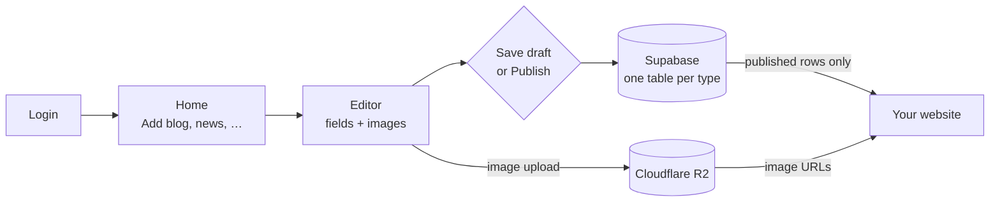
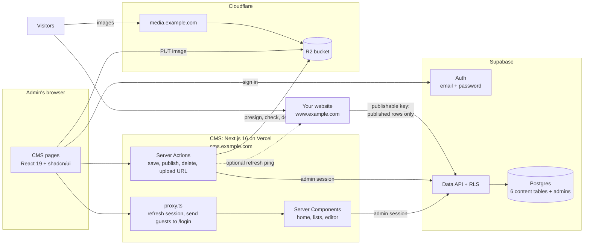

# Content Admin (CMS): Implementation Plan

> A private admin website where you log in and manage your public website's content: **blog posts, news, success stories, testimonials, visa stamps and work permits**.
>
> - Content is saved in **Supabase** and images in **Cloudflare R2**.
> - Your website reads the published content **directly from Supabase**.
>
> **Status:** Draft v2 · **Date:** 2026-10-02. Library versions and platform facts were verified on this date; re-check versions when installing.
>
> **Replaces v1** of this plan, a general-purpose "Strapi alternative". v1 is still in git history (commit `1e9e734`).

---

## Table of contents

1. [Summary](#1-summary)
2. [Scope](#2-scope)
3. [How it works](#3-how-it-works)
4. [Key decisions](#4-key-decisions)
5. [Tech stack](#5-tech-stack)
6. [Database](#6-database)
7. [Login & access control](#7-login--access-control)
8. [Images on Cloudflare R2](#8-images-on-cloudflare-r2)
9. [Rich-text editor](#9-rich-text-editor)
10. [CMS screens](#10-cms-screens)
11. [How the code works](#11-how-the-code-works)
12. [Using the content on your website](#12-using-the-content-on-your-website)
13. [Project structure](#13-project-structure)
14. [Environment variables & config](#14-environment-variables--config)
15. [Roadmap](#15-roadmap)
16. [Testing](#16-testing)
17. [Deployment & operations](#17-deployment--operations)
18. [Security & privacy checklist](#18-security--privacy-checklist)
19. [Later (backlog)](#19-later-backlog)
20. [Open questions](#20-open-questions)
21. [References](#21-references)

---

## 1. Summary

### 1.1 What you get

| Step | Screen | What happens |
|---|---|---|
| 1 | **Login** (`/login`) | Email + password. This is the only page a visitor can open. There is no sign-up and no "forgot password"; you create users yourself in the Supabase dashboard. |
| 2 | **Home** (`/`) | One card per content type, showing counts and an **Add** button. |
| 3 | **List** (e.g. `/blog`) | Search, filter by Draft/Published, open, publish/unpublish, delete. |
| 4 | **Editor** (e.g. `/blog/new`) | All the fields for that type: text, rich text with images, main image, dates, rating, country, … |
| 5 | **Save draft / Publish** | The row is saved in that type's Supabase table. Its images are already in R2. |
| 6 | **Your website** | Reads published rows with `supabase-js` and the publishable key. It cannot see drafts. |



### 1.2 The six content types

**Blog** · **News** · **Success stories** · **Testimonials** · **Visa stamps** · **Work permits**. Each one is its own Postgres table. The fields are in [§6.2](#62-fields-per-table-proposed).

### 1.3 The main decisions

- **Six fixed tables with real columns**; there is no "content-type builder".
- **Supabase Row Level Security (RLS) is the gatekeeper.** Visitors can read only published rows, and only admins on an allowlist can write.
- **The CMS talks to Supabase as the logged-in admin.** There is no secret key on the server.
- **Images are resized in the browser and uploaded straight to R2.** The row stores the image's URL, alt text, width and height.
- **Rich text** is written in **Tiptap** and stored as **sanitized HTML**, so the website only has to render it.
- **One config file describes all six types.** There is one generic list page and one generic editor.

### 1.4 What changed from v1

| v1 (Strapi alternative) | v2 (this plan) |
|---|---|
| Content types designed in the UI and stored as JSON documents | **Six fixed tables** with typed columns |
| Drizzle ORM over a direct Postgres connection, with Supabase's auto-generated API (the Data API) off | **supabase-js + RLS**, with the Data API on |
| Our own REST API, API tokens and webhooks | **None of these.** The website reads Supabase directly. |
| Media library with reusable files | Images uploaded **inside the editor**: one main image per item, plus images inside rich text |
| Separate draft and published copies of each entry | A simple **Draft / Published** status per row |

---

## 2. Scope

### In v1

- **Login and logout** with email and password. Only users on the **admin allowlist** get in.
- **Home dashboard** with counts and quick **Add** buttons.
- **For each content type:** a list (search, status filter, pagination), plus create, edit, delete and publish/unpublish.
- **Editor:**
  - auto-generated URL slugs;
  - rich text with inline images;
  - main-image upload with progress and alt text;
  - clear validation errors;
  - an unsaved-changes warning;
  - an edit-conflict warning;
  - a "View on website" link.
- **Images:** resized in the browser and uploaded straight to R2. Replaced or deleted main images are removed from R2.
- **Database rules (RLS):** the website, or anyone holding the publishable key, can read only **published** content, and only admins can write.
- **For your website:** a guide with copy-paste queries and generated TypeScript types, plus an optional "refresh the website" ping after each save.

### Not in v1 (see [§19](#19-later-backlog))

- Sign-up, invitations, password-reset emails and user-management screens. Use the Supabase dashboard instead.
- Roles: every admin can do everything.
- Creating content types or fields from the UI. A new field is one migration plus one line of config ([§6.7](#67-changing-the-schema-later)).
- A media library, image galleries (several images per item), and video uploads. Paste a YouTube link instead.
- Multiple languages, revision history, and previewing drafts on the website.

---

## 3. How it works

### 3.1 Architecture



- **CMS:** a Next.js app on its own subdomain. It holds no database password and no Supabase secret key. It only needs the R2 upload credentials.
- **Supabase:** stores the content and runs the login. The **Data API** (PostgREST) serves both the CMS (as the admin) and the website (as an anonymous visitor). RLS decides what each one may see or change.
- **Cloudflare R2:** stores the images. They are served from `media.example.com` through Cloudflare's CDN.

### 3.2 Who can do what

Postgres enforces this; the CMS code only adds friendlier checks on top.

| Who | Connects with | Can read | Can write |
|---|---|---|---|
| Your website / any visitor | publishable key, no login | rows with `status = 'published'` and `published_at <= now()` | nothing |
| **Admin** (listed in `admins`) | publishable key + their login session | everything, drafts included | the six content tables |
| A logged-in user **not** in `admins` | publishable key + session | the same as a visitor | nothing |
| You, in the Supabase dashboard or CLI | database owner | everything | everything |

### 3.3 Saving an item with an image

```mermaid
sequenceDiagram
  autonumber
  participant B as Browser (CMS editor)
  participant S as CMS server (Server Actions)
  participant R as Cloudflare R2
  participant D as Supabase (Postgres + RLS)
  participant W as Your website
  B->>B: Choose image, resize to 2000 px max, WebP or JPEG, strip EXIF
  B->>S: createUploadUrl(collection, type, size)
  S->>S: requireAdmin, check type and size, generate key
  S-->>B: presigned PUT URL (5 min) + public URL
  B->>R: PUT image (progress bar)
  B->>B: Show preview; admin fills alt text and the other fields
  B->>S: saveItem(values, status = published)
  S->>S: requireAdmin, Zod validation, sanitize HTML, HeadObject check
  S->>D: insert or update with the admin's session
  D->>D: RLS: is the caller in admins?
  D-->>S: saved row (id, updated_at)
  S-->>B: ok, then toast "Published"
  S--)R: after response: delete the replaced image
  S--)W: after response (optional): POST /api/revalidate
```

---

## 4. Key decisions

| # | Decision | Why | Trade-off |
|---|---|---|---|
| D1 | **Six real tables with typed columns.** No generic content engine. | Exactly what you need. Easy to query from the website, and `supabase gen types` gives full TypeScript types. | A new field needs a small migration plus one config line, about 10 minutes. |
| D2 | **The CMS uses supabase-js with the logged-in admin's session, and RLS decides what is allowed.** There is no secret key on the server. | The database itself enforces "only admins write, the public sees only published content", even if app code has a bug. It is the same access path the website uses, and there is one less secret to leak. | No multi-statement transactions. They aren't needed: every save touches one row. |
| D3 | **An admin allowlist** (the `admins` table plus `private.is_admin()`), with sign-ups switched off. | Being logged in is not the same as being an admin. This keeps you safe if you later add user accounts to the website in the same Supabase project. | One extra SQL line when you create an admin. |
| D4 | **Every table has a Draft/Published `status` and a `published_at`.** The website only sees published rows whose date has passed. | Unfinished work never reaches the website, and backdating or scheduling come for free. | Editing a *published* item changes the live site as soon as you save. There is no separate draft copy. |
| D5 | **Images go from the browser straight to R2 through a presigned URL, resized and re-encoded in the browser first.** | Avoids Vercel's 4.5 MB request limit and makes pages fast. Re-encoding also removes GPS/EXIF data from phone photos. | Safari (Mac and iPhone) can't encode WebP, so images uploaded from Safari are saved as JPEG. They are still resized and EXIF-free. |
| D6 | **The main image is stored as four columns:** `image_url`, `image_alt`, `image_width`, `image_height`. | The website gets everything from one row, fully typed and with no joins. Width and height prevent layout shift. | If the media domain ever changes, run one SQL `replace()`. |
| D7 | **Rich text is written in Tiptap, saved as HTML and sanitized on the server** before it is stored. | The website renders it in one line and needs no editor libraries. | HTML is less structured than JSON, which is fine for articles. |
| D8 | **One config file describes the six content types**, so there is one generic list, editor and set of actions. | Six types for the cost of one, and adding a field is one line. | A type with unusual UI needs a custom field component. |
| D9 | **SQL migrations go in `supabase/migrations/`, applied with the Supabase CLI**, and types are generated from the database. | A reproducible database, and the same types in the CMS and on the website. | You need the CLI, which installs as a dev dependency. |
| D10 | **The browser signs in with the Supabase client; access checks run on the server.** | Supabase limits `/auth/v1/token`, used for both sign-in and token refresh, to **150 requests per 5 min per IP**. If login ran on our server, every attempt (an attacker's too) would come from the server's IP, so a flood of bad logins could lock real admins out. | — |
| D11 | **CMS pages are never cached.** The website does its own caching, refreshed on a timer and by an optional ping. | Admins always see the latest data, and there is nothing to invalidate in the CMS. | — |

---

## 5. Tech stack

Versions as of 2026-10-02.

| Layer | Choice | Version | Notes |
|---|---|---|---|
| Runtime | Node.js LTS | 24 (minimum 22.12, required by sanitize-html) | pin it with `.nvmrc`; choose Node 24.x in Vercel |
| Framework | Next.js (App Router, Turbopack) + React | 16.3.8 / 19.2.8 | already installed |
| Language & styling | TypeScript (strict), Tailwind CSS | 5.x / 4.x | already installed |
| UI kit | shadcn/ui (CLI v4, Base UI primitives) + lucide-react + sonner (toasts) | 4.21 / 1.50 / 2.0 | components are copied into `src/components/ui` |
| Forms | react-hook-form + @hookform/resolvers + zod | 7.89 / 5.9 / 4.6 | the same Zod schemas run in the browser and on the server |
| Supabase | @supabase/supabase-js + @supabase/ssr | 2.117 / 0.12.7 | cookies-based sessions for Next.js |
| DB tooling | Supabase CLI (`supabase` npm dev dependency) | 2.119 | migrations and type generation |
| Images | @aws-sdk/client-s3 + @aws-sdk/s3-request-presigner | 3.1145 | R2 speaks the S3 API |
| Rich text | Tiptap 3: `@tiptap/react`, `@tiptap/pm`, `@tiptap/starter-kit`, `@tiptap/extension-image`, `@tiptap/extensions`, `@tiptap/extension-file-handler` | 3.31 (≥ 3.30.5 for security fixes) | MIT licensed |
| HTML cleaning | sanitize-html (+ @types/sanitize-html) | 2.18 | server only; tested with Next 16.3.8 + Turbopack, no extra config |
| Slugs | @sindresorhus/slugify | 3.0 | transliterates letters such as ł, ą, ü |
| Tests | Vitest, Playwright | 5.0 / 1.63 | |
| Lint and format | Biome | 2.5 | `next lint` no longer exists |
| Hosting | Vercel | — | CMS at `cms.example.com` |

Dropped from v1: Drizzle, `pg`, TanStack Table, nuqs, dnd-kit, CodeMirror, `qs` and react-dropzone. Dates are formatted with the built-in `Intl` APIs.

---

## 6. Database

### 6.1 Tables at a glance

| Table | Used on the website for | Slug (own page) | Rich text | Main image | Featured flag |
|---|---|---|---|---|---|
| `blog` | article list + article pages | ✅ | ✅ `content` | cover, optional | — |
| `news` | news list + news pages | ✅ | ✅ `content` | cover, optional | — |
| `success_stories` | story list + story pages | ✅ | ✅ `content` | photo, optional | ✅ |
| `testimonials` | quotes / carousel | — | — | photo, optional | ✅ |
| `visa_stamps` | gallery of approved visas | — | — | **image, required** | — |
| `work_permits` | gallery of issued work permits | — | — | **image, required** | — |
| `admins` | nothing (CMS access list) | | | | |

Every content table has these **standard columns**:

| Column | Type | Notes |
|---|---|---|
| `id` | `uuid` primary key | `gen_random_uuid()` |
| `status` | enum `content_status` | `'draft'` (default) or `'published'` |
| `published_at` | `timestamptz` | Set automatically the first time the item is published. You can edit it to backdate, or set a future date to schedule. |
| `created_at`, `updated_at` | `timestamptz` | `updated_at` is set by a trigger on every update. It also detects edit conflicts. |
| `image_url`, `image_alt`, `image_width`, `image_height` | `text`, `text`, `integer`, `integer` | The main image, in every table |

### 6.2 Fields per table (proposed)

> **Please confirm or adjust these fields before Phase 1.** They are a sensible starting point for a visa and work-permit agency site. Changing them later is easy ([§6.7](#67-changing-the-schema-later)), but renaming a column also means updating the website.

**Required**:
- **Always:** needed even to save a draft.
- **Publish:** needed before publishing.
- **Blank:** optional.

**`blog`**

| Column | Type | Required | Editor input | Notes |
|---|---|---|---|---|
| `title` | text ≤ 200 | Always | Text | |
| `slug` | text, unique | Always | Slug | Generated from the title; used in `/blog/<slug>` |
| `excerpt` | text ≤ 300 | Publish | Textarea | Shown on cards and as the meta description |
| `content` | text (HTML) | Publish | Rich text | |
| `image_*` | — | | Image ("Cover image") | |
| `author_name` | text ≤ 100 | | Text | |
| `tags` | text[] (≤ 10) | | Tags | e.g. `work-visa`, `poland` |
| `seo_title` | text ≤ 70 | | Text (SEO section) | Falls back to `title` |
| `seo_description` | text ≤ 160 | | Textarea (SEO section) | Falls back to `excerpt` |

**`news`**

| Column | Type | Required | Editor input | Notes |
|---|---|---|---|---|
| `title` | text ≤ 200 | Always | Text | |
| `slug` | text, unique | Always | Slug | `/news/<slug>` |
| `excerpt` | text ≤ 300 | Publish | Textarea | |
| `content` | text (HTML) | Publish | Rich text | |
| `image_*` | — | | Image ("Cover image") | |
| `source_url` | text (URL) | | URL ("Source link") | e.g. the official announcement |
| `seo_title`, `seo_description` | text ≤ 70 / ≤ 160 | | SEO section | |

**`success_stories`**

| Column | Type | Required | Editor input | Notes |
|---|---|---|---|---|
| `title` | text ≤ 200 | Always | Text | e.g. "From Kathmandu to Wrocław in 9 weeks" |
| `slug` | text, unique | Always | Slug | `/success-stories/<slug>` |
| `person_name` | text ≤ 100 | Publish | Text | A first name is enough |
| `country` | text ≤ 60 | | Country | Destination country |
| `job_title` | text ≤ 100 | | Text | e.g. "Welder" |
| `excerpt` | text ≤ 300 | Publish | Textarea | |
| `content` | text (HTML) | Publish | Rich text | The story |
| `image_*` | — | | Image ("Photo") | |
| `video_url` | text (URL) | | URL | A YouTube or Vimeo link |
| `is_featured` | boolean | | Switch | Show on the home page |

**`testimonials`**

| Column | Type | Required | Editor input | Notes |
|---|---|---|---|---|
| `name` | text ≤ 100 | Always | Text | |
| `job_title` | text ≤ 100 | | Text | e.g. "Warehouse operator, Poznań" |
| `country` | text ≤ 60 | | Country | |
| `quote` | text ≤ 1000 | Publish | Textarea | Plain text; line breaks are kept |
| `rating` | smallint 1–5 | | Rating | |
| `image_*` | — | | Image ("Photo") | |
| `video_url` | text (URL) | | URL | For video testimonials |
| `is_featured` | boolean | | Switch | |

**`visa_stamps`**

| Column | Type | Required | Editor input | Notes |
|---|---|---|---|---|
| `image_*` | — | Always | Image ("Visa stamp") | Blur personal data first ([§8.7](#87-privacy)) |
| `country` | text ≤ 60 | Always | Country | |
| `visa_type` | text ≤ 100 | | Text | e.g. "National visa (D), work" |
| `person_name` | text ≤ 100 | | Text | First name or initials only |
| `issued_on` | date | | Date | |
| `description` | text ≤ 500 | | Textarea | |

**`work_permits`**

| Column | Type | Required | Editor input | Notes |
|---|---|---|---|---|
| `image_*` | — | Always | Image ("Work permit") | Blur personal data first |
| `country` | text ≤ 60 | Always | Country | |
| `permit_type` | text ≤ 100 | | Text | e.g. "Type A" |
| `job_title` | text ≤ 100 | | Text | |
| `person_name` | text ≤ 100 | | Text | First name or initials only |
| `issued_on` | date | | Date | |
| `description` | text ≤ 500 | | Textarea | |

`country` is a text field that suggests country names from `src/config/countries.ts` (an HTML `datalist`). The suggestions keep spelling consistent, so the website can filter by country, but any value can still be typed.

### 6.3 Migration 1: content tables

Create it with `pnpm db:new content_tables`. That makes `supabase/migrations/<timestamp>_content_tables.sql`; paste in the SQL below.

```sql
create type public.content_status as enum ('draft', 'published');

-- Helpers live in a schema that the Data API does not expose
create schema if not exists private;

-- Keeps updated_at fresh, protects created_at, and stamps published_at on first publish
create function private.content_before_write()
returns trigger
language plpgsql
set search_path = ''
as $$
begin
  if tg_op = 'UPDATE' then
    new.created_at := old.created_at;
    new.updated_at := now();
  end if;
  if new.status = 'published' and new.published_at is null then
    new.published_at := now();
  end if;
  return new;
end;
$$;

create table public.blog (
  id               uuid primary key default gen_random_uuid(),
  title            text not null check (char_length(title) between 1 and 200),
  slug             text not null unique check (slug ~ '^[a-z0-9]+(-[a-z0-9]+)*$' and char_length(slug) <= 120),
  excerpt          text check (char_length(excerpt) <= 300),
  content          text not null default '',
  image_url        text,
  image_alt        text check (char_length(image_alt) <= 200),
  image_width      integer check (image_width > 0),
  image_height     integer check (image_height > 0),
  author_name      text check (char_length(author_name) <= 100),
  tags             text[] not null default '{}' check (cardinality(tags) <= 10),
  seo_title        text check (char_length(seo_title) <= 70),
  seo_description  text check (char_length(seo_description) <= 160),
  status           public.content_status not null default 'draft',
  published_at     timestamptz,
  created_at       timestamptz not null default now(),
  updated_at       timestamptz not null default now()
);

create table public.news (
  id               uuid primary key default gen_random_uuid(),
  title            text not null check (char_length(title) between 1 and 200),
  slug             text not null unique check (slug ~ '^[a-z0-9]+(-[a-z0-9]+)*$' and char_length(slug) <= 120),
  excerpt          text check (char_length(excerpt) <= 300),
  content          text not null default '',
  image_url        text,
  image_alt        text check (char_length(image_alt) <= 200),
  image_width      integer check (image_width > 0),
  image_height     integer check (image_height > 0),
  source_url       text check (source_url ~ '^https?://'),
  seo_title        text check (char_length(seo_title) <= 70),
  seo_description  text check (char_length(seo_description) <= 160),
  status           public.content_status not null default 'draft',
  published_at     timestamptz,
  created_at       timestamptz not null default now(),
  updated_at       timestamptz not null default now()
);

create table public.success_stories (
  id               uuid primary key default gen_random_uuid(),
  title            text not null check (char_length(title) between 1 and 200),
  slug             text not null unique check (slug ~ '^[a-z0-9]+(-[a-z0-9]+)*$' and char_length(slug) <= 120),
  person_name      text check (char_length(person_name) <= 100),
  country          text check (char_length(country) <= 60),
  job_title        text check (char_length(job_title) <= 100),
  excerpt          text check (char_length(excerpt) <= 300),
  content          text not null default '',
  image_url        text,
  image_alt        text check (char_length(image_alt) <= 200),
  image_width      integer check (image_width > 0),
  image_height     integer check (image_height > 0),
  video_url        text check (video_url ~ '^https?://'),
  is_featured      boolean not null default false,
  status           public.content_status not null default 'draft',
  published_at     timestamptz,
  created_at       timestamptz not null default now(),
  updated_at       timestamptz not null default now()
);

create table public.testimonials (
  id               uuid primary key default gen_random_uuid(),
  name             text not null check (char_length(name) between 1 and 100),
  job_title        text check (char_length(job_title) <= 100),
  country          text check (char_length(country) <= 60),
  quote            text check (char_length(quote) <= 1000),
  rating           smallint check (rating between 1 and 5),
  image_url        text,
  image_alt        text check (char_length(image_alt) <= 200),
  image_width      integer check (image_width > 0),
  image_height     integer check (image_height > 0),
  video_url        text check (video_url ~ '^https?://'),
  is_featured      boolean not null default false,
  status           public.content_status not null default 'draft',
  published_at     timestamptz,
  created_at       timestamptz not null default now(),
  updated_at       timestamptz not null default now()
);

create table public.visa_stamps (
  id               uuid primary key default gen_random_uuid(),
  image_url        text not null,
  image_alt        text check (char_length(image_alt) <= 200),
  image_width      integer check (image_width > 0),
  image_height     integer check (image_height > 0),
  country          text not null check (char_length(country) between 1 and 60),
  visa_type        text check (char_length(visa_type) <= 100),
  person_name      text check (char_length(person_name) <= 100),
  issued_on        date,
  description      text check (char_length(description) <= 500),
  status           public.content_status not null default 'draft',
  published_at     timestamptz,
  created_at       timestamptz not null default now(),
  updated_at       timestamptz not null default now()
);

create table public.work_permits (
  id               uuid primary key default gen_random_uuid(),
  image_url        text not null,
  image_alt        text check (char_length(image_alt) <= 200),
  image_width      integer check (image_width > 0),
  image_height     integer check (image_height > 0),
  country          text not null check (char_length(country) between 1 and 60),
  permit_type      text check (char_length(permit_type) <= 100),
  job_title        text check (char_length(job_title) <= 100),
  person_name      text check (char_length(person_name) <= 100),
  issued_on        date,
  description      text check (char_length(description) <= 500),
  status           public.content_status not null default 'draft',
  published_at     timestamptz,
  created_at       timestamptz not null default now(),
  updated_at       timestamptz not null default now()
);

-- Same indexes and trigger on all six tables
do $$
declare t text;
begin
  foreach t in array array['blog', 'news', 'success_stories', 'testimonials', 'visa_stamps', 'work_permits'] loop
    -- website lists: newest published first
    execute format('create index %I on public.%I (published_at desc) where status = ''published''', t || '_published_idx', t);
    -- CMS lists: recently edited first
    execute format('create index %I on public.%I (updated_at desc)', t || '_updated_idx', t);
    execute format('create trigger content_before_write before insert or update on public.%I
                    for each row execute function private.content_before_write()', t);
  end loop;
end $$;
```

**Draft vs publish checks.**
- The database enforces formats, lengths and the *Always* fields.
- The *Publish* requirements are checked by the shared Zod schemas ([§11.3](#113-validation-draft-vs-publish)), in the browser for quick feedback and on the server as the final word.

### 6.4 Migration 2: access rules (RLS)

`pnpm db:new access_control`

> **Why explicit `GRANT`s?** Supabase is changing its defaults. Projects created since 2026-05-30 no longer give the API roles automatic access to new `public` tables, and **from 2026-10-30 this applies to all projects**. We therefore revoke everything and grant exactly what is needed, which works under the old and the new defaults. RLS then filters the rows.

```sql
-- 1. Who may use the CMS
create table public.admins (
  user_id     uuid primary key references auth.users (id) on delete cascade,
  created_at  timestamptz not null default now()
);
alter table public.admins enable row level security;
revoke all on public.admins from anon, authenticated;
grant select on public.admins to authenticated;
create policy "Users can see their own admin row"
  on public.admins for select to authenticated
  using (user_id = (select auth.uid()));

-- 2. Policy helper. SECURITY DEFINER lets it read `admins` regardless of RLS;
--    the `private` schema keeps it out of the Data API.
create function private.is_admin()
returns boolean
language sql
stable
security definer
set search_path = ''
as $$
  select exists (select 1 from public.admins where user_id = (select auth.uid()))
$$;
revoke execute on function private.is_admin() from public;
grant usage on schema private to authenticated;
grant execute on function private.is_admin() to authenticated;

-- 3. Content tables: privileges + policies
do $$
declare t text;
begin
  foreach t in array array['blog', 'news', 'success_stories', 'testimonials', 'visa_stamps', 'work_permits'] loop
    execute format('alter table public.%I enable row level security', t);

    execute format('revoke all on public.%I from anon, authenticated', t);
    execute format('grant select on public.%I to anon', t);
    execute format('grant select, insert, update, delete on public.%I to authenticated', t);
    -- Only for scripts that use the secret key (never the website, never the CMS)
    execute format('grant select, insert, update, delete on public.%I to service_role', t);

    -- Visitors (and your website): published items whose date has arrived
    execute format($p$
      create policy "Public reads published" on public.%I
        for select to anon
        using (status = 'published' and published_at <= now())
    $p$, t);

    -- Logged-in users: the same, or everything for admins (one policy per role, no overlap)
    execute format($p$
      create policy "Admins read all, others read published" on public.%I
        for select to authenticated
        using ((status = 'published' and published_at <= now()) or (select private.is_admin()))
    $p$, t);

    execute format($p$
      create policy "Admins insert" on public.%I
        for insert to authenticated
        with check ((select private.is_admin()))
    $p$, t);

    execute format($p$
      create policy "Admins update" on public.%I
        for update to authenticated
        using ((select private.is_admin()))
        with check ((select private.is_admin()))
    $p$, t);

    execute format($p$
      create policy "Admins delete" on public.%I
        for delete to authenticated
        using ((select private.is_admin()))
    $p$, t);
  end loop;
end $$;
```

**Notes**
- **`(select private.is_admin())`** is evaluated once per query, not once per row (Supabase's RLS performance advice).
- **One SELECT policy per role.** This avoids the advisor's "multiple permissive policies" warning.
- **`anon` never evaluates `private.is_admin()`**, so it needs no access to the `private` schema.
- **Missing grants** show up as error `42501`, with a hint naming the `GRANT` that is needed.

### 6.5 Managing admins

Create the user first in **Authentication → Users → Add user → Create new user**. Then run this in the SQL editor:

```sql
-- give CMS access
insert into public.admins (user_id)
select id from auth.users where email = 'name@example.com';

-- list admins
select u.email, a.created_at
from public.admins a join auth.users u on u.id = a.user_id
order by a.created_at;

-- remove CMS access (also delete or ban the auth user if they shouldn't log in at all)
delete from public.admins
where user_id = (select id from auth.users where email = 'name@example.com');
```

### 6.6 Checking the rules

Run each block **on its own** in the SQL editor. Every block ends with `rollback`, so nothing is kept.

```sql
-- As a website visitor: drafts are invisible and writes are refused
begin;
  insert into public.blog (title, slug) values ('RLS test draft', 'rls-test-draft');
  set local role anon;
  select title, status from public.blog;  -- no 'RLS test draft'
rollback;

begin;
  set local role anon;
  insert into public.blog (title, slug) values ('Hack', 'hack');  -- ERROR: permission denied
rollback;

-- As an admin: drafts are visible
begin;
  select set_config('request.jwt.claims',
    json_build_object('sub', (select id from auth.users where email = 'name@example.com'), 'role', 'authenticated')::text, true);
  set local role authenticated;
  select count(*) from public.blog;  -- includes drafts
rollback;
```

Also check that **Advisors → Security Advisor** shows no errors. Automated versions of these checks are in [§16](#16-testing).

> **Already tested.** Both migrations and these checks were run on a local PostgreSQL 18, with stand-ins for Supabase's `auth` schema and API roles (Supabase runs Postgres 17). Results:
> - Visitors see only published rows whose date has passed; drafts and scheduled items are hidden.
> - Visitors can't write and can't read `admins`.
> - A logged-in non-admin sees the same as a visitor: an insert is refused by RLS, updates match 0 rows, and they see no `admins` rows.
> - Admins see and change everything.
> - The trigger stamps `published_at`, moves `updated_at` and protects `created_at`.
> - A stale `updated_at` matches 0 rows, which is the edit-conflict check.
> - A duplicate slug gives `23505`, a malformed slug gives `23514`, and a visa stamp without an image is rejected.

### 6.7 Changing the schema later

To add a field, e.g. a blog category:

1. Create a migration with `pnpm db:new add_blog_category`, containing `alter table public.blog add column category text check (char_length(category) <= 60);`.
2. Apply it and regenerate types with `pnpm db:push && pnpm db:types`.
3. Add one line to `src/config/collections.ts`: `{ name: 'category', label: 'Category', type: 'text', maxLength: 60, placement: 'side' }`.
4. Optionally, regenerate the types in the website project and use the new column.

**Renaming or deleting** a column breaks website queries that use it. Update the website in the same release.

---

## 7. Login & access control

### 7.1 Supabase setup (one-time)

1. **Create the project** in a region near you and your website, e.g. Frankfurt (`eu-central-1`).
   - Under **Security options**, untick **"Automatically expose new tables"**; the migrations grant access explicitly.
   - Tick **"Enable automatic RLS"**.
   - Keep the database password in a password manager.
2. **Turn off sign-ups.** In **Authentication → Sign In / Providers**:
   - keep the **Email** provider enabled;
   - turn **off "Allow new users to sign up"**. This blocks only `/signup`; users you create can still log in with a password.
   - Leave **anonymous sign-ins off** (the default).
3. **Set a password rule.** In the Email provider settings, set the minimum password length to 12 or more.
4. **Set the Site URL.** In **Authentication → URL Configuration**, set it to `https://cms.example.com`.
5. **Copy the keys.** In **Project Settings → API Keys**, copy the **Project URL** and the **publishable key** (`sb_publishable_…`). The CMS and the website need nothing else. Never deploy the secret key (`sb_secret_…`).
6. **Run the migrations.** This is Phase 1 ([§15](#15-roadmap)).
7. **Create yourself as admin.** **Add user → Create new user**, enter email and password, and leave "Auto confirm user" ticked. No email is sent. Then run the `insert into public.admins …` SQL from [§6.5](#65-managing-admins).
8. **Optional: add a CAPTCHA.** In **Authentication → Attack Protection**, enable Cloudflare Turnstile. The login form must then send `options.captchaToken`.

### 7.2 How login works

1. **The `/login` page** is a Server Component. It checks the current session:
   - **an admin** is redirected to `/`;
   - **logged in but not an admin:** shows "This account has no access to the CMS" and a **Sign out** button;
   - **otherwise:** shows the login form.
2. **The login form** is a Client Component. It calls `supabase.auth.signInWithPassword()` **in the browser** (see D10), and `@supabase/ssr` stores the session in cookies.
3. **The form then reads the `admins` table.** RLS lets a user see only their own row.
   - **No row:** it calls `signOut()` and shows "This account does not have access".
   - **Otherwise:** it goes to `next` (only paths starting with a single `/`) or to `/`.
4. **`src/proxy.ts` runs on every page request.** It refreshes the session cookie and sends visitors without a session to `/login?next=…`. This is only a fast first gate.
5. **The real check** is `requireAdmin()`. It runs in every CMS page, every data function and every Server Action:
   - it calls `getClaims()`, which verifies the JWT;
   - it then looks up `admins`.

   RLS backs it up: even if a check were forgotten, a non-admin could not read drafts or write anything.
6. **Logout** is a Server Action that calls `signOut()` and redirects to `/login`.

### 7.3 Code

**Supabase clients** (`src/lib/supabase/`). These follow Supabase's official Next.js setup.

```ts
// src/lib/supabase/server.ts
import 'server-only'
import { createServerClient } from '@supabase/ssr'
import { cookies } from 'next/headers'
import type { Database } from './database.types'

export async function createClient() {
  const cookieStore = await cookies()
  return createServerClient<Database>(
    process.env.NEXT_PUBLIC_SUPABASE_URL!,
    process.env.NEXT_PUBLIC_SUPABASE_PUBLISHABLE_KEY!,
    {
      cookies: {
        getAll: () => cookieStore.getAll(),
        setAll(cookiesToSet) {
          try {
            cookiesToSet.forEach(({ name, value, options }) => cookieStore.set(name, value, options))
          } catch {
            // Called from a Server Component: safe to ignore, proxy.ts refreshes sessions.
          }
        },
      },
    },
  )
}
```

```ts
// src/lib/supabase/client.ts  (browser)
import { createBrowserClient } from '@supabase/ssr'
import type { Database } from './database.types'

export function createClient() {
  return createBrowserClient<Database>(
    process.env.NEXT_PUBLIC_SUPABASE_URL!,
    process.env.NEXT_PUBLIC_SUPABASE_PUBLISHABLE_KEY!,
  )
}
```

**Proxy.** In Next.js 16, `proxy.ts` replaced `middleware.ts`. It runs on Node.js.

```ts
// src/proxy.ts
import type { NextRequest } from 'next/server'
import { updateSession } from '@/lib/supabase/proxy'

export async function proxy(request: NextRequest) {
  return updateSession(request)
}

export const config = {
  matcher: ['/((?!_next/static|_next/image|favicon.ico|robots.txt|.*\\.(?:svg|png|jpg|jpeg|gif|webp|ico)$).*)'],
}
```

```ts
// src/lib/supabase/proxy.ts
import { createServerClient } from '@supabase/ssr'
import { NextResponse, type NextRequest } from 'next/server'

export async function updateSession(request: NextRequest) {
  let response = NextResponse.next({ request })

  const supabase = createServerClient(
    process.env.NEXT_PUBLIC_SUPABASE_URL!,
    process.env.NEXT_PUBLIC_SUPABASE_PUBLISHABLE_KEY!,
    {
      cookies: {
        getAll: () => request.cookies.getAll(),
        setAll(cookiesToSet, headers) {
          cookiesToSet.forEach(({ name, value }) => request.cookies.set(name, value))
          response = NextResponse.next({ request })
          cookiesToSet.forEach(({ name, value, options }) => response.cookies.set(name, value, options))
          // no-cache headers so a CDN never stores a response that sets auth cookies
          Object.entries(headers ?? {}).forEach(([key, value]) => response.headers.set(key, value))
        },
      },
    },
  )

  // Don't run code between createServerClient and getClaims(): it verifies and refreshes the session.
  const { data } = await supabase.auth.getClaims()

  if (!data?.claims && request.nextUrl.pathname !== '/login') {
    const url = request.nextUrl.clone()
    url.pathname = '/login'
    url.search = `?next=${encodeURIComponent(request.nextUrl.pathname + request.nextUrl.search)}`
    const redirect = NextResponse.redirect(url)
    response.cookies.getAll().forEach((cookie) => redirect.cookies.set(cookie)) // keep refreshed cookies
    return redirect
  }
  return response
}
```

**Access checks** (`src/lib/auth.ts`):

```ts
import 'server-only'
import { cache } from 'react'
import { redirect } from 'next/navigation'
import { createClient } from '@/lib/supabase/server'

/** Runs once per request (React cache). Null when nobody is logged in. */
export const getCurrentUser = cache(async () => {
  const supabase = await createClient()
  const { data } = await supabase.auth.getClaims()
  const claims = data?.claims
  if (!claims) return null

  const { data: admin } = await supabase
    .from('admins')
    .select('user_id')
    .eq('user_id', claims.sub)
    .maybeSingle()

  return { id: claims.sub, email: String(claims.email ?? ''), isAdmin: admin !== null }
})

/** Use at the top of every CMS page, data function and Server Action. */
export async function requireAdmin() {
  const user = await getCurrentUser()
  if (!user?.isAdmin) redirect('/login') // the login page explains "no access" when relevant
  return user
}
```

**Login form** (`src/app/login/login-form.tsx`). The page passes in `next`, already checked on the server.

```tsx
'use client'
import { useActionState } from 'react'
import { useRouter } from 'next/navigation'
import { createClient } from '@/lib/supabase/client'

export function LoginForm({ next }: { next: string }) {
  const router = useRouter()
  const [error, formAction, pending] = useActionState(
    async (_prev: string | null, formData: FormData) => {
      const supabase = createClient()
      const { data, error } = await supabase.auth.signInWithPassword({
        email: String(formData.get('email') ?? ''),
        password: String(formData.get('password') ?? ''),
      })
      if (error) {
        return error.status === 429 ? 'Too many attempts. Try again in a few minutes.' : 'Invalid email or password.'
      }

      const { data: admin } = await supabase.from('admins').select('user_id').eq('user_id', data.user.id).maybeSingle()
      if (!admin) {
        await supabase.auth.signOut()
        return 'This account does not have access to the CMS.'
      }
      router.replace(next)
      return null
    },
    null,
  )

  return (
    <form action={formAction}>
      {/* shadcn Field + Input for "email" (type=email, autoComplete=username)
          and "password" (type=password, autoComplete=current-password) */}
      {error && <p role="alert">{error}</p>}
      <button type="submit" disabled={pending}>{pending ? 'Signing in…' : 'Sign in'}</button>
    </form>
  )
}
```

**Logout** (`src/actions/auth.ts`):

```ts
'use server'
import { redirect } from 'next/navigation'
import { createClient } from '@/lib/supabase/server'

export async function logout() {
  const supabase = await createClient()
  await supabase.auth.signOut()
  redirect('/login')
}
```

**Rules**
- **`proxy.ts` is only a fast first gate.** Next.js docs say Proxy must not be your only authorization. Server Actions are POST requests to the page that uses them, so **every action calls `requireAdmin()` itself**.
- **Don't rely on checks in layouts alone.** Layouts don't re-render on client navigation.
- **Use `getClaims()` on the server, never `getSession()`.** `getSession()` doesn't verify the token. New projects sign JWTs with asymmetric keys, so `getClaims()` verifies locally without a network call.
- **Client Components never import `src/lib/auth.ts` or other server modules.** `import 'server-only'` enforces this.

### 7.4 Passwords

- There are no reset emails. Supabase's built-in email sender only delivers to your own team's addresses anyway.
- **To reset an admin's password,** run the small local script `scripts/set-password.ts`. It calls `supabase.auth.admin.updateUserById(id, { password })` with the **secret key**, which you keep in `.env.local` only and never deploy.
- A "change my password" page is in the backlog.

---

## 8. Images on Cloudflare R2

### 8.1 Cloudflare setup (one-time)

1. **Enable R2.** It needs a payment method, but this project stays inside the free tier.
2. **Create the bucket** `cms-media`.
   - **If data must stay in the EU,** create it with **EU jurisdiction**. This **cannot be changed later**, and the S3 endpoint becomes `<ACCOUNT_ID>.eu.r2.cloudflarestorage.com`.
   - **Otherwise,** pick a location hint near your users, e.g. Western Europe.
3. **Connect a custom domain.** In **Settings → Custom Domains**, add `media.example.com`; the domain's DNS must be on Cloudflare. Keep the `r2.dev` URL **disabled**: it is rate-limited and meant for testing.
4. **Add a CORS policy** (**Settings → CORS policy**) so the CMS can upload from the browser:

   ```json
   [
     {
       "AllowedOrigins": ["https://cms.example.com", "http://localhost:3000"],
       "AllowedMethods": ["PUT"],
       "AllowedHeaders": ["Content-Type"],
       "ExposeHeaders": ["ETag"],
       "MaxAgeSeconds": 3600
     }
   ]
   ```

   - Changes can take about 30 seconds to apply.
   - This JSON is the dashboard's format. `wrangler r2 bucket cors set` uses a different schema.
   - Presigned uploads only work on the S3 endpoint (`<ACCOUNT_ID>.r2.cloudflarestorage.com`), not on the custom domain. The custom domain is for reading.

5. **Add a Cache Rule** for `media.example.com`: eligible for cache, with edge TTL and browser TTL of 1 year. This is safe because a file name never changes once uploaded.
6. **Add a Response Header Transform Rule** for `media.example.com` that sets `X-Content-Type-Options: nosniff`.
7. **Create an R2 API token** (**R2 → Manage API tokens**) with **Object Read & Write** on **this bucket only**. Copy the Access Key ID and Secret Access Key.

### 8.2 File names (object keys)

```text
<collection>/<yyyy>/<mm>/<uuid>.<ext>      e.g. visa-stamps/2026/10/7c9e6679-7425-40de-944b-e07fc1f90ae7.webp
```

- **The server generates the keys.** Original file names are never used, because they often contain people's names.
- **Keys are never reused,** so a replacement is always a new file and caching stays simple.

### 8.3 Upload flow

**Step 1: prepare the image in the browser** (`src/lib/images/prepare.ts`).

```ts
const ACCEPTED = ['image/jpeg', 'image/png', 'image/webp', 'image/avif', 'image/gif', 'image/heic', 'image/heif']
const MAX_INPUT_BYTES = 25 * 1024 * 1024

export type PreparedImage = { blob: Blob; type: string; width: number; height: number }

export async function prepareImage(file: File, maxSide = 2000): Promise<PreparedImage> {
  if (!ACCEPTED.includes(file.type)) throw new Error('Please use a JPG, PNG, WebP, AVIF, HEIC or GIF image.')
  if (file.size > MAX_INPUT_BYTES) throw new Error('Images must be smaller than 25 MB.')

  let bitmap: ImageBitmap
  try {
    bitmap = await createImageBitmap(file, { imageOrientation: 'from-image' }) // respects phone rotation
  } catch {
    // e.g. HEIC in Chrome/Edge/Firefox (only Safari can decode HEIC)
    throw new Error('This browser cannot read this image. Please convert it to JPG and try again.')
  }

  if (file.type === 'image/gif') {
    const size = { width: bitmap.width, height: bitmap.height }
    bitmap.close()
    return { blob: file, type: file.type, ...size } // keep animation: upload as-is
  }

  const scale = Math.min(1, maxSide / Math.max(bitmap.width, bitmap.height))
  const width = Math.round(bitmap.width * scale)
  const height = Math.round(bitmap.height * scale)
  const canvas = document.createElement('canvas')
  canvas.width = width
  canvas.height = height
  const ctx = canvas.getContext('2d')!
  ctx.imageSmoothingQuality = 'high'
  ctx.fillStyle = '#fff' // transparent areas become white (JPEG has no transparency; it would turn them black)
  ctx.fillRect(0, 0, width, height)
  ctx.drawImage(bitmap, 0, 0, width, height)
  bitmap.close()

  // Re-encoding drops EXIF metadata (GPS location, camera, date).
  // Chrome, Edge and Firefox encode WebP. Safari can't: it silently returns a big PNG, so fall back to JPEG.
  let blob = await toBlob(canvas, 'image/webp', 0.82)
  if (blob.type !== 'image/webp') blob = await toBlob(canvas, 'image/jpeg', 0.85)
  return { blob, type: blob.type, width, height } // the canvas size is the exact output size
}

function toBlob(canvas: HTMLCanvasElement, type: string, quality: number) {
  return new Promise<Blob>((resolve, reject) =>
    canvas.toBlob((b) => (b ? resolve(b) : reject(new Error('Could not process this image.'))), type, quality),
  )
}
```

**Step 2: ask the server for an upload URL** (`src/lib/r2.ts` and `src/actions/uploads.ts`).

```ts
// src/lib/r2.ts
import 'server-only'
import { S3Client, PutObjectCommand, HeadObjectCommand, DeleteObjectCommand } from '@aws-sdk/client-s3'
import { getSignedUrl } from '@aws-sdk/s3-request-presigner'

const jurisdiction = process.env.R2_JURISDICTION // 'eu' or empty
export const r2 = new S3Client({
  region: 'auto',
  endpoint: `https://${process.env.R2_ACCOUNT_ID}${jurisdiction ? `.${jurisdiction}` : ''}.r2.cloudflarestorage.com`,
  credentials: {
    accessKeyId: process.env.R2_ACCESS_KEY_ID!,
    secretAccessKey: process.env.R2_SECRET_ACCESS_KEY!,
  },
  // Newer SDKs put an empty-body CRC32 checksum into presigned URLs, which can never match the real file.
  // These two settings turn that off, as Cloudflare recommended.
  requestChecksumCalculation: 'WHEN_REQUIRED',
  responseChecksumValidation: 'WHEN_REQUIRED',
})

const BUCKET = process.env.R2_BUCKET!
const MEDIA_URL = process.env.NEXT_PUBLIC_MEDIA_URL!
const KEY_PATTERN = /^[a-z-]+\/\d{4}\/\d{2}\/[0-9a-f-]{36}\.(webp|jpg|png|gif)$/

export function keyFromUrl(url: string): string | null {
  if (!url.startsWith(`${MEDIA_URL}/`)) return null
  const key = url.slice(MEDIA_URL.length + 1)
  return KEY_PATTERN.test(key) ? key : null
}

export function presignUpload(key: string, contentType: string, size: number) {
  return getSignedUrl(
    r2,
    new PutObjectCommand({ Bucket: BUCKET, Key: key, ContentType: contentType, ContentLength: size }),
    // Content-Type is NOT signed unless listed here; ContentLength is signed automatically.
    // An upload with a different type or size then fails the signature check.
    { expiresIn: 300, signableHeaders: new Set(['content-type']) },
  )
}
// + headObject(url) for the save-time check, deleteObject(url) for clean-up
```

```ts
// src/actions/uploads.ts
'use server'
import * as z from 'zod'
import { requireAdmin } from '@/lib/auth'
import { presignUpload } from '@/lib/r2'
import { COLLECTION_SLUGS } from '@/config/collections'

const EXT = { 'image/webp': 'webp', 'image/jpeg': 'jpg', 'image/png': 'png', 'image/gif': 'gif' } as const
const Input = z.object({
  collection: z.enum(COLLECTION_SLUGS),
  contentType: z.enum(['image/webp', 'image/jpeg', 'image/png', 'image/gif']),
  size: z.number().int().positive().max(10 * 1024 * 1024), // after browser processing
})

export async function createUploadUrl(input: { collection: string; contentType: string; size: number }) {
  await requireAdmin()
  const parsed = Input.safeParse(input)
  if (!parsed.success) return { ok: false as const, error: 'This file type or size is not allowed.' }

  const { collection, contentType, size } = parsed.data
  const now = new Date()
  const key = `${collection}/${now.getUTCFullYear()}/${String(now.getUTCMonth() + 1).padStart(2, '0')}/${crypto.randomUUID()}.${EXT[contentType]}`
  return {
    ok: true as const,
    data: { uploadUrl: await presignUpload(key, contentType, size), url: `${process.env.NEXT_PUBLIC_MEDIA_URL}/${key}` },
  }
}
```

**Step 3: upload with a progress bar** (`src/lib/images/upload.ts`). `fetch` can't report upload progress, so this uses `XMLHttpRequest`.

```ts
export function putWithProgress(url: string, blob: Blob, contentType: string, onProgress?: (ratio: number) => void) {
  return new Promise<void>((resolve, reject) => {
    const xhr = new XMLHttpRequest()
    xhr.open('PUT', url)
    xhr.setRequestHeader('Content-Type', contentType) // must equal the signed value
    xhr.upload.onprogress = (e) => e.lengthComputable && onProgress?.(e.loaded / e.total)
    xhr.onload = () => (xhr.status < 300 ? resolve() : reject(new Error(`Upload failed (${xhr.status})`)))
    // An expired link returns 403 without CORS headers, so the browser reports it as a network error
    xhr.onerror = () => reject(new Error('Upload failed. Check your connection and try again.'))
    xhr.send(blob)
  })
}

/** prepare → presign → PUT. Returns what the image field stores. */
export async function uploadImage(file: File, collection: string, opts: { maxSide?: number; onProgress?: (r: number) => void } = {}) {
  const image = await prepareImage(file, opts.maxSide)
  const res = await createUploadUrl({ collection, contentType: image.type, size: image.blob.size })
  if (!res.ok) throw new Error(res.error)
  await putWithProgress(res.data.uploadUrl, image.blob, image.type, opts.onProgress)
  return { url: res.data.url, width: image.width, height: image.height }
}
```

**Step 4: saving the item.** The image field's value is `{ url, alt, width, height }`. It is written to the `image_*` columns when the item is saved ([§11.5](#115-server-actions)).

### 8.4 Rules & limits

| Rule | Value |
|---|---|
| Accepted files | JPG, PNG, WebP, AVIF, GIF and HEIC. iPhones hand photos from the photo library to the browser as JPEG. A HEIC file only works in Safari; other browsers show "please convert it to JPG". The file input uses `accept="image/*"`; don't add `image/heic` to it, because Safari would then convert JPEGs *to* HEIC. |
| Maximum file chosen | 25 MB |
| Stored size | Longest side **2000 px** for main images and **1600 px** for images in rich text |
| Stored format | **WebP** (quality 0.82) from Chrome, Edge and Firefox. **JPEG** (quality 0.85) from Safari, which can't encode WebP. Transparent areas become white. GIFs are kept as they are. |
| Maximum upload (server check) | 10 MB |
| Not allowed | SVG (can carry scripts), PDF, video |
| Upload URL lifetime | 5 minutes, valid for one exact type and size |

### 8.5 Checks on save

- **The URL must be one of ours.** `image_url` must start with `NEXT_PUBLIC_MEDIA_URL/` and match the key pattern, so the database can't point at random external images.
- **The file must exist.** When the image changed, the server runs **`HeadObject`** to confirm the file exists, is an allowed type and is within the size limit.
- **Inline images** in rich text are restricted to the same domain by the HTML sanitizer ([§9.3](#93-cleaning-the-html-on-the-server)).

### 8.6 Deleting images

| Event | What happens in R2 |
|---|---|
| Main image replaced or removed, then saved | The old file is deleted **after** the save succeeds (`after()`) |
| Item deleted | Its main image is deleted after the row is deleted |
| Image inside rich text removed, or an upload abandoned (image chosen, page left without saving) | The file stays. The **"Clean up unused images"** tool in Phase 8 finds files older than 24 h that no row references and deletes them. At this scale the leftovers cost nothing (10 GB is free). |

Deleting a file doesn't instantly clear Cloudflare's CDN cache. **If something sensitive was published by mistake,** delete the item, then purge its image URL in Cloudflare under **Caching → Configuration → Purge Cache → Custom purge**.

### 8.7 Privacy

Visa stamps, work permits and client photos contain **personal data**, so the GDPR applies.

- **Blur before uploading:** passport numbers, the machine-readable (MRZ) lines, dates of birth, signatures, and the faces of people who haven't agreed. The editor shows this reminder above the image field for visa stamps and work permits.
- **Keep names short.** A first name or initials is enough in `person_name`.
- **Get the person's consent** before publishing their story, photo or document. Keep that record outside the CMS.
- **Location data is stripped.** Re-encoding in the browser removes GPS and other EXIF data from phone photos automatically. GIFs are not re-encoded, so don't use GIFs for documents.
- **Images are public once uploaded.** Anyone with the URL can open them, even while the item is a draft. The random file names make the URLs impossible to guess.

---

## 9. Rich-text editor

Used by `blog.content`, `news.content` and `success_stories.content`.

### 9.1 What it can do

- **Toolbar:** paragraph, H2, H3, H4, bold, italic, underline, strikethrough, bulleted list, numbered list, quote, link, image, horizontal line, undo and redo.
- **Images:**
  - The **image button** opens a small dialog: choose a file, type the alt text, Insert. The image is resized (1600 px max), uploaded to R2, and inserted as ``.
  - **Pasted or dropped image files** are uploaded the same way. Base64 images are never embedded.
- **Pasting from Word or Google Docs** keeps headings, lists and links. Anything the editor doesn't support, such as fonts, colours or tables, is dropped.
- **Links:** added with a dialog and opened in a new tab (`target="_blank" rel="noopener noreferrer nofollow"`). Tiptap's link validator already refuses `javascript:`, `data:` and `vbscript:` links, and the server only keeps `http(s)`, `mailto` and `tel`.

### 9.2 Editor setup

```tsx
// src/components/editor/rich-text-editor.tsx (simplified)
'use client'
import { useEditor, EditorContent } from '@tiptap/react'
import StarterKit from '@tiptap/starter-kit'
import Image from '@tiptap/extension-image'
import FileHandler from '@tiptap/extension-file-handler'
import { Placeholder } from '@tiptap/extensions'

// FileHandler matches file.type exactly: no wildcards
const IMAGE_TYPES = ['image/jpeg', 'image/png', 'image/webp', 'image/avif', 'image/gif', 'image/heic', 'image/heif']

export function RichTextEditor({ value, onChange, collection }: Props) {
  const editor = useEditor({
    immediatelyRender: false, // required with SSR in Next.js
    extensions: [
      StarterKit.configure({
        heading: { levels: [2, 3, 4] },
        code: false,
        codeBlock: false,
        link: { openOnClick: false, defaultProtocol: 'https' },
      }),
      Image, // defaults: block image, allowBase64: false
      FileHandler.configure({
        allowedMimeTypes: IMAGE_TYPES,
        consumePasteEvent: true, // otherwise pasted HTML may add the same image a second time
        onDrop: (ed, files, pos) => files.forEach((f) => insertUploaded(ed, f, collection, pos)),
        onPaste: (ed, files) => files.forEach((f) => insertUploaded(ed, f, collection, ed.state.selection.anchor)),
      }),
      Placeholder.configure({ placeholder: 'Start writing…' }),
    ],
    content: value,
    onUpdate: ({ editor }) => onChange(editor.isEmpty ? '' : editor.getHTML()),
  })
  return (
    <div className="rounded-md border">
      <Toolbar editor={editor} collection={collection} />
      <EditorContent editor={editor} className="prose max-w-none p-4" />
    </div>
  )
}
```

- **`insertUploaded()`:**
  - calls `uploadImage(file, collection, { maxSide: 1600 })`;
  - then runs `editor.chain().insertContentAt(pos, { type: 'image', attrs: { src, alt, width, height } }).run()`;
  - while it runs, the toolbar shows "Uploading image… 45%".
- **Never insert a file as a `data:` URL** (Tiptap's own FileHandler demo does). `allowBase64: false` only stops data-URL images *pasted as HTML*, not images inserted by code. The server sanitizer is the backstop: it drops any image that isn't on our media domain.
- **Toolbar state:** in Tiptap 3 the editor doesn't re-render React on every keystroke. The toolbar reads active states, such as "bold is on", with `useEditorState({ editor, selector })`.
- **The editor is loaded only in the browser,** inside a client-only form ([§11.1](#111-collection-config)).
- **Styling:** add `@tailwindcss/typography` (the `prose` class), so the editor looks like the website.

### 9.3 Cleaning the HTML on the server

Everything the browser sends is untrusted. The save action runs the HTML through an allowlist before storing it, so the website can render it safely.

```ts
// src/lib/sanitize.ts
import 'server-only'
import sanitizeHtml from 'sanitize-html'

// The trailing slash also blocks look-alikes such as media.example.com.evil.com or media.example.com@evil.com
const MEDIA_PREFIX = `${process.env.NEXT_PUBLIC_MEDIA_URL}/`

export function sanitizeRichText(html: string): string {
  const clean = sanitizeHtml(html, {
    allowedTags: ['p', 'br', 'h2', 'h3', 'h4', 'strong', 'em', 'u', 's', 'blockquote', 'ul', 'ol', 'li', 'hr', 'a', 'img'],
    allowedAttributes: {
      a: ['href', 'rel', { name: 'target', values: ['_blank'] }],
      img: ['src', 'alt', 'title', 'width', 'height'],
      ol: ['start'],
    },
    allowedSchemes: ['http', 'https', 'mailto', 'tel'],
    allowedSchemesByTag: { img: ['https'] },
    allowProtocolRelative: false,
    transformTags: {
      // Runs before attribute filtering, which is why `rel` is allowed above
      a: (tagName, attribs) => {
        if (attribs.target === '_blank') attribs.rel = 'noopener noreferrer nofollow'
        else delete attribs.target
        return { tagName, attribs }
      },
    },
    exclusiveFilter: (frame) =>
      frame.tag === 'img'
        ? !(frame.attribs.src ?? '').startsWith(MEDIA_PREFIX) // only our own images
        : frame.tag === 'a' && !frame.attribs.href
          ? 'excludeTag' // unwrap links whose href was removed (e.g. javascript:), keep the text
          : false,
  })
  return clean === '<p></p>' ? '' : clean
}
```

This configuration was tested with sanitize-html 2.18 in a Next 16.3.8 server action (Turbopack build):
- `<script>`, `<style>`, `<iframe>`, `onerror=…`, `style=…` and stray classes are removed.
- `javascript:` links are unwrapped, including `&colon;`-encoded and protocol-relative (`//…`) forms.
- Images from other hosts, `data:` images and `http:` images are dropped, and so are look-alike hosts.

sanitize-html is CommonJS and needs Node ≥ 22.12. It installs 17 packages, about 4 MB. The alternative, isomorphic-dompurify, pulls in jsdom: 40 packages, about 28 MB.

### 9.4 What gets stored

```html
<h2>How long does it take?</h2>
<p>Most <strong>work permits</strong> take 4–8 weeks. See the
  <a href="https://www.gov.pl/web/udsc" target="_blank" rel="noopener noreferrer nofollow">official page</a>.</p>

```

---

## 10. CMS screens

### 10.1 Routes

| URL | Screen |
|---|---|
| `/login` | Login |
| `/` | Home dashboard |
| `/blog`, `/news`, `/success-stories`, `/testimonials`, `/visa-stamps`, `/work-permits` | List for that type |
| `/<type>/new` | Create |
| `/<type>/<id>` | Edit |

These are implemented with one dynamic segment, `src/app/(cms)/[collection]/…`. An unknown type name, or an `id` that isn't a UUID, shows a 404.

### 10.2 Login

- A centred card with the app name, **Email**, **Password**, and a **Sign in** button with a spinner.
- One generic error message ("Invalid email or password"), plus "Too many attempts" when rate-limited.
- The footer reads "Access by invitation only." There are no sign-up or forgot-password links.

### 10.3 Layout (app shell)

- **Sidebar** (shadcn `Sidebar`, collapses to a drawer on phones):
  - **Home**;
  - **Content:** the six types with icons;
  - at the bottom: **Open website ↗**, your email, and **Sign out**.
- **Header:** breadcrumbs (Home / Blog / Edit).
- The CMS is told **never to be indexed** by search engines, through the `robots` metadata, `robots.txt` and an `X-Robots-Tag` header.

### 10.4 Home

```text
┌───────────────────┬──────────────────────────────────────────────────────────┐
│ CMS               │ Home                                                     │
│                   │                                                          │
│ Home              │ ┌────────────────┐ ┌────────────────┐ ┌────────────────┐ │
│ Content           │ │ Blog           │ │ News           │ │ Success stories│ │
│   Blog            │ │ 12 published   │ │ 8 published    │ │ 5 published    │ │
│   News            │ │ 3 drafts       │ │ 1 draft        │ │ 0 drafts       │ │
│   Success stories │ │ [+ Add] [View] │ │ [+ Add] [View] │ │ [+ Add] [View] │ │
│   Testimonials    │ └────────────────┘ └────────────────┘ └────────────────┘ │
│   Visa stamps     │ ┌────────────────┐ ┌────────────────┐ ┌────────────────┐ │
│   Work permits    │ │ Testimonials   │ │ Visa stamps    │ │ Work permits   │ │
│                   │ │ 20 published   │ │ 64 published   │ │ 41 published   │ │
│ Open website ->   │ │ 2 drafts       │ │ 5 drafts       │ │ 0 drafts       │ │
│ you@...  Sign out │ │ [+ Add] [View] │ │ [+ Add] [View] │ │ [+ Add] [View] │ │
│                   │ └────────────────┘ └────────────────┘ └────────────────┘ │
└───────────────────┴──────────────────────────────────────────────────────────┘
```

Each card shows the type's icon, name, a one-line description, its published and draft counts, and **+ Add** / **View** (the list) buttons.

### 10.5 List

- **Header:** the type name and a **New blog post** button.
- **Toolbar:** a search box (title, or name / country for image types) and the tabs **All / Published / Drafts**.
- **Table** for text types:
  - thumbnail, title, status badge (**Draft** / **Published** / **Scheduled** when the publish date is in the future), publish date, last updated;
  - clicking a row opens the editor;
  - the row menu has **Edit**, **Publish/Unpublish**, **View on website** and **Delete** (with a confirmation dialog).
- **Grid of image cards** for **visa stamps** and **work permits**, because those are mostly pictures.
- **Pagination:** 20 per page, with Previous / Next.
- **The state lives in the URL**, e.g. `/blog?q=visa&status=draft&page=2`, so Back and Refresh work.
- **Empty state:** "No blog posts yet" with a **Create the first one** button.

### 10.6 Editor

```text
┌──────────────────────────────────────────────────────────────────────────────┐
│ <- Blog   New blog post        Draft  [Save draft] [Publish]                 │
├────────────────────────────────────────────────────┬─────────────────────────┤
│ Title                                              │ Publish date            │
│ [How to get a Polish work visa                ]    │ [2026-10-02  10:00]     │
│ URL slug  /blog/[how-to-get-a-polish-work-visa]    │ (empty = when published)│
│ Short summary                           86/300     │─────────────────────────│
│ [.............................................]    │ Cover image             │
│ Content                                            │ ┌─────────────────────┐ │
│ ┌─────────────────────────────────────────────┐    │ │ Drop an image or    │ │
│ │ H2 H3 | B I U S | List 1. Quote | Link Img  │    │ │ click to choose     │ │
│ ├─────────────────────────────────────────────┤    │ └─────────────────────┘ │
│ │                                             │    │ Alt text [...........]  │
│ │                                             │    │ Author   [...........]  │
│ └─────────────────────────────────────────────┘    │ Tags  [visa x] [+]      │
│ > SEO (optional)                                   │                         │
└────────────────────────────────────────────────────┴─────────────────────────┘
```

**Buttons by state**

| Item state | Main button | Other actions |
|---|---|---|
| New | **Publish** | Save draft |
| Draft | **Publish** | Save draft · Delete |
| Published | **Save changes** (goes live immediately) | Unpublish · View on website · Delete |

**Behaviour**
- **Slug:** fills in from the title as you type, until you edit it yourself. Changing the slug of a *published* item shows a warning that old links will break.
- **Publish:** checks the *Publish* fields, highlights what's missing and scrolls to the first problem. Save draft only needs the *Always* fields.
- **Image uploads:** **Save** is disabled while an image is still uploading.
- **After saving:**
  - a new item's URL becomes `/blog/<id>`;
  - a toast says "Draft saved", "Published" or "Changes saved".
- **Unsaved changes:** the browser warns before you leave or reload, and **Ctrl/⌘ + S** saves.
- **Edit conflicts:** if someone saved this item after you opened it, saving shows "This item was changed by someone else. Reload to see the latest version." Nothing is overwritten silently.
- **Mobile:** works on phones. One column, and the image input opens the camera or photo library, which is handy for uploading visa stamps from a phone.

---

## 11. How the code works

### 11.1 Collection config

`src/config/collections.ts` is the single description of the six types. The list page, editor, validation and actions all read it.

```ts
import type { LucideIcon } from 'lucide-react'
import type { Database } from '@/lib/supabase/database.types'

export type ContentTable = Exclude<keyof Database['public']['Tables'], 'admins'>
export type Row = Record<string, unknown>

export type FieldType =
  | 'text' | 'textarea' | 'slug' | 'richtext' | 'image'
  | 'url' | 'date' | 'country' | 'rating' | 'tags' | 'boolean'

export type FieldConfig = {
  name: string                         // column name; 'image' maps to image_url/_alt/_width/_height
  label: string
  type: FieldType
  required?: 'always' | 'publish'      // omitted = optional
  maxLength?: number
  help?: string
  placement?: 'main' | 'side' | 'seo'  // where the editor shows it (default 'main')
  from?: string                        // slug: which field it is generated from
}

export type CollectionConfig = {
  slug: string                         // URL segment and R2 folder: 'success-stories'
  table: ContentTable                  // 'success_stories'
  label: string                        // 'Success stories'
  singular: string                     // 'Success story'
  description: string                  // shown on the home card
  icon: LucideIcon
  fields: FieldConfig[]
  list: { columns: string[]; searchField: string; view?: 'table' | 'grid' }
  displayTitle: (row: Row) => string   // list rows, page titles, breadcrumbs
  websitePath?: (row: Row) => string   // "View on website" (adjust to your site's URLs)
  privacyNotice?: boolean              // the "blur personal data" reminder
}
```

Example: the blog entry. The other five follow the field tables in [§6.2](#62-fields-per-table-proposed).

```ts
{
  slug: 'blog',
  table: 'blog',
  label: 'Blog',
  singular: 'Blog post',
  description: 'Articles and guides',
  icon: BookOpen,
  fields: [
    { name: 'title', label: 'Title', type: 'text', required: 'always', maxLength: 200 },
    { name: 'slug', label: 'URL slug', type: 'slug', required: 'always', from: 'title' },
    { name: 'excerpt', label: 'Short summary', type: 'textarea', required: 'publish', maxLength: 300,
      help: 'Shown on cards and in search results.' },
    { name: 'content', label: 'Content', type: 'richtext', required: 'publish' },
    { name: 'image', label: 'Cover image', type: 'image', placement: 'side' },
    { name: 'author_name', label: 'Author', type: 'text', maxLength: 100, placement: 'side' },
    { name: 'tags', label: 'Tags', type: 'tags', placement: 'side' },
    { name: 'seo_title', label: 'SEO title', type: 'text', maxLength: 70, placement: 'seo' },
    { name: 'seo_description', label: 'SEO description', type: 'textarea', maxLength: 160, placement: 'seo' },
  ],
  list: { columns: ['image', 'title', 'status', 'published_at', 'updated_at'], searchField: 'title' },
  displayTitle: (row) => String(row.title),
  websitePath: (row) => `/blog/${row.slug}`,
}
```

**How the pages use it**
- `src/app/(cms)/[collection]/page.tsx` does `getCollection(slug) ?? notFound()`, loads rows with `listItems()`, and renders `<ItemsTable>` or `<ItemsGrid>`.
- The new and edit pages load the row (edit only) and render `<ItemFormLoader collection=… initialValues=… updatedAt=…>`.
- That loader is a Client Component which imports the form with `next/dynamic(…, { ssr: false })`. The form uses browser-only APIs (Tiptap, canvas, the local time zone), so it never renders on the server and can't cause hydration mismatches.
- `published_at` is a standard field on every type, so it isn't in `fields`. The editor always shows it in the side column.

### 11.2 Field types

| Type | Input | Form value | Stored as |
|---|---|---|---|
| `text` | Input with a character counter when `maxLength` is set | `string` | `text` (empty → `null`) |
| `textarea` | Auto-growing textarea with a counter | `string` | `text` (empty → `null`) |
| `slug` | Input with a `/blog/` prefix and **Generate**; auto-follows `from` until edited | `string` | `text`, unique |
| `richtext` | Tiptap editor ([§9](#9-rich-text-editor)) | HTML `string` | sanitized HTML (empty → `''`) |
| `image` | Drop zone → preview + progress → alt text, Replace, Remove | `{ url, alt, width, height } \| null` | `image_url`, `image_alt`, `image_width`, `image_height` |
| `url` | `<input type="url">` | `string` | `text` (`http(s)://` only) |
| `date` | `<input type="date">` | `'YYYY-MM-DD'` | `date` |
| `country` | Input with a country `datalist` | `string` | `text` |
| `rating` | Five clickable stars, plus "no rating" | `number \| null` | `smallint` 1–5 |
| `tags` | Type and press Enter → chips (lowercase, unique, max 10) | `string[]` | `text[]` |
| `boolean` | Switch | `boolean` | `boolean` |
| *(standard)* publish date | `<input type="datetime-local">` in the admin's time zone | ISO string or `''` | `timestamptz` (empty → set on publish) |

Each type is one component in `src/components/fields/`. A small registry maps a type to its component, its Zod rule and its row mapping.

### 11.3 Validation: draft vs publish

One builder, used both by react-hook-form in the browser and by the Server Actions:

```ts
// src/lib/schemas.ts (shared)
import * as z from 'zod'

export type SaveMode = 'draft' | 'publish'
const SLUG = /^[a-z0-9]+(-[a-z0-9]+)*$/
const MEDIA_URL = process.env.NEXT_PUBLIC_MEDIA_URL!
const emptyToNull = (v: string) => v || null

function rule(field: FieldConfig): z.ZodType {
  switch (field.type) {
    case 'text':
    case 'textarea':
    case 'country':  return z.string().trim().max(field.maxLength ?? 200).transform(emptyToNull)
    case 'slug':     return z.string().trim().max(120).regex(SLUG, 'Use lowercase letters, numbers and hyphens').or(z.literal('')).transform(emptyToNull)
    case 'richtext': return z.string().max(500_000)
    case 'url':      return z.url({ protocol: /^https?$/ }).or(z.literal('')).transform(emptyToNull)
    case 'date':     return z.iso.date().or(z.literal('')).transform(emptyToNull)
    case 'rating':   return z.number().int().min(1).max(5).nullable()
    case 'tags':     return z.array(z.string().trim().toLowerCase().min(1).max(30)).max(10)
    case 'boolean':  return z.boolean()
    case 'image':    return z.object({
                       url: z.url().refine((u) => u.startsWith(`${MEDIA_URL}/`), 'Upload the image here'),
                       alt: z.string().trim().max(200),
                       width: z.number().int().positive().nullable(),
                       height: z.number().int().positive().nullable(),
                     }).nullable()
  }
}

const hasValue = (v: unknown) =>
  v !== null && v !== '' && !(Array.isArray(v) && v.length === 0)

export function buildSchema(collection: CollectionConfig, mode: SaveMode) {
  const shape: Record<string, z.ZodType> = {
    published_at: z.iso.datetime({ offset: true }).or(z.literal('')).transform(emptyToNull),
  }
  for (const field of collection.fields) {
    const needed = field.required === 'always' || (field.required === 'publish' && mode === 'publish')
    shape[field.name] = needed ? rule(field).refine(hasValue, 'Required') : rule(field)
  }
  return z.object(shape)
}
```

- **Which schema runs:** the editor validates with the *draft* schema on **Save draft**, and with the *publish* schema on **Publish** and **Save changes** (published items).
- **In the browser**, the resolver reads the mode from a ref that is set just before `handleSubmit`.
- **On the server**, the action always re-validates with the schema for the status being saved. Unknown keys are dropped.

### 11.4 Reading data

`src/lib/items.ts` (server-only). Each function calls `requireAdmin()` first (the data-access-layer pattern).

```ts
const PAGE_SIZE = 20

export async function listItems(collection: CollectionConfig, params: { q?: string; status?: 'draft' | 'published'; page: number }) {
  await requireAdmin()
  const supabase = await createClient()
  const from = (params.page - 1) * PAGE_SIZE

  let query = supabase.from(collection.table).select('*', { count: 'exact' })
  if (params.status) query = query.eq('status', params.status)
  if (params.q) query = query.ilike(collection.list.searchField, `%${params.q.replace(/[%_\\]/g, '')}%`)

  const { data, count, error } = await query
    .order('updated_at', { ascending: false })
    .range(from, from + PAGE_SIZE - 1) // filters first, then order/range
  if (error) throw error
  return { rows: data, total: count ?? 0, pageSize: PAGE_SIZE }
}

export async function countItems(table: ContentTable) {
  await requireAdmin()
  const supabase = await createClient()
  const head = { count: 'exact', head: true } as const
  const [published, drafts] = await Promise.all([
    supabase.from(table).select('id', head).eq('status', 'published'),
    supabase.from(table).select('id', head).eq('status', 'draft'),
  ])
  return { published: published.count ?? 0, drafts: drafts.count ?? 0 }
}
// + getItem(collection, id): select('*').eq('id', id).maybeSingle()
```

- **Typing:** the generic layer works on `Row = Record<string, unknown>` because the table name is only known at runtime, and Zod guards every write. Typed rows (`Tables<'blog'>`) are used on the website.
- **Row limit:** the Data API returns at most 1,000 rows per request by default; lists are paginated anyway.
- **Dates:** in Server Components they are formatted with `Intl.DateTimeFormat` in `APP_TIME_ZONE`, because Vercel's servers run in UTC.

### 11.5 Server Actions

All actions return the same shape:

```ts
export type ActionResult<T = void> =
  | { ok: true; data: T }
  | { ok: false; error: string; fieldErrors?: Record<string, string[]> }
```

| Action | Does |
|---|---|
| `saveItem({ collection, id, values, status, expectedUpdatedAt })` | Create or update, as draft or published ([see below](#saveitem)) |
| `setItemStatus({ collection, id, status })` | Publish or unpublish from the list. Publishing re-checks the row against the *publish* schema. On failure: "Open the item to add: excerpt, content". |
| `deleteItem({ collection, id })` | Delete the row, then (after the response) delete its main image from R2 and ping the website |
| `createUploadUrl({ collection, contentType, size })` | Presigned PUT URL ([§8.3](#83-upload-flow)) |
| `logout()` | Sign out and redirect to `/login` |

#### `saveItem`

```ts
// src/actions/items.ts
'use server'
import { after } from 'next/server'
import { refresh } from 'next/cache'
import * as z from 'zod'
// + requireAdmin (lib/auth), getCollection (config/collections), buildSchema (lib/schemas),
//   valuesToRow (lib/mapping), createClient (lib/supabase/server), headObject + deleteObject (lib/r2),
//   pingWebsite (lib/website), ActionResult

export async function saveItem(input: {
  collection: string
  id: string | null                    // null = create
  values: Record<string, unknown>
  status: 'draft' | 'published'        // which button was pressed
  expectedUpdatedAt: string | null     // for edit-conflict detection
}): Promise<ActionResult<{ id: string; updatedAt: string }>> {
  await requireAdmin()
  const collection = getCollection(input.collection)
  if (!collection) return { ok: false, error: 'Unknown content type.' }

  const parsed = buildSchema(collection, input.status === 'published' ? 'publish' : 'draft').safeParse(input.values)
  if (!parsed.success) {
    return { ok: false, error: 'Please fix the highlighted fields.', fieldErrors: z.flattenError(parsed.error).fieldErrors }
  }

  const supabase = await createClient()
  const previous = input.id
    ? (await supabase.from(collection.table).select('*').eq('id', input.id).maybeSingle()).data
    : null
  if (input.id && !previous) return { ok: false, error: 'This item no longer exists.' }

  // image object → image_* columns, rich text → sanitizeRichText(), '' → null, status
  const row = valuesToRow(collection, parsed.data, input.status)

  if (row.image_url && row.image_url !== previous?.image_url) {
    const check = await headObject(row.image_url as string) // exists, allowed type, within size limit
    if (!check.ok) return { ok: false, error: check.error, fieldErrors: { image: [check.error] } }
  }

  const write = input.id
    ? supabase.from(collection.table).update(row).eq('id', input.id).eq('updated_at', input.expectedUpdatedAt!)
    : supabase.from(collection.table).insert(row)
  const { data, error } = await write.select('id, updated_at').maybeSingle()

  if (error?.code === '23505') {
    return { ok: false, error: 'This URL slug is already used.', fieldErrors: { slug: ['Already used by another item'] } }
  }
  if (error) return { ok: false, error: 'Could not save. Please try again.' }
  if (!data) return { ok: false, error: 'This item was changed by someone else. Reload to see the latest version.' }

  after(async () => {
    if (previous?.image_url && previous.image_url !== row.image_url) await deleteObject(previous.image_url as string)
    if (input.status === 'published' || previous?.status === 'published') {
      await pingWebsite({ collection: collection.slug, slug: (row.slug ?? previous?.slug ?? null) as string | null })
    }
  })

  refresh() // re-render the current page with fresh data in the same response
  return { ok: true, data: { id: data.id, updatedAt: data.updated_at } }
}
```

**On the client**
- **After a create succeeds,** the form shows a toast and calls `router.replace('/<type>/<id>')`.
- **After an update succeeds,** it calls `form.reset(values)`, which clears the "unsaved" state, and stores the new `updatedAt` for the next conflict check.
- **Field errors from the server** are mapped onto the inputs with `setError`.

**Why `after()`?** Deleting old images and pinging the website shouldn't slow down the save, and shouldn't fail it. Both run after the response has been sent.

### 11.6 Error messages

| Cause | Shown to the admin |
|---|---|
| Zod validation (browser or server) | The message next to each field, plus a toast: "Please fix the highlighted fields" |
| `23505` unique violation | Next to the slug: "Already used by another item" |
| Update matched no row (`updated_at` changed) | "This item was changed by someone else. Reload to see the latest version." |
| `42501` (RLS / permission) | "You don't have permission to do this." This should never happen for admins. |
| R2 file missing at save | Next to the image: "The upload didn't finish. Please upload the image again." |
| Anything else | "Could not save. Please try again." The details go to the server log. |

---

## 12. Using the content on your website

Your website, the separate project at `www.example.com`, reads Supabase directly. It **never** talks to the CMS. The examples assume a Next.js website, but the queries work the same in any framework.

### 12.1 Setup

```bash
pnpm add @supabase/supabase-js
pnpm add -D supabase
pnpm supabase login   # once
pnpm supabase gen types typescript --project-id <project-ref> --schema public > src/lib/database.types.ts
```

```bash
# .env.local (website)
NEXT_PUBLIC_SUPABASE_URL=https://<project-ref>.supabase.co
NEXT_PUBLIC_SUPABASE_PUBLISHABLE_KEY=sb_publishable_...
CMS_REVALIDATE_SECRET=<same value as WEBSITE_REVALIDATE_SECRET in the CMS>   # optional, §12.4
```

```ts
// src/lib/cms.ts (website)
import { cache } from 'react'
import { createClient } from '@supabase/supabase-js'
import type { Database, Tables } from './database.types'

export const cms = createClient<Database>(
  process.env.NEXT_PUBLIC_SUPABASE_URL!,
  process.env.NEXT_PUBLIC_SUPABASE_PUBLISHABLE_KEY!,
  { auth: { persistSession: false, autoRefreshToken: false } }, // read-only visitor, no login
)

export type BlogPost = Tables<'blog'>
export type Testimonial = Tables<'testimonials'>
export type VisaStamp = Tables<'visa_stamps'>
```

### 12.2 Queries

```ts
// Blog list (page 1 = newest 9)
export async function getBlogPosts(page = 1, pageSize = 9) {
  const from = (page - 1) * pageSize
  const { data, count, error } = await cms
    .from('blog')
    .select('id, title, slug, excerpt, image_url, image_alt, image_width, image_height, tags, published_at', { count: 'exact' })
    .eq('status', 'published')
    .order('published_at', { ascending: false })
    .range(from, from + pageSize - 1)
  if (error) throw error
  return { posts: data, total: count ?? 0 }
}

// One post by slug (cache() shares it between generateMetadata and the page)
export const getBlogPost = cache(async (slug: string) => {
  const { data, error } = await cms.from('blog').select('*').eq('status', 'published').eq('slug', slug).maybeSingle()
  if (error) throw error
  return data // null → notFound()
})

// News: the same as blog with .from('news')

// Featured success stories for the home page
const { data: stories } = await cms
  .from('success_stories')
  .select('title, slug, person_name, country, job_title, excerpt, image_url, image_alt, image_width, image_height')
  .eq('status', 'published').eq('is_featured', true)
  .order('published_at', { ascending: false }).limit(3)

// Testimonials carousel
const { data: testimonials } = await cms
  .from('testimonials')
  .select('name, job_title, country, quote, rating, image_url, image_alt, video_url')
  .eq('status', 'published')
  .order('is_featured', { ascending: false }).order('published_at', { ascending: false }).limit(12)

// Visa stamp gallery, optionally for one country
let stamps = cms
  .from('visa_stamps')
  .select('id, image_url, image_alt, image_width, image_height, country, visa_type, issued_on')
  .eq('status', 'published')
if (country) stamps = stamps.eq('country', country)
const { data: visaStamps } = await stamps.order('published_at', { ascending: false }).range(0, 23)

// Work permits: the same pattern with .from('work_permits')

// Blog posts with a tag
const { data: tagged } = await cms.from('blog').select('title, slug').eq('status', 'published').contains('tags', ['work-visa'])
```

### 12.3 Rendering rich text and images

```tsx
// app/blog/[slug]/page.tsx (website)
import Image from 'next/image'
import { notFound } from 'next/navigation'
import type { Metadata } from 'next'
import { getBlogPost } from '@/lib/cms'

export async function generateMetadata({ params }: PageProps<'/blog/[slug]'>): Promise<Metadata> {
  const post = await getBlogPost((await params).slug)
  if (!post) return {}
  return {
    title: post.seo_title ?? post.title,
    description: post.seo_description ?? post.excerpt ?? undefined,
    openGraph: post.image_url ? { images: [post.image_url] } : undefined,
  }
}

export default async function BlogPostPage({ params }: PageProps<'/blog/[slug]'>) {
  const post = await getBlogPost((await params).slug)
  if (!post) notFound()
  return (
    <article className="prose lg:prose-lg mx-auto">
      <h1>{post.title}</h1>
      {post.image_url && (
        <Image src={post.image_url} alt={post.image_alt ?? ''} width={post.image_width ?? 1600}
               height={post.image_height ?? 900} loading="eager" sizes="(max-width: 768px) 100vw, 768px" />
      )}
      {/* HTML was sanitized by the CMS before it was saved */}
      <div dangerouslySetInnerHTML={{ __html: post.content }} />
    </article>
  )
}
```

- **Allow the media domain** in the website's `next.config.ts`: `images: { remotePatterns: [new URL('https://media.example.com/**')] }`.
- **Style rich text** with `@tailwindcss/typography` (`prose`).
- **Testimonial quotes** are plain text; render them with `whitespace-pre-line` so line breaks show.
- **Video links** (`video_url`) can be turned into a YouTube embed on the website.
- **In Next.js 16, `priority` on `next/image` is deprecated.** Use `loading="eager"` or `fetchPriority="high"` for the main image.

### 12.4 Keeping pages fresh

Without extra setup, a Next.js page that reads Supabase at build time stays as it was built. Pick one of these:

| Option | Setup | New content appears |
|---|---|---|
| **A. Time-based (simplest)** | `export const revalidate = 300` in list and detail pages, plus `export async function generateStaticParams() { return [] }` in `[slug]` pages | within 5 minutes |
| **B. A + instant refresh (recommended)** | Option A, plus the route below; set `WEBSITE_REVALIDATE_URL` and the secret in the CMS | within seconds; A stays as the safety net |
| **C. Cache Components** (if the website uses `cacheComponents: true`) | Wrap reads in `'use cache'` + `cacheTag('cms')` + `cacheLife('max')`; the route calls `revalidateTag('cms', 'max')` | within seconds |

```ts
// app/api/revalidate/route.ts (website), called by the CMS after each save
import { revalidatePath } from 'next/cache'

export async function POST(request: Request) {
  if (request.headers.get('authorization') !== `Bearer ${process.env.CMS_REVALIDATE_SECRET}`) {
    return Response.json({ revalidated: false }, { status: 401 })
  }
  revalidatePath('/', 'layout') // content changes are rare: refresh every page
  return Response.json({ revalidated: true })
}
```

The CMS side (`src/lib/website.ts`) sends a `POST` with `{ collection, slug }`, a 5-second timeout, and logs failures. Option A catches anything missed.

**Scheduled items** (a future `published_at`) appear when the time-based refresh runs after that moment. Saving does not trigger it.

### 12.5 Rules for the website

- **Use only the publishable key.** The secret key bypasses RLS, so drafts would leak.
- **Always add `.eq('status', 'published')`.** RLS already enforces it, but the query stays correct and readable, and it matches the index.
- **Select only the columns you show.**
- **Regenerate the types** (`supabase gen types …`) whenever the CMS schema changes.
- **If anything other than the CMS can write to these tables,** sanitize the HTML again on the website.

---

## 13. Project structure

```text
.
├── plan.md
├── AGENTS.md / CLAUDE.md
├── next.config.ts
├── biome.json
├── vitest.config.ts
├── playwright.config.ts
├── .env.example
├── .nvmrc                              # 24
├── scripts/
│   └── set-password.ts                 # local only: reset an admin's password (secret key)
├── supabase/
│   ├── config.toml                     # from `supabase init`
│   ├── migrations/
│   │   ├── <ts>_content_tables.sql
│   │   └── <ts>_access_control.sql
│   └── tests/rls.test.sql              # optional pgTAP tests (§16)
├── src/
│   ├── proxy.ts                        # session refresh + send guests to /login
│   ├── app/
│   │   ├── layout.tsx                  # <html>, fonts, <Toaster/>, robots: noindex
│   │   ├── globals.css
│   │   ├── robots.txt                  # Disallow: /
│   │   ├── login/
│   │   │   ├── page.tsx                # form / "no access" / redirect if already admin
│   │   │   └── login-form.tsx
│   │   └── (cms)/
│   │       ├── layout.tsx              # app shell: sidebar, header, user menu
│   │       ├── page.tsx                # home dashboard
│   │       ├── loading.tsx · error.tsx · not-found.tsx
│   │       └── [collection]/
│   │           ├── page.tsx            # list
│   │           ├── new/page.tsx        # create
│   │           └── [id]/page.tsx       # edit
│   ├── actions/
│   │   ├── auth.ts                     # logout
│   │   ├── items.ts                    # saveItem, setItemStatus, deleteItem
│   │   └── uploads.ts                  # createUploadUrl
│   ├── config/
│   │   ├── collections.ts              # the six content types
│   │   ├── countries.ts                # country suggestions
│   │   └── site.ts                     # app name, website URL
│   ├── components/
│   │   ├── ui/                         # shadcn-generated
│   │   ├── shell/                      # sidebar, header, user menu
│   │   ├── items/                      # table, grid, status badge, delete dialog, item form + loader
│   │   ├── fields/                     # one component per field type + registry
│   │   └── editor/                     # Tiptap editor, toolbar, link and image dialogs
│   └── lib/
│       ├── supabase/{server.ts, client.ts, proxy.ts, database.types.ts}
│       ├── auth.ts                     # getCurrentUser, requireAdmin (server-only)
│       ├── items.ts                    # listItems, getItem, countItems (server-only)
│       ├── schemas.ts                  # buildSchema (shared)
│       ├── mapping.ts                  # valuesToRow / rowToValues (shared)
│       ├── sanitize.ts                 # sanitizeRichText (server-only)
│       ├── r2.ts                       # S3 client, presign, head, delete (server-only)
│       ├── website.ts                  # pingWebsite (server-only)
│       ├── images/{prepare.ts, upload.ts}  # browser-only
│       ├── slug.ts                     # wraps @sindresorhus/slugify
│       ├── dates.ts                    # Intl helpers
│       └── env.ts                      # Zod-validated environment variables
└── tests/
    ├── unit/                           # schemas, mapping, sanitize, slug, keys
    └── e2e/                            # Playwright smoke tests
```

The files `src/app/page.tsx` and `public/*.svg` from create-next-app are removed, because `(cms)/page.tsx` now serves `/`.

---

## 14. Environment variables & config

### 14.1 CMS (`.env.local` and Vercel project settings)

| Variable | Scope | Example / notes |
|---|---|---|
| `NEXT_PUBLIC_SUPABASE_URL` | public | `https://<project-ref>.supabase.co` |
| `NEXT_PUBLIC_SUPABASE_PUBLISHABLE_KEY` | public | `sb_publishable_…`. Safe in the browser; RLS protects the data. |
| `NEXT_PUBLIC_MEDIA_URL` | public | `https://media.example.com` (no trailing slash) |
| `NEXT_PUBLIC_WEBSITE_URL` | public | `https://www.example.com`, for "View on website" |
| `R2_ACCOUNT_ID` | server | Cloudflare account ID |
| `R2_ACCESS_KEY_ID`, `R2_SECRET_ACCESS_KEY` | server | The bucket-scoped R2 token |
| `R2_BUCKET` | server | `cms-media` |
| `R2_JURISDICTION` | server | `eu` for an EU-jurisdiction bucket, otherwise empty |
| `APP_TIME_ZONE` | server | e.g. `Europe/Warsaw`; used to show dates in lists |
| `WEBSITE_REVALIDATE_URL` | server, optional | `https://www.example.com/api/revalidate` |
| `WEBSITE_REVALIDATE_SECRET` | server, optional | A long random string, the same as `CMS_REVALIDATE_SECRET` on the website |
| `SUPABASE_SECRET_KEY` | **local only** | `sb_secret_…`, for local scripts: create admin users, `scripts/set-password.ts`, data migration. **Never set it on Vercel.** |
| `SUPABASE_PROJECT_REF` | **local only** | The project id from the dashboard URL; used by the CLI and the Management API |
| `SUPABASE_DB_URL`, `SUPABASE_DB_PASSWORD` | **local only** | Session-pooler URI *without* the password, plus the password, for backups (`pg_dump`), migrations and type generation |
| `SUPABASE_ACCESS_TOKEN` | **local only** | Personal access token for the Supabase CLI / Management API (Data API and Auth settings). Delete it after setup. |

`src/lib/env.ts` validates these with Zod at startup, so a missing variable fails fast with a clear message.

### 14.2 `next.config.ts`

```ts
import type { NextConfig } from 'next'

const mediaUrl = process.env.NEXT_PUBLIC_MEDIA_URL ?? 'https://media.example.com'

const nextConfig: NextConfig = {
  poweredByHeader: false,
  images: { remotePatterns: [new URL(`${mediaUrl}/**`)] }, // thumbnails and previews
  async headers() {
    return [{
      source: '/:path*',
      headers: [
        { key: 'X-Frame-Options', value: 'DENY' },
        { key: 'X-Content-Type-Options', value: 'nosniff' },
        { key: 'Referrer-Policy', value: 'strict-origin-when-cross-origin' },
        { key: 'X-Robots-Tag', value: 'noindex, nofollow' },
      ],
    }]
  },
}

export default nextConfig
```

Server Action bodies are limited to 1 MB by default, which is plenty: images never pass through our server. If very long articles ever hit the limit, raise `experimental.serverActions.bodySizeLimit`.

### 14.3 `package.json` scripts

```json
{
  "dev": "next dev",
  "build": "next build",
  "start": "next start",
  "typecheck": "next typegen && tsc --noEmit",
  "lint": "biome check .",
  "format": "biome format --write .",
  "test": "vitest run",
  "test:e2e": "playwright test",
  "db:new": "supabase migration new",
  "db:push": "supabase db push",
  "db:types": "supabase gen types typescript --linked --schema public > src/lib/supabase/database.types.ts"
}
```

---

## 15. Roadmap

Each phase ends in a working, deployable state.

### Phase 0: Accounts & project setup

- [ ] **Supabase:** create the project and configure it as in [§7.1](#71-supabase-setup-one-time), steps 1–5.
- [ ] **Cloudflare R2:** set up as in [§8.1](#81-cloudflare-setup-one-time) (decide the EU jurisdiction first).
- [ ] **Vercel:**
  - create a project linked to this repo;
  - add the domain `cms.example.com`;
  - set the function region near Supabase (e.g. `fra1` for Frankfurt);
  - set Node.js to 24.x.
- [ ] **Install the dependencies:**

  ```bash
  pnpm add @supabase/supabase-js @supabase/ssr zod react-hook-form @hookform/resolvers \
    @aws-sdk/client-s3 @aws-sdk/s3-request-presigner sanitize-html @sindresorhus/slugify server-only \
    @tiptap/react @tiptap/pm @tiptap/starter-kit @tiptap/extension-image @tiptap/extensions \
    @tiptap/extension-file-handler @tiptap/extension-text-style   # text-style: peer of file-handler
  pnpm add -D supabase @types/sanitize-html @tailwindcss/typography vitest @playwright/test
  pnpm add -D -E @biomejs/biome
  pnpm approve-builds      # allow the `supabase` package to download its CLI binary
  pnpm dlx shadcn@latest init   # accept the defaults (Base UI)
  pnpm dlx shadcn@latest add button input textarea label field card badge table dropdown-menu \
    alert-dialog dialog sidebar separator skeleton sonner switch tabs tooltip breadcrumb progress collapsible
  ```

- [ ] **Tooling:**
  - Biome config, with Tailwind directives enabled in its CSS parser;
  - `vitest.config.ts` with the `@/` alias, and `playwright.config.ts`;
  - the scripts from [§14.3](#143-packagejson-scripts);
  - `.nvmrc` containing `24`.
- [ ] **Environment:** `.env.example`, `.env.local`, and `src/lib/env.ts`.

**Done when:**
- `pnpm dev`, `pnpm build`, `pnpm lint` and `pnpm typecheck` pass.
- A preview deployment on Vercel works.

### Phase 1: Database

- [ ] **Link the CLI:** run `pnpm supabase login`, `pnpm supabase init`, then `pnpm supabase link --project-ref <ref>`. `link` asks for the database password.
- [ ] **Migration 1** ([§6.3](#63-migration-1-content-tables)): enum, `private` schema, trigger function, the six tables, indexes and triggers.
- [ ] **Migration 2** ([§6.4](#64-migration-2-access-rules-rls)): `admins`, `private.is_admin()`, grants and RLS policies.
- [ ] **Apply and generate types:** `pnpm db:push`, then `pnpm db:types`.
- [ ] **Create your admin user** ([§6.5](#65-managing-admins)).
- [ ] **Check the rules** with the SQL from [§6.6](#66-checking-the-rules); the Security Advisor must be clean.

**Done when:**
- `curl "$SUPABASE_URL/rest/v1/blog?select=title" -H "apikey: $PUBLISHABLE_KEY"` returns only published rows, which is `[]` for now.
- An anonymous insert is refused.
- The admin check in the SQL editor sees drafts.

### Phase 2: Login & app shell

- [ ] **Session plumbing:**
  - the Supabase server, browser and proxy clients;
  - `src/proxy.ts`;
  - `src/lib/auth.ts` (`getCurrentUser`, `requireAdmin`).
- [ ] **Login and logout:**
  - the `/login` page with its three states (form / no access / redirect);
  - the login form with a safe `next`;
  - the logout action.
- [ ] **App shell:**
  - remove the starter `src/app/page.tsx`;
  - add the `(cms)` layout with sidebar, header and user menu;
  - add `loading`, `error` and `not-found` pages.
- [ ] **No indexing:** robots metadata, `robots.txt`, and the `X-Robots-Tag` header.

**Done when:**
- A logged-out visit to `/blog` goes to `/login?next=%2Fblog`, and logging in returns you there.
- A wrong password shows a generic error.
- A user who isn't in `admins` gets "no access" and is signed out.
- Logout works, and the session survives a page reload.

### Phase 3: Content config, home & lists

- [ ] **Config:** `src/config/collections.ts` for all six types, plus `countries.ts`.
- [ ] **Data functions:** `src/lib/items.ts` (`listItems`, `getItem`, `countItems`).
- [ ] **Home dashboard:** cards with counts.
- [ ] **List page:**
  - search, status tabs and pagination;
  - thumbnails and status badges (Draft / Published / Scheduled);
  - empty states;
  - a grid view for visa stamps and work permits.
- [ ] **Actions:** `setItemStatus` and `deleteItem` with a confirmation dialog. The R2 deletion is wired up in Phase 5.

**Done when:**
- Rows inserted with SQL show up with the right counts, filters and pages.
- Publish and unpublish from the list work.
- `/foo` shows a 404.

### Phase 4: Editor

- [ ] **Shared logic:** `buildSchema`, `valuesToRow` and `rowToValues`, with unit tests for every collection in draft and publish mode.
- [ ] **Field components:** text, textarea (with counter), slug (auto plus Generate), url, date, country, rating, tags, boolean, and the publish date. Image and rich text are placeholders until Phases 5–6.
- [ ] **Editor layout:**
  - main, side and SEO areas;
  - buttons that depend on the state;
  - status badge;
  - the client-only form loader.
- [ ] **`saveItem` action:**
  - validation;
  - slug-taken and edit-conflict errors;
  - toasts;
  - navigation after create.
- [ ] **Unsaved changes:** the leave-page warning and Ctrl/⌘ + S.

**Done when:**
- Testimonials can be fully created, edited, published, unpublished and deleted (they need no rich text).
- Publishing an empty item lists every missing field.
- Saving the same item in two tabs gives the second tab a conflict message.
- A duplicate slug shows its error next to the slug field.

### Phase 5: Images (R2)

- [ ] **Server:** `src/lib/r2.ts` (client, presign, head, delete) and the `createUploadUrl` action.
- [ ] **Browser:** `prepareImage`, `putWithProgress` and `uploadImage`.
- [ ] **Image field:**
  - drop zone or file picker, preview and progress;
  - alt text, Replace and Remove;
  - error messages;
  - the privacy reminder for visa stamps and work permits.
- [ ] **On save:** the `HeadObject` check, and deleting replaced or removed images after the save. Deleting an item deletes its image.
- [ ] **Thumbnails:** `next/image` `remotePatterns` for list thumbnails and previews.

**Done when:**
- A 10–12 MB phone photo is stored with its longest side at 2000 px or less, typically under 600 KB, and with no EXIF data. It is WebP from Chrome and JPEG from Safari.
- An SVG or a 30 MB file is rejected with a clear message.
- Replacing an image removes the old file from R2.
- A visa stamp can be published end to end, including from a phone.

### Phase 6: Rich text

- [ ] **Tiptap editor:**
  - toolbar;
  - link dialog;
  - image dialog (upload and alt text);
  - paste and drop of images;
  - no base64 images.
- [ ] **`sanitizeRichText`** in `saveItem`, with unit tests covering XSS cases.
- [ ] **Full forms** for blog, news and success stories.

**Done when:**
- An article with headings, lists, links and two inline images saves and reloads identically.
- `<script>`, `onerror=`, `javascript:` links and images from other domains are stripped.

### Phase 7: Website hookup & go-live

- [ ] **Website:** environment variables, generated types, the `cms` client, and queries for all six types ([§12](#12-using-the-content-on-your-website)).
- [ ] **Instant refresh:** the revalidation route on the website, `pingWebsite` in the CMS, and the shared secret on both sides.
- [ ] **Tests and docs:**
  - Playwright smoke tests in CI;
  - a README covering setup, adding an admin, resetting a password and restoring a backup.
- [ ] **Production:**
  - the Supabase plan decided ([§17](#17-deployment--operations));
  - production environment variables on Vercel and domains connected;
  - real admins created.

**Done when:**
- A blog post published in the CMS appears on the website within seconds.
- Drafts never appear on the website.
- A restore from backup has been tried once.

### Phase 8: After launch (optional)

- [ ] **"Clean up unused images":**
  - lists R2 objects older than 24 h that no row references (the `image_url` columns plus `` tags in rich text);
  - asks for confirmation, then deletes them.
- [ ] "Recently edited" on the home page.
- [ ] A "Change my password" page.
- [ ] Anything from the backlog ([§19](#19-later-backlog)).

---

## 16. Testing

| Layer | Tool | Covers |
|---|---|---|
| Unit | Vitest | `buildSchema` (draft vs publish, per collection), `valuesToRow` / `rowToValues`, `sanitizeRichText` (scripts, event handlers, `javascript:` links, foreign images, styles), slug generation, R2 key and URL checks |
| Database | SQL checks ([§6.6](#66-checking-the-rules)); optional pgTAP in `supabase/tests/` run by `supabase test db` against the local Docker stack | anon sees only published, already-live rows; anon and non-admins can't write; admins can do everything; the trigger stamps `published_at` |
| End-to-end | Playwright against a preview deployment, with a dev Supabase project and a dev bucket | login (wrong password, non-admin, admin); create draft → publish → visible to an anonymous query; image upload; delete |
| Manual | Release checklist | upload from an iPhone, an Android phone, desktop Safari (JPEG fallback) and desktop Chrome (WebP), and try a HEIC file in Chrome to see the friendly error; the website renders the content; the Security Advisor is clean; CORS works from the real CMS domain |

---

## 17. Deployment & operations

- **Where things live:**
  - **CMS:** `cms.example.com` on Vercel, in the same region as Supabase.
  - **Images:** `media.example.com`, the R2 custom domain.
  - **Website:** `www.example.com`, which reads Supabase directly.
- **Environments:**
  - Simplest: one Supabase project plus a separate **dev bucket** for local work.
  - Safer: a second free Supabase project for development and previews.
  - The local Docker stack (`supabase start`) is optional. If you use it, set `[api] auto_expose_new_tables = false` in `supabase/config.toml` so it behaves like production.
- **Migrations:** run `pnpm db:push` **before** deploying code that needs the change.
- **Plans and costs** (approximate):

  | Service | Free tier | Recommended for a business site |
  |---|---|---|
  | **Supabase** | Free: **no backups**; pauses after ~7 days of low activity (daily website traffic usually prevents this) | **Pro, from $25/month**: daily backups kept 7 days, never paused |
  | **Cloudflare R2** | 10 GB storage, 1M writes and 10M reads per month, **free egress** | stays free at this scale |
  | **Vercel** | Hobby is for non-commercial use only | **Pro, $20/month per member** for a business |

- **Backups:**
  - On Supabase Pro, daily backups are automatic.
  - On Free, run `supabase db dump` weekly and keep the file somewhere private.
  - R2 images are **not** part of database backups. Copy the bucket occasionally if losing images would hurt (backlog).
- **Runbooks** for the README:
  - add or remove an admin ([§6.5](#65-managing-admins));
  - reset a password ([§7.4](#74-passwords));
  - rotate the R2 token (create the new one → update Vercel → delete the old one);
  - remove a sensitive image ([§8.6](#86-deleting-images));
  - restore the database.

---

## 18. Security & privacy checklist

- [ ] **Supabase Auth:** sign-ups off, anonymous sign-ins off, a minimum password length set, and only allowlisted users in `admins`.
- [ ] **Database:**
  - RLS is on for every table;
  - explicit grants are in place (`anon` = SELECT only);
  - the policies have been checked ([§6.6](#66-checking-the-rules));
  - the Security Advisor is clean.
- [ ] **Keys:**
  - only the publishable key is used by the CMS and the website;
  - the secret key never reaches Vercel or the browser;
  - no secret has a `NEXT_PUBLIC_` name.
- [ ] **Server code:**
  - every page, data function and Server Action calls `requireAdmin()`;
  - every action validates its input with Zod;
  - `server-only` is imported in all server modules.
- [ ] **Login:**
  - a generic error message;
  - `next` accepts only same-site paths;
  - Supabase's per-IP rate limits apply;
  - optionally Turnstile.
- [ ] **Rich text** is sanitized on the server with an allowlist; images in it may only come from our media domain.
- [ ] **Uploads:**
  - keys are generated by the server;
  - presigned URLs last 5 minutes and are locked to one type and size;
  - SVG is not allowed;
  - every upload is checked with `HeadObject` on save;
  - the R2 token is scoped to one bucket;
  - the media domain sends `nosniff`.
- [ ] **Privacy (GDPR):**
  - EXIF is stripped;
  - personal data on documents is blurred;
  - consent is recorded before publishing;
  - names are kept short;
  - you know how to purge a published image from the CDN.
- [ ] **CMS hygiene:** `noindex` everywhere, plus the security headers (`X-Frame-Options`, `nosniff`, `Referrer-Policy`).
- [ ] **Backups exist** and one restore has been tested.

---

## 19. Later (backlog)

- **Media:** a media library to reuse images; galleries (several images per item, e.g. for success stories); the unused-image cleanup, if not done in Phase 8.
- **Content:**
  - categories for blog and news;
  - manual ordering (drag & drop) for testimonials and galleries;
  - scheduled *unpublish*;
  - duplicating an item.
- **Website integration:** draft preview using Next.js Draft Mode with a signed preview link.
- **Languages:** multi-language content (e.g. Polish + English), either a `locale` column or per-language fields. Decide early if you need it ([§20](#20-open-questions)).
- **History and audit:** revision history (who changed what, restore an old version), and an activity log.
- **Accounts:** a "Change my password" page and MFA for admins (Supabase supports TOTP).
- **Look and feel:** dark mode, bulk actions in lists, and a search across all content types.
- **Operations:** periodic R2 backup with rclone, and error monitoring with Sentry.

---

## 20. Open questions

The default answer is in **bold**; the plan assumes it.

1. **Fields per table.** Do the fields in [§6.2](#62-fields-per-table-proposed) match what your website shows? **Yes, as proposed.** Please review them before Phase 1.
2. **Languages.** Is the content in one language? **Yes, one language.** If you need two (e.g. Polish and English), decide before Phase 1, because it changes the tables.
3. **Domains.** `cms.<your-domain>` for the CMS and `media.<your-domain>` for images? **Yes.**
4. **R2 data location.** Use an **EU-jurisdiction bucket**, or only a location hint? This can't be changed later.
5. **Hosting.** **Vercel**, or your own Node/Docker server?
6. **Supabase plan for production.** **Pro**, for backups and no pausing, or Free plus weekly manual dumps?
7. **Website framework.** **Next.js** (the examples in §12 use it) or something else? The queries are the same either way.
8. **Website URLs.** Are the detail pages at `/blog/<slug>`, `/news/<slug>` and `/success-stories/<slug>`? **Yes**; they're configurable in `collections.ts`.
9. **Personal data.** Do visa stamps and work permits show names at all? **Optional field, first names or initials only**, with document details blurred.

---

## 21. References

**Next.js 16.3** (bundled docs in `node_modules/next/dist/docs/01-app/`)
- `01-getting-started/16-proxy.md`, `03-api-reference/03-file-conventions/proxy.md`
- `01-getting-started/07-mutating-data.md`, `02-guides/server-actions.md`, `02-guides/forms.md`
- `02-guides/authentication.md`, `02-guides/data-security.md`
- `02-guides/caching-without-cache-components.md`, `02-guides/incremental-static-regeneration.md`, `01-getting-started/09-revalidating.md`
- `03-api-reference/04-functions/{after,refresh,revalidatePath,generate-static-params}.md`
- `03-api-reference/02-components/image.md` (`remotePatterns`, `preload` / deprecated `priority`)
- `03-api-reference/03-file-conventions/01-metadata/robots.md`

**Supabase**
- https://supabase.com/docs/guides/auth/server-side/creating-a-client (Next.js SSR setup)
- https://supabase.com/docs/reference/javascript/auth-getclaims
- https://supabase.com/docs/guides/getting-started/api-keys
- https://supabase.com/docs/guides/auth/general-configuration
- https://supabase.com/docs/guides/auth/rate-limits
- https://supabase.com/docs/guides/database/postgres/row-level-security
- https://supabase.com/docs/guides/api/securing-your-api
- https://supabase.com/docs/guides/troubleshooting/do-i-need-to-expose-security-definer-functions-in-row-level-security-policies-iI0uOw
- https://supabase.com/changelog/45329-breaking-change-tables-not-exposed-to-data-and-graphql-api-automatically (and discussion #45329)
- https://supabase.com/docs/guides/api/rest/generating-types
- https://supabase.com/docs/reference/javascript/select (counts, ranges)
- https://supabase.com/docs/guides/platform/backups, https://supabase.com/docs/guides/platform/free-project-pausing, https://supabase.com/pricing

**Cloudflare R2**
- https://developers.cloudflare.com/r2/examples/aws/aws-sdk-js-v3/
- https://developers.cloudflare.com/r2/api/s3/presigned-urls/
- https://developers.cloudflare.com/r2/buckets/cors/
- https://developers.cloudflare.com/r2/buckets/public-buckets/
- https://developers.cloudflare.com/r2/reference/data-location/
- https://developers.cloudflare.com/r2/pricing/
- https://developers.cloudflare.com/cache/how-to/purge-cache/
- https://github.com/aws/aws-sdk-js-v3/issues/6810 (checksum defaults), https://github.com/aws/aws-sdk-js-v3/issues/3497 (Content-Type not signed)

**Editor, forms & UI**
- https://tiptap.dev/docs/editor/getting-started/install/nextjs
- https://tiptap.dev/docs/editor/extensions/functionality/starterkit
- https://tiptap.dev/docs/editor/extensions/nodes/image
- https://tiptap.dev/docs/editor/extensions/functionality/filehandler
- https://tiptap.dev/docs/guides/performance (`useEditorState`)
- https://github.com/apostrophecms/sanitize-html
- https://developer.mozilla.org/docs/Web/API/HTMLCanvasElement/toBlob (no WebP encoding in Safari)
- https://react-hook-form.com · https://zod.dev · https://ui.shadcn.com/docs/installation/next
